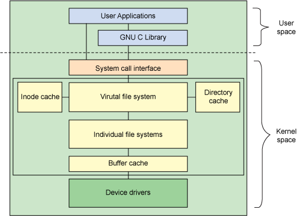

> 参考: [理解inode](https://www.ruanyifeng.com/blog/2011/12/inode.html) <<Linux内核设计与实现>> <<深入理解Linux内核>>

# 1.Linux 的文件系统概述

> 文件系统: 对存储设备上的数据和元数据进行组织的机制;

- 磁盘的一些扩展概念:
  
  - `扇区(Sector)`: 磁盘上的每个磁道被分为若干弧段, 这些弧段就是扇区; 是硬盘的最小存储单位;
  - `簇(cluster)和块(block)`:  文件系统的最小存储单元; 按照扇区读取效率较低, 操作系统会一次连续读取多个扇区, 作为一个存储管理单位; 在linux下的Ext4中叫块, windows下的NTFS中叫簇, ;
  - A: 磁道, B:几何扇区, C:磁道扇区, D:簇
  
  
  
- `inode`: 对应一个文件, 包含文件的元信息和数据信息(block位置); `inode`信息会存储在磁盘的`inode`区中; 对应的数据信息存放在磁盘的数据区中;
  
- 文件的控制信息存储在**超级块**中,超级块是一种包含文件系统信息的数据结构;

- Linux 文件系统的结构:



- `VFS`: 虚拟文件系统, 在用户进程和文件系统之间引入的一层抽象层, 通过标准的系统调用, 对不同的文件系统进行读写; 例如`Ext4, Ext3`

# 2.VFS 虚拟文件系统

> `VFS`是一个内核软件层, 用来处理与`Unix`标准文件系统相关的所有系统调用. 使得用户可以直接使用`open(), read(), write()`这样的系统调用而无需考虑具体的文件系统和实际物理介质;
>
> Linux 内核在执行类似`read`之类的函数时, 通过使用指针, **指向了具体的文件系统的适当函数**;
>
> **VFS 中四个重要对象**:
>
> 1. 超级块对象(superblock object): 存放已安装文件系统的有关信息;
> 2. 索引节点对象(inode object): 存放具体文件的一般信息;
> 3. 文件对象(file object): 存放打卡文件与进程之间进行交互的有关信息;
> 4. 目录项对象(dentry object): 存放目录项与对应文件进行连接的有关信息;


## 1.超级块对象 `super_block`

> 各种文件系统必须实现超级块对象, 用于存储特定文件系统的信息; 通常对应于存放在磁盘特定扇区中的文件系统超级块或文件系统控制块.
>
> 

```c
struct super_block {
    struct list_head    s_list;               /* 超级块链表 */
    dev_t			s_dev;                   /* 设备标识符 */
    unsigned long		s_blocksize;         /* 以字节为单位的块大小 */
    void             *s_fs_info;              /* 指向特定文件系统的超级块的指针 */
    const struct super_operations    *s_op;   /* 超级快操作 */
    struct list_head    s_inodes;             /* inodes链表 */
    struct dentry        *s_root;             /* 目录挂载点 */
    struct file_system_type    *s_type;       /* 文件系统类型 */
    struct block_device	*s_bdev;              /* 相关的块设备 */
}
```

- 所有超级块以双向循环链表的形式链接在一起, 头部为`super_blocks`变量, 使用`sb_lock`自旋锁, 保护链表.
- `s_op`: 超级块操作; 文件系统根据自身特性, 将不需要的操作设置为 NULL;
    - `alloc_inode(sb)`: 创建`inode`对象;
    - `read_inode(inode)`: 用磁盘上的数据填充传递的`inode`;
    - `write_inode(inode, flag)`: 更新文件系统的索引节点; 
    - `write_super(super)`: 用指定对象的内容更新文件系统的超级块;
- `s_fs_info`: 指向具体文件系统的超级块信息;
- 文件系统安装时, 会调用`alloc_super()`创建并初始化超级块;

## 2.索引节点 `inode`

> 每个文件(和目录)都有且只有一个对应的`indoe`, 其中包含**元数据(访问权限, 修改日期, 等等)**和**数据信息(block的位置)**;
>
> **每一个索引节点代表系统中的一个文件, 但是索引节点仅当文件被访问时, 才在内存中创建**;

- ```c
    struct inode {
        unsigned long      i_ino;              /* 节点号 */
        atomic_t           i_count;            /* 引用计数, 访问该inode的进程数 */
        loff_t			  i_size;             /* 以字节为单位的文件大小 */
        umode_t            i_mode;             /* 文件访问权限和所有权信息 */
        kuid_t             i_uid;              /* 使用者 id */
        kgid_t             i_gid;              /* 使用组 id */
        const struct inode_operations *i_op;   /* 索引节点操作 */
        const struct file_operations  *i_fop   /* 文件操作 */
        dev_t            i_rdev;               /* 实际设备标识符 */
        union {
            struct pipe_inode_info  *i_pipe;   /* 管道 */
            struct block_device     *i_bdev;   /* 块设备 */
            struct cdev             *i_cdev;   /* 字符设备 */
      };
        struct super_block  *i_sb;             /* 相关的超级块 */
        struct list_head  i_sb_list;           /* 超级块的链表 */
        struct hlist_head i_dentry;            /* 目录项的链表 */
        struct address_space	i_data;        /* 设备地址映射 */
        struct file_lock	*i_flock;          /* 文件锁链表 */
    }
    ```

- `i_op` :`inode`相关操作, **负责管理结构性的操作(链接, 删除, 创建文件)**

  - `create(dir, dentry, mode, nameidata)`: 为目录项对象相关的普通文件创建一个新的磁盘索引节点;
  - `link(old_dentry, dir, new_dentry)`: 创建硬链接;
  - `mkdir(dir, dentry, mode)`: 为与目录项对象相关的目录创建一个新的索引节点;

- `i_fop`: 文件操作函数指针; **用于操作文件中包含的数据(读, 写)等**;

    - `read(), write()`

- 文件锁信息:

    - `i_flock`指向一个`lock_file`结构组成链表,  表示对该文件加的锁; 

- 包含的链表信息:

  - `i_list`: 存储`inode`数据的链表;
  - `i_sb_list`: 超级块链表;

## 3.目录项 `dentry`

> VFS 将目录也作为文件对待, 路径中的每个组成部分都由一个索引节点对象表示. 为方便查找, VFS 引入了目录项的概念, 每个`dentry`代表路径中的一个特定部分;

 ```c
struct dentry {
    unsigned int d_flags;                       /* protected by d_lock */
    seqcount_t d_seq;                           /* per dentry seqlock */
    struct hlist_bl_node d_hash;                /* 指向散列表表项的指针 */
    struct dentry *d_parent;                    /* !! 父目录的目录项对象 */
    struct qstr d_name;                         /* 文件名 */
    struct inode *d_inode;                      /* 指向索引节点 */
    unsigned char d_iname[DNAME_INLINE_LEN];    /* 短文件名 */

    /* Ref lookup also touches following */
    struct lockref d_lockref;                   /* per-dentry lock and refcount */
    const struct dentry_operations *d_op;       /* 目录项操作方法 */
    struct super_block *d_sb;                   /* 文件的超级块 */
    unsigned long d_time;                       /* used by d_revalidate */
    void *d_fsdata;                             /* fs-specific data */
    
    struct list_head d_lru;                     /* LRU 双向链表(最近最少使用) */
    struct list_head d_child;                   /* !! 同一父目录中的目录项链表 */
    struct list_head d_subdirs;                 /* !! 子目录的链表头 */
    
    union {
        struct hlist_node d_alias;               /* 链表 */
         struct rcu_head d_rcu;
    } d_u;
};

 ```

- 目录项高速缓存:
  - 为了提升处理目录项对象的效率 , Linux 使用**目录项高速缓存**, 简称`dcache`;
  - 当访问一个文件时, `VFS`会先在目录项缓存中搜索路径名, 如果不存在, 遍历文件路径, 解析并加载相应的目录项;
  - `LRU`链表: 最后释放的目录项对象放在链表的首部; 尾部是最近最少使用的数据, 一旦目录项高速缓存的空间变小, 内核就从链表的尾部删除元素;

## 4.文件对象 `file`

> 文件对象表示进程已打开的文件, 包含访问模式, 偏移量等信息. 该对象由`open()`系统调用创建, 由`close()`系统调用撤销; 

```c
struct file {
    union {
        struct llist_node    fu_llist;           /* 文件对象链表 */
        struct rcu_head     fu_rcuhead;          /* 释放后的RCU链表 */
    } f_u;
    struct path        f_path;                   /* 包含目录项和 */
    /* 
    struct path {
        struct vfsmount *mnt;    // 对应的挂载信息
        struct dentry *dentry;   // 对应的目录项
	};
    */
    struct address_space	*f_mapping;          /* 页缓存映射 */
    const struct file_operations    *f_op;       /* 文件对象操作, 由inode中拷贝 */
    unsigned int 		f_flags;                 /* 打开文件时指定的标志(只读, 只写, 读写等) */
    fmode_t            f_mode;                   /* 文件访问模式 */
    loff_t            f_pos;                     /* 文件当前的位移量(文件指针) */
}
```


- 文件对象没有对应的磁盘数据;
- `f_op`: 文件对象的操作, 当内核将一个索引节点从磁盘装入内存时, 会将`inode->i_fop`字段拷贝到`file->f_op`

# 3. 文件系统的其他内容

## 1.特殊文件系统

>   为系统程序员和管理员提供一种容易的方式来控制内核的数据结构并实现操作系统的特殊特征;
>
>   `sysfs`: 主要是要展现设备驱动程序模型组件间的层次关系;
>
>   

| 名字   | 安装点        | 说明                                    |
| ------ | ------------- | --------------------------------------- |
| proc   | /proc         | 对内核数据结构的常规访问点              |
| bdev   | 无            | 块设备                                  |
| pipefs | wu            | 管道                                    |
| sockfs | 无            | 套接字                                  |
| sysfs  | /sys          | 对系统数据的常规访问点                  |
| tmpfs  | 任意          | 临时文件(如果不被交换出去就保存在RAM中) |
| usbfs  | /proc/bus/usb | USB设备                                 |

## 2.与进程相关的文件系统对象

- `files_struct`: 进程打开文件结构体, 进程描述符中的`files`指向, 进程打开的文件及文件描述符都包含在其中;

```c
        struct files_struct {
        	atomic_t count;                  /* 使用计数 */
        	struct fdtable __rcu *fdt;       /* 指向超过数组容量的fd表 */
        	struct fdtable fdtab;
            /*
                struct fdtable {
        	        unsigned int max_fds;   // 
        	        struct file __rcu **fd; // 指向打开的文件对象数组 
                };
            */
        	int next_fd;                                           /* 所分配的最大文件描述符加1 */
        	unsigned long close_on_exec_init[1];
        	unsigned long open_fds_init[1];                         /* 打开的文件描述符链表 */
        	struct file __rcu * fd_array[NR_OPEN_DEFAULT];          /* 默认打开的文件对象数组 */
    };
```

- `fd_array`: 存储已打开的文件对象, 64位系统大小为64, 如果打开文件超过64, 内核将分配一个新的数组; 并将`fdt->fd`指针指向.
  
- `open()`时返回的**文件描述符**就是文件对象在数组中的索引;    

- `fs_struct`: 由进程描述符的`fs`域指向.包含文件系统和进程相关的信息(**进程的工作目录, 根目录**);

    - ```c
        struct fs_struct {
        	int users;              /* 用户数目 */
        	spinlock_t lock;     
        	seqcount_t seq;
        	int umask;
        	int in_exec;            /* 当前正在执行的文件 */
            struct path root;       /* 进程的root目录 */
        	struct path pwd;        /* 当前工作目录 */
        };
        /*
        struct path {
        	struct vfsmount *mnt;
        	struct dentry *dentry;
        };
        */
        ```

## 3.文件系统注册安装

>   每个注册的文件系统都用一个类型为`file_system_type`的对象来表示;
>
>   所有注册的文件系统类型对象都插入到一个单向链表中, 由**变量`file_systems`指向链表头**;

- `file_system_type`: 文件系统类型, 主要表明文件系统的**名称, 挂载方式, 卸载方式;**

    - ```c
        struct file_system_type {
        	const char *name;                /* 文件系统的名字 */
        	int fs_flags;                    /* 文件系统类型标志 */
        	struct dentry *(*mount) (struct file_system_type *, int,
        		       const char *, void *);             /* 代替get_sb(), 用户挂载此文件系统时使用 */
        	void (*kill_sb) (struct super_block *);       /* 删除内存中的超级块, 在卸载文件系统时使用 */
        	struct module *owner;
        	struct file_system_type * next;               /* 链表中的下一个文件系统 */
        	struct hlist_head fs_supers;                  /* 超级块对象链表 */
        }
        ```

- 文件系统通过`register_filesystem()`进行注册;

- 每个文件系统都有自己的根目录, 也称为挂载点;

- `vfsmount`: 当文件系统实际安装时, 将有一个`vfsmount`结构体在被创建, 保存挂载点和挂载标志等信息;

    - ```c
    struct vfsmount {
        	struct dentry *mnt_root;	/* 挂载点 */
        	struct super_block *mnt_sb;	/* 超级块 */
        	int mnt_flags;              /* 挂载标志 */
        };
      ```
    
- 

## 4.路径名查找

1.  如果路径名是`/`, 说明是绝对路径, 由`current->fs->root `目录开始查找, 否则由`current->fs->pwd`开始查找;
2.  检查第一个名字匹配的目录项, 获取相应的索引节点. 
3.  从磁盘读取索引节点的目录文件, 检查第二个名字匹配的目录项, 获取相应索引节点;
4.  反复执行上述过程;

## 5.VFS系统调用的实现

## 6.文件加锁

> Linux支持所有文件加锁方式: 劝告锁和强制锁, 以及`fcntl(), flock(), lockf()`系统调用;
>
> 在实现上, 一个`file_lock`结构就对应一个文件锁; 

- ```c
    struct file_lock {
    	struct file_lock *fl_next;	/* 同一个文件的锁链表中的下一个元素  */
    	struct hlist_node fl_link;	/* 全局活跃/阻塞锁的链表 */
    	struct list_head fl_block;	/* 被同一个锁阻塞的锁的链表 */
    	fl_owner_t fl_owner;        /* 锁的拥有者 */
    	unsigned int fl_flags;      /* 锁标志 */
    	unsigned char fl_type;      /* 锁类型(F_RDLCK,F_WRLCK,F_UNLCK) */
    	unsigned int fl_pid;
        wait_queue_head_t fl_wait;  /* 被锁阻塞等待的进程队列 */
    	
    	struct file *fl_file;      /* 指向文件对象(进程打开的文件) */
    	loff_t fl_start;           /* 被锁区域的开始位移 */
    	loff_t fl_end;             /* 被锁区域的结束位移 */
    
    
    	unsigned long fl_break_time;
    	unsigned long fl_downgrade_time;
    
    	const struct file_lock_operations *fl_ops;	/* Callbacks for filesystems */
    
    };
    ```

- 指向同一个文件的所有锁(`lock_file`结构)都被收集到一个链表中, `inode`结构中的`i_flock`指向链表头;

- 如果文件加锁, 排他锁请求不能被立即满足, 进程被阻塞. 进程就放入等待队列. 由`fl_wait`指向;

- 所有活动锁被连接到**全局文件锁链表**中, 由变量`file_lock_list`指向, 所有阻塞锁被链接到**全局阻塞文件锁链表**, 由`blocked_list`变量指向, `file_lock`通过`fl_link`实现;

- 所有等待同一个锁的锁由`fl_block`串联;

- `FL_FLOCK`锁:

    - 与文件对象关联(进程打开的某个文件), 

# 4.扩展

## 1.磁盘分区


- `0x0-0x1F0`: 保护MBR, GPT分区不用;
- `0x200-0x280`: GPT头, 其作用是定义区域的位置和大小, 校验信息等;
- `0x400-*`: 分区表, 每个分区表占用`0x80`大小空间, 定义分区类型, 分区GUID, 起始扇区和结束扇区等信息;
- 分区区域为用户使用区域;

## 2.EXT2文件系统分析

