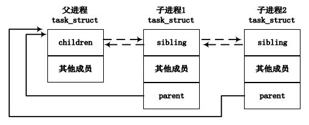
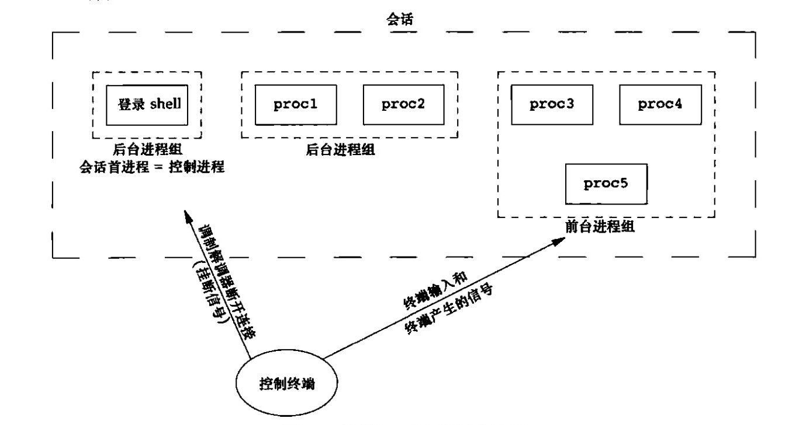

# Linux进程

## 1.进程概念及进程描述

### 1.概念

- 内核调度的是线程;
- 进程就是执行期的程序, 包括若干资源, 如打开的文件, 挂起的信号, 内核内部数据, 处理器状态, 一个或多个执行线程.
- Linux 系统不区分进程和线程, 线程只是一种特殊的进程;
- Linux 系统中, 通过`fork()`创建新的进程, `fork()`是由`clone()`系统调用实现;

### 2.内核态和用户态

> [参考1](https://www.zhihu.com/search?type=content&q=%E5%86%85%E6%A0%B8%E6%80%81) [参考2](https://www.zhihu.com/question/57013926)
>
> 内核态是CPU的一种工作状态, 在内核态CPU可以执行一些特权指令, 作此区分是为了防止应用程序的越权操作; 同时为了防止应用程序越权访问内存, 使用虚拟地址空间映射技术, 将内存分为用户空间和内核空间;
>
> 应用程序无法自由进入内核态, 只能通过操作系统提供的接口(系统调用);
>
> 每个进程都需要有用户空间和内核空间;

- 用户态进程/线程在内核中都是用一个`task_struct`的实例描述; 一般说的堆栈都是指用户态的概念;
- 用户态的堆栈, 在`task_struct->mm->vm_area`描述, 属于进程虚拟地址空间的一个区域;
- 内核态的堆栈, 在`task_struct->stack`里描述, 底部是`thread_info`对象, 主要作用是指向`task_struct`, 便于快速查找`task_struct`;
- 内核栈同普通堆栈一样, 也是进程私有的, 通过`task_struct`获取;
- 内核态没有堆的概念, 空间又Linux内核同一管理, 一般用`slab`分配器(内存缓存池)

### 3.进程描述符

> [参考](https://www.cnblogs.com/JohnABC/p/9084750.html) [参考]()
>
> 内核把进程的相关信息存放在一个双向循环链表中, 称为任务队列;
>
> 列表中每一项都是类型为`task_struct`, 称为进程描述符, 包含进程的所有信息;

```c
struct task_struct {
    volatile long state;                                           /* 进程状态 */
    void *stack;                                                     /* 内核栈 */
    struct mm_struct **mm;                            /* 进程所拥有的内存描述符 */
    struct mm_staruct *active_mm;              /* 进程运行时所使用的的内存描述符 */
    struct task_group *sched_task_group;
    struct list_head tasks;
    struct task_struct __rcu *real_parent; /* real parent process */
    struct task_struct __rcu *parent; /* recipient of SIGCHLD, wait4() reports */
    struct list_head children;       /* list of my children */
    struct list_head sibling;        /* linkage in my parent's children list */
    struct task_struct *group_leader;   /* 进程组组长 */
}
```

#### 1.进程描述符的存储和分配

- 内核需要经常访问`task_struct`, 因此需要快速查找到当前进程的`task_struct`地址; 系统会提供`current`宏快速获取地址;

- 通过`current`获取当前进程的`task_struct`, 通过`current_thread_info`获取`thread_info`; 不同平台的实现不同, 方式有寄存器存放, 地址偏移计算等;

- 有关进程的核心信息存储在两个位置: `task_struct`庞大,且与平台无关; `thread_info`内容小, 与平台紧密关联;

- `task_struct`结构从堆中分配, `thread_info`结构

```c
union thread_union {
    struct thread_info thread_info;                  /*  */
    unsigned long stack[THREAD_SIZE/sizeof(long)];
};

struct thread_info {
    struct task_struct  *task;      /* 指定当前的进程的进程描述符 */
    ...
};

/*
    KERNEL_STACK_OFFSET: 一部分保留结构, 作用目前没有查到
    THREAD_SIZE: 内核栈大小
    this_cpu_read_stable(kernel_stack): 栈的开始使用的位置
    内核栈尾部存放 thread_info 结构

 高 +--------------+
    | offset       |
    +--------------+ <------ this_cpu_read_stable(kernel_stack)
    |              |
    |              |
    +--------------+
    | thread_info  |   task -> task_struct
 低  +--------------+
*/
static inline struct thread_info *current_thread_info(void)
{
    struct thread_info *ti;
    ti = (void *)(this_cpu_read_stable(kernel_stack) +
              KERNEL_STACK_OFFSET - THREAD_SIZE);
    return ti;
}

static __always_inline struct task_struct *get_current(void)
{
    return this_cpu_read_stable(current_task);
}
```

#### 2.状态

> 进程描述符中的`state`描述了进程的当前状态;

- `TASK_RUNNING 运行`: 进程是可执行的; 正在执行或在运行队列中等待执行;
- `TASK_INTERRUPTIBLE 可中断`: 进程正在睡眠(被阻塞), 等待某些条件达成;
- `TASK_UNINTERRUPTIBLE 不可中断`: 接收到信号也不会被唤醒, 域可中断状态相同. (很少使用)
- `__TASK_STOPPED 停止`: 进程停止执行; 进程没有投入运行也不能投入运行.
- `__TASK_TRACED 跟踪`: 被其他进程跟踪的进程, 例如通过`ptrace`调试追踪;

#### 3.进程 ID

- 每一个进程会分配一个号码作为唯一标识, 称为进程 ID. 存储在`pid`中;
- 处于某个线程组中的所有进程都有统一的线程组 ID. 存储在`tgid`中;
- 多个进程可以合并为进程组, 同组的`pgrp`属性相同, 都是组长的`PID`;
- 几个进程组可以合并为一个会话;

#### 4.进程关系

- `parent`: 指向其父进程;
- `children`: 指向子进程链表的表头;
- `sibling`: 将兄弟进程彼此连接;



## 2.进程创建和销毁

> 进程一般由`fork()`创建, 由`exit()`销毁;
>
> `fork(), vfork(), clone()`等函数以及线程的实现最终都是调用`do_fork()`实现;
>
>`do_fork(clone_flags, stack_start, stack_size, parent_tidptr, child_tidptr)`, 参数指明父子进程需要共享的资源, 该函数定义在`kernel/fork.c`中;

### 1.do_fork

- 整体分两部分: 1.`copy_process()`通过拷贝父进程信息(写时复制)创建新进程/线程所需的数据信息, 2.唤醒子进程并运行;
- `copy_process()`:
  - 调用`dup_task_struct()`创建`thread_info, task_struct, 内核栈`;
  - ...
- 运行子进程: 

## 3.Linux 线程的实现

> Linux对线程的实现非常特别, Linux把所有的线程都当做进程来实现; 线程仅仅被视作与其他进程共享某些资源的进程; 每个线程也有自己的`task_struct`;

## 4.进程的其他相关概念

- 进程组: 指一个或多个进程的集合, 被用于控制信号的分配, 对于一个进程组发出的信号, 会被递送到这个组群下的每个进程(一个进程集合, 可以对集合进行整体管理, 如发送信号);
  - `kill(pid, signo)`: 将信号发送到进程或进程组, `pid<0`时, 将信号发送到进程组ID等于`pid`绝对值的进程组;
- 会话: 多个进程组可以构成一个会话(session), 具有以下特点;
  - 会话由其中一个进程创建, 该进程叫做会话的先导进程(session leader), 一般来说控制进程也就是登录系统的shell进程;
  - 会话中的每个进程组称为一个作业(job),  
  - 一个会话最多拥有一个控制终端;
  - 建立与控制终端连接的会话首进程被称为控制进程;
  - 会话可以有**一个前台作业和若干后台作业**, 控制终端属于前台进程组, 输入输出都会传递给前台进程组;

- 作业控制: 允许在一个终端上启动多个作业(进程组), 它控制哪一个作业可以访问该终端以及哪些作业在后台运行.
  - 将后台作业放在前台运行: `fg %作业号`;
  - 将作业放后台运行: 1.`cmd&`, 2.使用`bg %作业号`将后台**停止**作业放到后台运行;
    - `Ctrl+z`暂停正在进行的作业
  - 后台作业不能从标准输入读取, 否则将会被阻塞;
  - 后台作业可以向标准输出输出数据;
