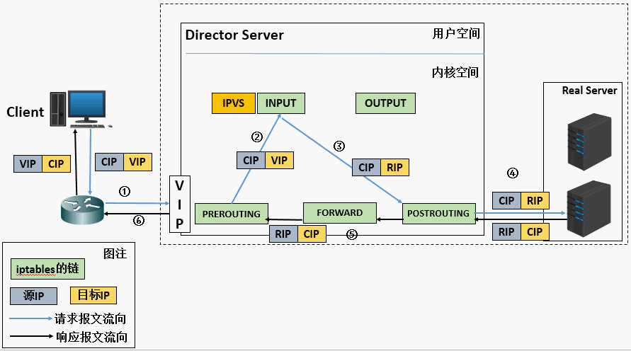
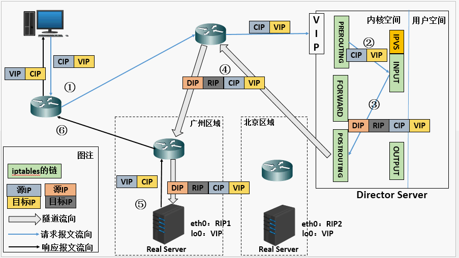

# LVS

> Linux Virtual Server, 内核自带的负载均衡器.

概念:

- Director Server: 负载均衡器所在节点.
- Real Server: 后端服务节点.
- VIP: Director Server IP
- RIP: Real Server IP 

## 1.转发模式

### 1.NAT

通过修改**数据包的目的IP**和**目的端口**来将包转发给`Real Server`.

原理:

- 步骤2->3, 通过DNAT, 将`VIP`转变为`RIP`
- 步骤5->6, 通过SNAT, 将`RIP`转换为`VIP`

**NAT**: 网络地址转换, 通过修改数据包中网络地址信息, 将一个IP地址重新映射到另一个IP地址的方法.

**DNAT**: 目标网络地址转换, 将IP包的目标地址转换为另一个地址.

**SNAT**: 源网络地址转换, 将IP包的源地址转换为另一个地址.

### 2.Direct Route

原理: 

- 步骤2->3, 将目的MAC地址转换为`R-MAC`

通常, 需要在`Real Server`配置虚IP(负载后的数据包含有VIP), 且禁用ARP解析(DS, RS上均有VIP).

DS仅替换MAC地址进行转发, 所以RS和DS应该在同一物理网络内, 二层可达.

### 3.TUN

原理:

- 步骤2->3, 将数据包装再另一个IP包内(**源IP: DIP, 目的IP: RIP**), 这个包会发送给RS

## 配置

## 其他负载均衡设备

### Haproxy

TCP和HTTP负载均衡器

### Nginx

常用做HTTP负载均衡器

## 参考

https://tonydeng.github.io/sdn-handbook/linux/loadbalance.html

