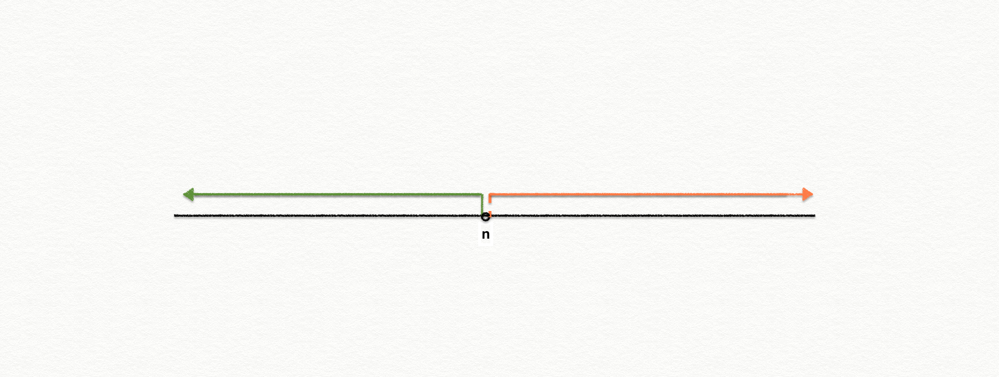

# 二分

> 二分: 区间在某个点左侧, 满足某个性质, 右侧则不满足. 通过循环判断中间点(`mid = l+r>>1 或者 mid = l+r+1>>1` 满足的性质, 可以快速定位到**性质的分界点**. 
>
> 二分就是根据左右性质的不一致, 快速定位到分界点.
>
> 
>
> 

## 1.整数二分模板

> 整数二分存在一个问题, **性质分界点是属于左侧还是右侧**. 
>
> 根据分界点所述不同, 计算`mid`的方法存在差异. 
>
> 先根据上下文信息, 写出`check()`方法, 更新 `l /r`的值, 然后根据以下模板, 如果是`r=mid`的情况, 则`mid=l+r>>1`, 如果是`l=mid`的情况, 则`mid=l+r+1>>1`

- ```c++
    /*
       c++版本
            分界点         (分界点)
       l______|_____mid_____|______r
    */
    
    
    int bsearch_1(int l, int r)
    {
        while (l < r)
        {
            int mid = l + r >> 1;
            // 适用于 右侧 为满足情况, 且包含分界点
            if (check(mid)) r = mid;
            else l = mid + 1;
        }
        return l;
    }
    
    int bsearch_2(int l, int r)
    {
        while (l < r)
        {
            int mid = l + r + 1 >> 1;
            // 适用于 左侧 为满足情况, 且包含分界点
            // 当 l = 1, r = 2 时, mid=1, l=mid=1, 会陷入死循环. 所以需要 +1 避免
            if (check(mid)) l = mid;
            else r = mid - 1;
        }
    return l;
    }
    ```
    

## 2.python 二分 bisect

- `bisect.bisect_left`:  匹配到的点的左侧.
- `bisect.bisect`:  匹配到的点的右侧.
- `bisect.bisect_right`:  和 `bisect.bisect`一致.

## 3.浮点数二分

> 无边界问题, 当区间长度 `r-l`足够小时, 例如`< 1e-6, 可以认为获得正确解.
>
> 也可以固定循环100次.

