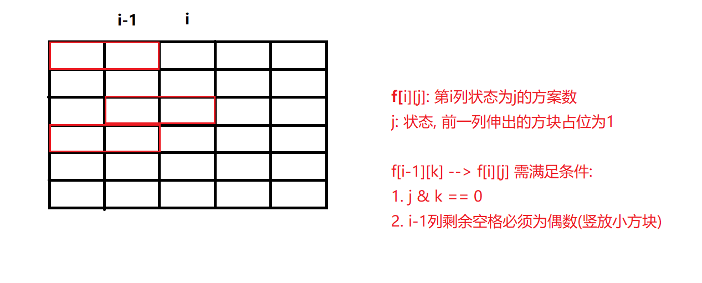

# 动态规划 Dynamic Programming

## 1.斐波那契数列 Fibonacci Sequence

> 定义: F(1)=F(2)=1, F(n)=F(n-1)+F(n-2) (n>=3)

### 1. 朴素递归

```python
def fib(n):
    if n <= 2:
        return 1
    else:
        return fib(n-1) + fib(n)
```

### 2.缓存子问题

```python
memo = {}
def fib(n):
    if n in memo:
        return memo[n]
    if n <= 2:
        f = 1
    else:
        f = fib(n-1) + fib(n)
    memo[n] = f
    return f
```

### 3.自下而上DP

> 后续状态是根据前面状态计算出的, 可以先计算前面的值, 依次推导后续值.

```python
def fib(n):
    mem = [ ]
    for k in range(1, n+1):
        if k <= 2:
            f = 1
        else:
            f = mem[k-1] + mem(k-2)
            mem[k]= f
         return mem[n]
```

## 2.解决PD问题的方法

> [参考 *闫氏DP分析法  : -)*](https://www.bilibili.com/video/BV1X741127ZM)
>
> DP问题 -- > 有限集中的最值问题

1. **状态表示**: `f[i, j, ...]`
- 集合f的含义是什么?
    - 每个维度参数的含义是什么?
    
- 例如0-1背包问题, `f[i, j]` 表示物品数量为`i`, 背包体积为`j`时, 最大价值.
  
2. **状态计算**: 集合划分, 寻找最后一个不同点, 然后分为不同的情况(集合).

    - 例如:01背包问题:  `f[i, j] = max{f[i-1, j], f[i-1, j-v(i)]+w(i)}`

3. 优化.

    - 例如减少维度.

## 3.背包问题

- **01背包问题**: `N`件物品, 容量为`V`的背包, 第i件物品体积是`v(i)`, 价值是`w(i)`, 数量是`1`, 求最大价值.

    - 状态表示: `f[i, j]` 物品数量为i, 背包体积为j时的的最大价值.
    - 状态计算: `f[i, j] = max{f[i-1, j], f[i-1, j-v[i]] + w[i]}`
    - 优化: 滚动数组, 优化为一维.

- **完全背包问题**:  `N`件物品, 容量为`V`的背包, 第i件物品体积是`v(i)`, 价值是`w(i)`, 数量是`+∞`, 求最大价值.

    - 状态表示: `f[i, j]` 物品数量为i, 背包体积为j时的的最大价值.

    - 状态计算: `f[i, j] = max{f[i-1, j-k*v[i]] + k*w[i] | 0<=k*v[i]<=j}`

    - 优化

        - ```
            f[i, j] = max{f[i-1, j], f[i-1, j-v] + w, f[i-1, j-2*v]+2w, f[i-1, j-3*v]+3w ... }
            f[i, j-v] = max{f[i-1, j-v], f[i-1, j-v-v]+w, f[i-1, j-v-2*v]+2*w ....}
            
            # 由上可以推导出 
            f[i, j] = max(f[i-1], j), f[i, j-v]+w)
            ```

- **多重背包问题**:  `N`件物品, 容量为`V`的背包, 第i件物品体积是`v(i)`, 价值是`w(i)`, 数量是s(i)`, 求最大价值.

    - 状态表示: `f[i, j]` 物品数量为`i`, 背包体积为`j`时的的最大价值.
    - 状态计算: `f[i, j] = max{f[i-1, j], f[i-1, j-v]+w, f[i-1, j-2v]+2w ... f[i-1, j-kv] + kw} | (j<=kv & k<=s`
    - 优化:
        - 把第i件物品组合为`(v, w), (v*2, w*2), (v*4, w*4), (v*8, w*8), (v*2^k, w*2^k), (v*c, w*c)`的一组物品. 每个新组合的物品最多选一次, 即可组合出s范围内的所有的第i件物品的选择.(1, 10, 100, 1000, 可以组合为1111中的任意一个数, 二进制的思想)

- **分组背包问题**: `N`件物品, 容量为`V`的背包, 第i件物品体积是`v(i)`, 价值是`w(i)`, 分为`K`组,  每组内部最多选出一个. 求最大价值.

    - 状态表示: `f[i, j]` `i`组物品, 背包体积为`j`时的最大价值.
    - 状态计算: `f[i, j]=max(f[i-1, j], f[i-1, j-v[i][k]]+w[i][k])| 0<=k<=s[i](k为i组物品的数量)`

## 4.线性DP

> 关键是状态如何划分， 初始化状态的设置。

- 最长上升子序列:

    - `st = []`: 记录上升序列.
        - `if q[i] > st[-1]: st.append(q[i]) `
        - `else: 用 q[i] 替换st中大于等于q[i]的最小的元素(bisect.bisect_left(q[i]))` 

- **最长公共子序列 LCS**: 字符串A和字符串B, 求即是A的子序列又是B的子序列的字符串最长长度.

    - 状态表示: `f[i][j]`, 所有在第一个序列的前i个字母中出现, 且在第二个序列的前j个字母中出现的子序列最大长度.

    - 状态计算: 以`A[i], B[j]`是否在子序列中作为划分依据.

        - 1.`A[i], B[j]`都不选: `f[i-1][j-1]`.

        - 2.选`A[i]`, 不选`B[j]`: `f[i][j-1]` -->  `A[i]`可能在子序列中, 也可能不在, 包含2和1两种情况.

        - 3.不选`A[i]`, 选`B[j]`:  `f[i-1][j]` --> `B[j]`可能在子序列中, 也可能不在. 包含3和1两种情况.

        - 4.`A[i], B[j]`都选: 只有在`A[i]==B[j]`的情况下才会出现 `f[i-1][j-1] + 1`.

        - ```python
            f[i][j] = max(f[i][j-1], f[i-1][j])
            if A[i] == B[j]:
                f[i][j] = max(f[i][j], f[i-1][j-1]+1)
            ```

## 5.区间DP

> 在分阶段地划分问题时，与阶段中元素出现的顺序和由前一阶段的哪些元素合并而来由很大的关系。令状态`f(i, j)` 表示将下标位置`i` 到`j`的所有元素合并能获得的价值的最大值，那么`f(i, j)=max{f(i,k)+f(k+1, j)+cost}, cost为代价` 为将这两组元素合并起来的代价。

- 石子合并: 
    - 状态表示: `f[i][j]`将第`i`至`j`颗石子合并代价最小值.
    - 状态计算: `f[i][j] = min(f[i][k], f[k+1][j]) + s[j]-s[i-1] | i<k<j`
        - **当计算`f[i][j]`区间时, 需要保证较小的子区间已经计算完成.**
        - 所以, 需要先枚举区间长度. `for l in range(2, n+1):` 然后枚举左端点和`k`值.

## 6.状态压缩DP

> 使用整数(二进制数)标识状态, 达到优化状态转移的目的.

### 1.蒙德里安的梦想

> 求把`N*M`的棋盘分割成若干个`1*2`的的长方形，有多少种方案。



- 状态表示: `f[i][j]`, 在第`i`列状态为`j`的方案数. 

    - 棋盘由第`0`列开始, 到`m-1`列结束.
    - 初始化`f[0][0]=1, f[0][j|j!=0]=0`. 第`0`列只有`f[0][0]`一种状态.
    - `m`列的状态为`0`时, 说明`m-1`列无小方块伸出. 即结果为`f[m][0]` .

- 状态计算:  上一列中, 状态与当前状态契合(合法)的方案数之和.
  
    - `st[]`: 计算出每一个状态是否存在连续奇数个`0`.
        - **重要： 由于需要计算高位全为0时的奇偶状态， 所以事先求st时，需要定长的n， 也就是说不同的n，求出的s[i]值不同**
    - 契合的条件: 
        - `j & k ==0 `: 前一列伸出的和前前一列伸出的不冲突.
        - `st[k|j] = False`:  前一列被占的(k) 和 前一列横向放置的(j) 剩余的位置必须为偶数(竖向放置)
    

### 2.最短`Hamilton`路径

> Hamilton路径: 从0 点触发走到n-1号点. 不重不漏的经过每个点恰好一次.

- 状态表示: `f[i][j]`:  `i`为状态, 记录走过的路径. `j` 为走到的点.

    - 初始状态`f[0][0]=0`, 由0点出发, 记录`0`号点. 路径为0.
- 状态计算:
- `f[i][j]`状态成立, 肯定需要满足`i >> j & 1 != 0`
    - `f[i][j] = min(f[i][j], f[i-(1<<j)][k] + w[k][j])`: 
    - 状态`i`的前一状态为`i - (1<<j)` 
    - 由`k`走到`j`点需满足: `i>>j && 1`, 路径`i`包含`j`点; `(i-(1<<j))>>k & 1`, 路径包含`k`点. 

## 7.树型DP

> 树形 DP，即在树上进行的 DP。由于树固有的递归性质，树形 DP 一般都是递归进行的。

- 没有上司的舞会
    - 状态表示:
        - `f[i][0]`: 所有从以`i`为根的子树中选,  不选`i`点的方案.
        - `f[i][1]`: 所有从以`i`为根的子树中选,  选`i`的方案.
    - 状态计算:
        - $f[i][0] = \sum(max(f[s][0], f[s][1]))$
        - $f[i][1] = \sum(f[s][0])$

## 8.记忆搜索

> 缓存下来函数的结果. 当再次访问时, 直接取记录结果即可. 
>
> 关键点: **1.对未计算的函数利用特殊值进行标记(例如-1, None),    2.如果已经计算出结果, 直接返回结果, 3.注意区分特殊标记和初始值的区别(判定完特殊标记后需要按情况赋初始值)**

- 滑雪:

    - 状态表示: `f[i][j]` 滑(i, j)点最多可滑的距离.

    - 状态计算: 四个方向满足条件, 且高度较低的点+1的最大值.

## 9.字符串匹配

### 1.正则

> `.`匹配一个, `*`匹配零个或者多个**前面**的字符
>
> s: 配匹配串, p: 正则串

- 状态表示: `f[i][j]` `s`的前`i`个字符, `p`的前`j`个字符匹配的结果.

- 边界条件: 

    - `f[0][0]= True`
    - `f[0][j] = f[0][j-2] when p[j] == '*'`

- 状态计算:

    - `s[i]==p[j]`: `f[i][j] = f[i-1][j-1]`

    - `p[j]=='.'`: `f[i][j] = f[i-1][j-1]`
    - `p[j]=='*'`:  可以对`p[j-1]`匹配0次或者多次
        - 0次, 相当于p串直接删除j, j-1两个字符: `f[i][j] = f[i][j-2], s[i] != p[j-1]`
        - 多次,  1.能匹配`s`最后一个字符, 将最后一个字符删除, 继续匹配, 2.不能匹配最后一个字符, 移除p串的`字符+#号`:`f[i][j] = f[i-1][j] or f[i][j-2], s[i] == p[j-1] or p[j-1] == '.'`

```python
s, p = ' ' + s, ' ' + p
n, m = len(s), len(p)
dp = [[False for j in range(m)] for i in range(n)]

# 初始化边界条件
dp[0][0] = True
for j in range(1, m):
    if p[j] == '*':
        dp[0][j] = dp[0][j-2]

for i in range(1, n):
    for j in range(1, m):
        if p[j] == s[i] or p[j] == '.':
            dp[i][j] = dp[i-1][j-1]
        elif p[j] == '*':
            # 不匹配的情况
            dp[i][j] = dp[i][j-2]
            # 匹配
            if p[j-1] == s[i] or p[j-1] == '.':
                dp[i][j] = dp[i][j] or dp[i-1][j]
           

```

### 2.通配符

> '.'匹配一个字符, '*'匹配零个或多个字符
>
> s: 配匹配串, p: 正则串

- 状态表示: `f[i][j]` `s`的前`i`个字符, `p`的前`j`个字符匹配的结果.

- 边界条件: 

    - `f[0][0]= True`
    - `f[0][j] = true when p[0-j] 都为'*'`

- 状态计算:

    - `s[i]==p[j]`: `f[i][j] = f[i-1][j-1]`

    - `p[j]=='.'`: `f[i][j] = f[i-1][j-1]`
    - `p[j]=='*'`:  可以匹配0次或者多次`f[i][j] = f[i-1][j] or f[i][j-1]`