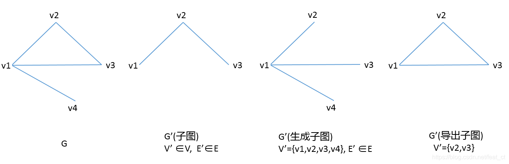

# 图论

## 1.基础

### 1.基本概念

- 图: 由顶点和顶点之间的边组成的集合;
- 顶点(Vertex): 数据元素节点;
- 无向边: 顶点到顶点之间没有方向;
- **无向图**: 任意边无向.
    - **连通图**: 任意两个顶点均连通.
    - **树**: 无环连通图.
- **有向图**: 任意边有向. 
- **有向无环图 DAG**:  能够拓扑排序的图, DAG一定能拓扑排序.  也成为**拓扑图**.
- **度数 Degree**: 与顶点v关联的边的条数.
    - **出度 Out-Degree**: 有向图中, 以顶点v为起点的边的条数.
    - **入度 In-Degree**: 有向图中, 以顶点v为终点的边的条数.
- **自环**: 由自己指向自己的边.
- **重边**: 两个点之间有多条边.
- **子图**: 所有顶点和边都属于图G的图.
    - **生成子图**: 含有G的所有顶点的子图.
- 
  
- **生成树**: 一个*连通无向图*的生成子图，同时要求是树(**无环图连通图**).
    - **最小生成树 Minimum Spanning Tree, MST**: 边权和最小的生成树. 

### 2.图的存储

- **直接存边**:  使用数组存边, 每个元素包含起点, 终点, 权重.`[(b, e, w), ....]`
- **邻接矩阵**: 使用一个二维数组来存边, 其中`g[u][v]`为`u`到`v`的边的权重, 0 表示边不存在(**适合稠密图 m和n^2同级别, m为边数, n为顶点数**).
- **临接表**: 使用一个**支持动态增加元素的数据结构**(动态数组, 链表) 所**组成的数组**. 数组元素`graph[u]`为u点发出的所有边的信息.
- 有向图和无向图的存储区别: 
    - 无向图: 有两个指向边的有向图.

### 3.图的遍历

#### 1.DFS 深度优先搜索

> DFS的特点:
>
> 1. **递归调用自身**
> 2. 对已访问过的节点打上标记, 确保**每个点仅访问一次**.
> 3. 注意dfs的初始参数.

```python
# u可以是图中的一个顶点，也可以是抽象的概念, 如 每一行.
def dfs(u):
  for x in u的相邻节点
    if x 没有打过访问标记 then
      dfs(x)
```

#### 2.BFS 广度优先搜索

> 特点:
>
> 1. 维护一个队列和一个访问记录.
> 2. 每次从队列中抛出一个点, 然后将其未访问的连接点入队.

```python
def bfs(s):
  q = queue()
  # q: 按层遍历的关键, 每一层依次如队, 依次出队.
  # visited: 是否访问过的标记
  q.push(s), visited[s] = True
  while not q.empty():
    u = q.pop()
    # 遍历所有的子节点. 并将子节点入队
    for v in edge(u):
      if (!visited[v]):
        q.push(v)
        visited[v] = True
```

## 2.拓扑排序 Topological Sorting

> 将图中的顶点以线性方式进行排序, 使得对于任何的顶点u到v的有向边(u, v), 都可以有u在v前.
>
> ```mermaid
graph LR;
	A((A))
	B((B))
	C((C))
	A ==> B;
	A ==> C;
	B ==> C;
	D[拓扑排序: A B C]
	```

- BFS方法实现:
    1. 记录所有节点的入度数.
    2. 将入度为0的点入队.
    3. 循环执行: a.弹出并记录队首节点. b.将该节点指向的节点 入度减一. c.遍历这些节点, 如果入度为0, 入队.
    4. 循环结束, 如果拓扑序列长度与原有节点相同, 则原图可以进行拓扑排序.

## 3.最短路问题

> 最短路问题: 网络中的每条边有权重, 找出两节点之间总权重最短的路径. n 为顶点数量, m 为边数量
>
> ```mermaid
> graph LR;
> A[最短路]
> B[单源最短路 计算给定点到其他所有点的距离]
> C[多源汇最短路 任选两点最短路]
> D[全正权边]
> E[负权边]
> F(朴素 Dijkstra算法 稠密图)
> G(堆优化版 Dijkstra算法 稀疏图)
> H(SPFA算法 通常速度快)
> I(Bellman-Ford算法)
> J(Floyd算法)
> A ==> B;
> A ==> C;
> B ==> D;
> B ==> E;
> D ==> F;
> D ==> G;
> E ==> H;
> E ==> I;
> C ==> J
> ```
>
> 

### 1.单源最短路

> 给定一个顶点为源, 计算源到其他所有各顶点的最短路径(加权)

#### 1.全正权边

>  朴素Dijkstra算法 $O(n^2)$, 适用于稠密图(m 和 n ^2 同级别)
>
>  堆优化版本的Dijkstra算法$O(mlog_n)$, 适用于稀疏图(m 和 n 同级别)
>
>  **核心思想**: 每次**在未确定最短路的集合中**, 找出**最小值**, 即为该点的最短路径, **使用该值, 更新其余点的路径**. 

- 朴素版:

    1. `dist` 用于记录所有点到起始点的最短路径, 初始化`dist[1]=0`, 其余点未`inf`;

    2. `st` 记录已确定最短路径的点.

    3. **循环n次**, 每次取出`dist`中路径最小且在`st`中无记录的点, 最为最短路径, 依此更新其他点到起始点的距离.

        ```python
        from math import inf
        n = 100
        g = [[]]
        def dijkstra():
            dist = [inf for i in range(n)]
            st = [False for i in range(n)]
            dist[1] = 0
            for i in range(n):
                t = -1
                for j in range(1, n+1):
                    if not st[j] and (t==-1 or dist[t] > dist[j]):
                        t = j
                st[t] = True
                for j in range(1, n+1):
                    dist[j] = min(dist[j], dist[t] + g[t][j])
        ```

- 堆优化版:

    1. 将朴素版的寻找最小路径的过程使用堆进行优化.

    2. 每次从堆中抛出最小点, 如果未确定, 用此更新其他点的距离, 如果已确定, `continue`.
    
        ```python
        from math import inf
        from collections import namedtuple
        import heapq
        
        Node = namedtuple("Node", ('val', 'idx'))
        N = 100
        g = [[]]
        
        def dijkstra():
            dist = [inf for i in range(N)]
            heap = []
            dist[1] = 0
            heapq.heappush(heap, Node(0, 1))
            while heap:
                t = heapq.heappop(heap)
                
        		# st 已确定最短路径的点, 如果已经确定最短路径, 以处理过, 无需处理.        
                if st[t.idx]:
                    continue
                st[t.idx] = True
                for val, idx in g[t.idx]:
                    if dist[idx] > t.val + val:
                        dist[idx] = t.val + val
                        heapq.heappush(heap, (dist[idx], idx))
                
        ```
    

#### 2.存在负权边

> SPFA 算法, 一般$O(m)$, 最坏$O(nm)$
>
> Bellman-Ford算法 $O(nm)$

- 松弛()操作: $dist(v) = min(dist(v), dist(u) + edge(u, v))$

    - `dist`: 到某个点的最短路径,
    - `edge`: 两个点之间的边长.

- 三角不等式: $dist(v) \leq dist(u) + edge(u, v)$

- **Bellman-Ford**算法:

    - 通过对所有边进行松弛操作来渐进地降低从源结点s到每个结点v的最短路径的估值, (n-1次).

    - 也可以计算最多经过k条边的最短路(k次循环), 需要避免一次更新多条边的问题.(拷贝dist), 避免一次循环更新了串联的多条边.

    - ```python
        for i in range(n-1):
            for b, e, w in edges:
                dist[e] = min(dist[e], dist[b] + w)
        ```

- **SPFA**算法:

    - Bellman-Ford算法的优化: **用队列来维护  " 哪些结点可能会引起松弛操 ". ** 进更新需要进行松弛操作的边即可.

    - 场景: 判断是否存在负环. 适用于大多数正权图和负权图场景, 可以**优先使用.**
    
    - 求最短路径
    
        - ```python
            dist = [inf for i in range(n)]
            # st 用于记录点是否已经在队列中
            st = [False for i in range(n)]
            # q, 需要进行松弛操作的点
            q = deque()
            dist[1] = 0
            q.append(1)
            
            while q:
                # t 出队, 松弛与t相邻的边
                t = q.popleft()
                st[t] = False
                for idx, val in g[t]:
                    # 判断是长度是否更新, 如果更新, 入队
                    if dist[idx] > dist[t] + val:
                        dist[idx] = dist[t] + val
                        if not st[idx]:
                            q.append(idx)
                            st[idx]
            ```
    
    - 判断是否存在负环
    
        - **关键点1: 需要判断的是负环, 而非从1开始的路径上的负环**
        
        - **关键点2: 基于点1, 可以设置一个虚拟的点0, 该点到所有点的距离都是0, 判断该点路径上的负环**
        
        - **基于以上: dist 所有元素均初始化为0, 将所有点push进入队列(相当于从0点开始, 对所有点做一次松弛操作**
        
        - ```python
            # 如果存在负环, dist会一直被更新到-inf
            dist = [0 for i in range(n+1)]
            # cnt 记录起始点到到当前点的最短距离所经历的点(边)的个数
            cnt = [0 for i in range(n+1)]
            # st 记录点是否已经入队
            st = [False for i in range(n+1)]
            q = deque()
            
            # 初始时, 将所有点加入队列
            # 可以处理不连通图,
            for i in range(1, n+1):
                q.append(i)
            	st[i] = True
               
            while q:
                t = q.popleft()
                st[t] = False
                for idx, val in g[t]:
                    if dist[idx] > dist[t] + val:
                        # 更新最短距离和边数
                        dist[idx] = dist[t] + val
                        cnt[idx] = cnt[t] + 1
                        
                        # 当边数大于等于n时, 证明 存在负环(抽屉原理)
                        if cnt[idx] >= n:
                            return True
                        if not st[t]:
                            q.append(idx)
            return False
            ```

### 2.多源汇最短路 Floyd算法

> **源点**: 起点
>
> **汇点**: 终端
>
> 任选两个点, 求加权最短路.
>
> Floyd算法, $O(n^3)$

```python
for k in range(1, n+1):
    for i in range(1, n+1):
        for j in range(1, n+1):
            graph[i][j] = min(graph[i][j], graph[i][k]+graph[k][j])
```

## 4.最小生成树

> **生成树**: 一个连通无向图的生成子图，同时要求是树(**无环图连通图**). 包含所有定点, 之间联通, 且无环.
>
> **最小生成树 Minimum Spanning Tree, MST**: 边权和最小的生成树. 
>
> 应用场景: 如城镇间修路, 彼此可达, 且总花费最小(路径最短)
>
> 
>
> ```mermaid
> graph LR;
> A[最小生成树]
> B[Prim]
> C[Kruskal 稀疏图]
> D[朴素版 稠密图]
> E[堆优化 不常用]
> 
> A ==> B;
> A ==> C;
> B ==> D;
> B ==> E;
> 
> ```
>
> 

### 1.Prim算法

> 核心思想: 循环n次, 每次在`dist[]`中找到**不在连通块集合`s`**中的最短的点`t`. 用`t`更新其他点**到集合**的距离. 然后把`t`加入到连通块集合中.
>
> **点到集合的距离**: 点连向集合中点的距离中最短的距离.如果没有, 为`inf`.
>
> 朴素版: 适用于稠密图(m 为 n^2级别)
>
> 堆优化版: 适用于稀疏图, 没有Kruskal算法常用.

```python
from math import inf
def prim():
    dist = [inf for i in range(n+1)]
    s = {}
    ret = 0
    for i in range(n):
        t = -1
        for j in range(1, n+1):
            if j not in s and (j == -1 or dist[t] > dist[j]):
                t = j
        
        # i=0时, t = 1, dist[1] == inf
        # 除此, 如果存在dist[t] == inf, 则说明不是连通图
        if i and dist[t] == inf:
            return inf
       
        if i:
            res += res
            
        for j in range(1, n+1):
            # t点加入了集合, 点到集合的距离为原有距离和g[j][t]之间的最小值.
            dist[j] = min(dist[j], g[j][t])
            
    return res
```

### 2.Kruskal算法

> 适用于稀疏图, 时间复杂度`O(mlogm)`
>
> 思路: 1.将所有边按权重排序. 2.枚举每条边, b, e, w. 如果b, e不连通(并查集), 加入集合.

```python
deges = []
N = 510
p = [i for i in range(N)]

def kruskal():
    deges.sort(lambda x:x[2])
    
    # res 最小生成树的权重
    # cnt 边的数量
    res = 0
    cnt = 0
    for b, e, w in deges:
        if find(b) != find(e):
            # 将边加入集合, 且b,e连通
            p[find(b)] = find(e)
            res += w
            cnt += 1
```

## 5.二分图

> 节点由两个集合组成，且两个集合内部没有边的图
>
> 

### 1.染色法

> 一个图是二分图, 当且仅当图中不含奇数环(**环中边的数量是奇数**).

### 2.匈牙利算法