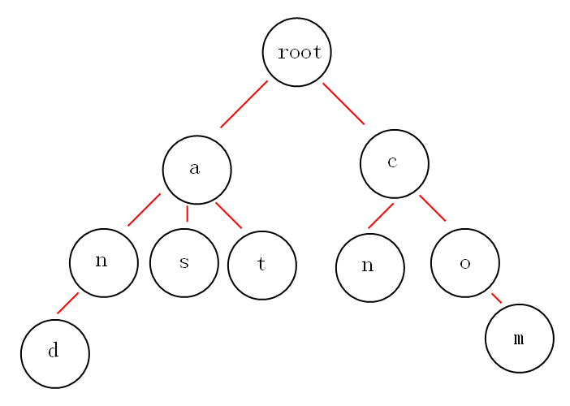

# 字符串

## 1.概念

- **子串**: 字符串S的子串S[i,j], 表示S串中从i到j这一段.
- **子序列**: 从S中将若干元素提取, 但不改变相对位置的序列.
- **后缀**: 从某个位置i(不包括开头元素)到整个串末尾结束的子串.
- **前缀**: 从串首到某个位置i(不包括结尾元素)的特殊字符串.
- **回文串**: 正写和倒写相同的字符串.
    - 长度为奇数的回文称为奇回文.
    - 长度为偶数的回文称为偶回文.
- 单模式匹配算法: 在一个模式串和一个主串之间进行匹配.
- 多模式串匹配算法:  在多个模式串和一个主串之间做匹配.

## 2.模式匹配的BF(Brute Force)算法

```c
for (int i =0; i<n; i++)
{
    bool falg = true;
    for (int j=0; j<m; j++)
    {
        if s[i+j] != p[j]
        {
            flag = false;
            break;
        }
    }
    do_something()
}
```

## 3.KMP模式匹配算法 [参考]([http://www.ruanyifeng.com/blog/2013/05/Knuth%E2%80%93Morris%E2%80%93Pratt_algorithm.html](http://www.ruanyifeng.com/blog/2013/05/Knuth–Morris–Pratt_algorithm.html))

### 1.简介

- **核心思想:利用子串结构, 和已匹配的信息, 尽可能让子串右移多位**;

    1. 利用以知的子串, 生成一个部分匹配表, 如字符串'ABCDABD'

        

    2. 进行匹配时, 如果某个位置字符不满足, 则查表找出**最后一个匹配的字符对应的匹配值**, 例子为`B: 2`

        

    3. 子串向后移动: **移动位数已匹配的字符数-对应的部分匹配值**, 例子: `6 - 2 = 4`

        

- 部分匹配表的产生

    -  **部分匹配值**就是"前缀"和"后缀"的**最长的共有元素的长度**
    -  例如
        -  `A`: 0
        -  `AB`: 0
        -  `ABC`: 0
        -  `ABCD`: 0
        -  `ABCDA`: 前缀`[A, AB, ABC, ABCD]`, 后缀`[A, DA, CDA, BCDA]`, 共有元素为`A`, 长度为1;
        -  `ABCDAB`: 前缀`[A, AB, ABC, ABCD, ABCDA]`, 后缀`[BCDAB, CDAB, DAB, AB, B]`, 共有元素为`AB`, 长度为2;

### 2.算法实现

```python
# p, s, n=len(s), m=len(p)
# i 指向长串 s
# j 指向短串 p

j = 0
for i in range(n):
    while j and p[j] != s[i]:
        # 不匹配, j向前移动
        j = ne[j-1]
    # 匹配, j 后移一位
    if p[j] == s[i]:
        j += 1
    # 字串匹配成功
    if j == n:
        j = ne[j-1]
```

-  求`next`数组

  ```python
p = "ABCDAB"
n = len(p)
j = 0
ne = [0 for i in range(n)]
for i in range(1, n):
    while j and p[j]!=p[i]:
        # j -= 1 可以优化为 j = ne[j-1]
        j -= 1
    if p[j] == p[i]:
        j += 1
    ne[i] = j
  ```
  
  

## 4.字符串hash

- 定义: 将字符串看做`P`进制的数, 例如"ABCD"
    - $(ord('A') \times P^3 + ord('B') \times P^2 + ord('C') \times P^1 + ord('D') \times P^0) \mod Q$
    - **经验值: $P = 131 或者 13331, Q=2<<63$**
- 对于字符串`str="ABCABCD"`:
    - 预先求出`P`的`0-n`次幂
    - 求字符串的前缀哈希
        - $h[i] = (h[i-1] \times P + str[i]) \mod Q$
- 利用前缀哈希, 可以求出任意子串的hash值.

    - `(高位)1_______L_________R___(低位)`
    - $h[L, R] = (h[R] - h[L-1] \times P^{R-L+1} ) \mod Q$
- 作用:
    - 字符串匹配: 求每个长度为模式串长度的子串的哈希值. 分别与模式串哈希值比较即可.
    - 最长回文子串: 
        - 分别预处理正着和倒着的哈希值.
    - 确定字符串不同子字符串的数量.

## 5.字典树(Trie树)



- 基本性质：

    - 1.根节点不包含字符，除此之外，每个节点包含一个字符；
    - 2.从根节点到某个节点，路径上的字符连接起来，为该节点对应的字符串；
    - 3.每个节点的子节点字符互不相同；
    - 通常, 会在节点结构中设置一个标志, 用来标记该节点处是否构成一个单词;
        - **最后的结点, 根据需求不同, 可以记录字符串长度, 字符串本体, 布尔值等信息**

- 实现：

    ```c
    struct trie_node{
        int count;						// 有多少个字符串经过
        struct trie_node * children[];	// 子节点
        char val;						//该节点值
    }
    ```

- 优缺点：

    - 优点：插入和查询效率高，可以快速按字典排序；核心思想：空间换时间，利用公共前缀减少无谓比较，

    - 缺点：空间消耗大；

## 6.马拉车算法

> 用于查找一个字符串的最长回文子串的算法.

- 预处理: 由于奇偶回文的情况不一样, 需要分别处理, 为了简化, 可以进行预处理.
    - 在每个字符的左右两边都加上特殊字符(不存在于原字符串中的字符), 让字符串变成奇回文.
        - `abba` --> `#a#b#b#a#`
        - `aba` --> `#a#b#a#`
    - 前后加上哨兵, 防止越界:
        - `aba` --> `#a#b#a#` -- > `\1#a#b#a#\2`
    
- Manacher算法 

    - `p[]`: 数组, 记录每个位置的回文串的半径.

    - `mx`: 构成回文串的**右端点的最大值**.
    - `center`: `mx`回文串对应的中心位置. `mx = center + p[id]`
    - Manacher算法核心: `p[i] = min(mx-i, p[2*id-i])`
        - ![p[i]](./image/Manacher.jpg)

- `mx`点的更新:

    - 当有回文串的右端点大于`mx`时, 需要更新. 同时需要更新对应的`center`.

- `p`和回文串的关系.

    - 情况1: `#A#A#` p[i] = 2, 回文串长度为 2.
    - 情况2: `#A#B#A#` p[i] = 3, 回文串长度为3.
    - **也就是p[i] 中存储的就是回文串的长度**.

- ```python
    def manacher(s):
    
        if len(s) <= 1:
            return s
    
        # 每个字符之间插入 \0, 
        # 前后插入哨兵\1, \2.
        ss = '\1\0' + '\0'.join([x for x in s]) + '\0\2'
        p = [0] * len(ss)
        center, center, max_str = 1, 1, ''
        
        for i in range(1, len(p)-1):
    
            if i < mx:
                j = 2 * center - i # i 关于 center 的对称点
                p[i] = min(mx-i, p[j])
    
            # 尝试继续向两边扩展，判断下一位置是否相同
            # 不必判断是否溢出，因为首位均有特殊字符，不会满足条件, 肯定退出
            while ss[i - p[i] - 1] == ss[i + p[i] + 1]: 
                p[i] += 1
    
            # 更新中心
            if i + p[i] > mx:
                mx = i + p[i]
                center = i
    
    	# 更新最长串, 最长回文串的长度就是p[center]
        # 令 回文长度 = x
        # 回文长度 + 特殊字符长度 = p[center] * 2 + 1
        # x + (x + 1) = p[center] * 2 + 1 ==> x = p[center]
        max_str = ss[center - p[center] : center + p[center] + 1]
        return max_str.replace('\0', '')
    ```
    

## 7.AC自动机

> 类似`KMP`, 在 `trie` 树基础上, 增加一个`fail`指针(失配指针), 如果当前点匹配失败, 则将指针转移到`fail`指针指向的地方.
>
> 失配指针: 指向当前状态的最长后缀状态.

> 对字符串`i`, `he`, `his`, `she`, `hers`组成的字典树构建`fail`指针.
>
> 

### 1.建立AC自动机

- 结点定义:

    - ```python
        class AcNode:
            def __self__(self, val):
                self.val = val
                self.son = [None] * 26  # a~z 这26个字符
                self.isEnd = False      # 是否结束
                self.length = -1;       # 长度
                self.fail = None        # fail 指针
        ```

- 分为两步:
    - 将所有模式串构建`Trie`树.

    - 对Trie树上所有结点构造失配指针(`fail`指针).

        - 

        - 构建过程, 以`6`结点为例(`root` 的失配指针指向自己):

            - 1.找到父节`5`的`fail`指针指向的结点`10`, 判定, `10`结点是否有字符`s`连出. 有指针指向这个点, 无继续下一步.
            - 2.跳到`10`的`fail`指针, `0`, 查找是否有字符`s`连出. 有, 指向. `6`的fail指针指向`7`.
            - 3.如果根结点没有找到匹配的字符, `fail`指向根结点. 

        - ```python
            class AcNode:
                def __self__(self, val):
                    self.val = val
                    self.son = [None] * 26  # a~z 这26个字符
                    self.isEnd = False      # 是否结束
                    self.length = -1;       # 长度
                    self.fail = None        # fail 指针
                    
            from collections import deque
            def build(root):
                root.fail = root
                queue = deque()
                queue.append(root)
                while queue:
                    # p: 父节点
                    # now: p 的子结点
                    # p_fail: 父节点的失配指针
                    p = queue.popleft()
                    for i in range(26):
                        now = p.son[i]
                        if now is None: continue                # son不存在
                        if p is root: now.fail = root           # root的子节点失配指针指向root
                        else:
                            p_fail = p.fail                     # 父节点的失配指针
                            while  is not None:
                                fail = p_fail.children[ord(pc.data)-ord('a')]
                                if fail is not None:
                                    now.fail = fail
                                    break;
                                # 如果没有匹配, 就查找失配指针的失配指针
                                p_fail = p_fail.fail
                            else:
                                # 没有找到. 指向root
                                now.fail = root
                            # 加入队列
                            queue.append(now)
            ```

### 2.匹配过程

```python
def match(text):
    n = len(text)
    p = root
    for i in range(n):
        idx = ord(text[i]) - ord('a')
        while p.son[idx] is not None and p is not root:
            # 如果不匹配, 移动到p的失配指针
            p = p.fail

        p = p.son[idx]
        if p is None: p = root
        tmp = p
        while tmp is not root:
            if tmp.isEnd:
                pos = i-tmp.length+1
                print(pos, tmp.length)
            tmp = tmp.fail
            
```


