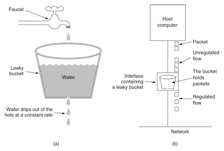

# 扩展算法

## 1.缓存淘汰算法

> 以整理买过的书为例.
>
> FIFO: 先进先出, (队列) : 淘汰的是最早买的书.
>
> LFU: 最少使用. 淘汰的是最少使用的(最小堆): 淘汰的是看的次数最少的书.
>
> LRU: 最近最少使用. 淘汰的是最长时间未被使用的: 淘汰的是最长时间没有被看过的书.

- LRU的实现

    - ```python
        from collections import OrderedDict
        
        d = OrderedDict()
        
        # 最新访问的在尾部
        # 最远访问的在头部
        
        def access(key):
            # 如果存在, 移动到头部
            # 如果不存在, 插入到头部, 判断是否需要删除
        	if key in d:
        		d.move_to_end(key)
            else:
                # 是否已满
                d[key] = 'xxx'
                if len(d) > max_cache:
                    delete()
                
        def delete():
        from collections import OrderedDict
            # 从尾部删除
            d.popitem(Flase)
        ```

## 2.布隆过滤器 Bloom Filter

> 当布隆过滤其说某个值存在时, 这个值可能不存在, 当它说**不存在时, 那就肯定不存在**.
>
> 主要用于查询某个东西是否在一个存有大量数据的池子中;

- 原理:

    - 使用**多个不同的哈希函数**, 生成并记录多个值;
    - 当要判断某个值是否存在时, 使用哈希函数计算, 如果所有哈希值均存在, 则该值可能存在, 如果有哈希值不存在, 则该值肯定不存在; 

    

- 特点:
  
    - 支持`add, isExist`, 不支持`delete`操作;

## 3.HyperLogLog

> 占用空间固定, 唯一值计数.

## 4.限流算法

### 1.计数器(固定窗口)

- 维护一个计数器, 单位时间开始清零, 产生请求加1.
- 无法应对小范围时间的短时突发流量.

### 2.滑动窗口算法

- 例如: `rest_framework`限流. 配置 `num_requests/duration`
    - 针对不同的限制维度(用户, 远端ip, 特定接口等)维护一个`list`, 记录每次请求时间.
    - 每次请求时. 根据当前时间和`duration`, 清除记录中的过期信息.
    - 然后判定剩余的请求记录数量是否已超出设定的`num_requests`, 超出则拒绝请求.

### 2.漏桶算法

> 所有请求放入队列中, 按照固定速率从队列中取出请求发到后端.


### 3.令牌桶算法

> 固定速率向队列中放入令牌, 请求需要先获取令牌, 才能发向后端.


## 5.分布式唯一ID生成器

- 字符串类型: `UUID`
- 整形ID: 
    - 类型采用64位的`long`类型.
    - 方案1: 数据库自增. 需要等事务提交后, ID才生效.
    - 方案2: `Snowflake`算法:
        - 每台机器分配一个唯一标识, 然后通过`时间戳+标识+自增`实现全局唯一ID.

- 使用`53位`?
    - 为了方便和前端交互, JavaScript支持的最大整数就是`53`位, 超出需要使用字符串传递.