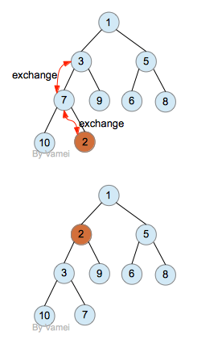
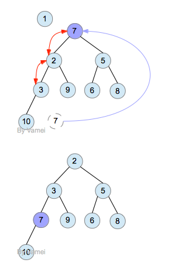

# 数据结构

> 逻辑结构: 数据元素间的相互关系, 分为**集合, 线性结构, 树形结构, 图形结构**
>
> 物理结构(存储结构)：在计算机中的存储方式，分为**顺序存储**和**链式存储**；

## 1.链表

- 单项链表的反转: [35. 反转链表 - AcWing题库](https://www.acwing.com/problem/content/33/)

    - 递归:
    - 迭代: 记录前一个链表元素.

- 环的判定: [34. 链表中环的入口结点 - AcWing题库](https://www.acwing.com/problem/content/description/86/)
    - 1.快慢指针相遇: 存在环
    - 2.快指针走的距离是慢指针的两倍, 2(x+y),  可以看出, 快指针在圈上走了x+2y. 回退y步即是圈的入口, 所以, (x+2y)-y=x+y是圈周长的整数倍.
    - 3.在相遇点, 已经相较于入口, 走了距离y, 所以, 再向前走x, 即可走到圈的入口.
    
- 有序链表合并: [36. 合并两个排序的链表 - AcWing题库](https://www.acwing.com/problem/content/34/)

- 删除链表倒数第n个节点: [33. 链表中倒数第k个节点](https://www.acwing.com/problem/content/32/)

    - 前后指针相差`n-1`,当前面的指针走到尾部时，后面的指针正好在倒数第`n`个位置上；

- 链表的中间节点: 

- 反向打印链表: [17.从尾到头打印链表](https://www.acwing.com/problem/content/18/)

    

## 2.栈和队列

### 1.栈

- 栈：实现后进先出策略, LIFO;
- 实现了: `pop`出栈, `push`进栈;
- **应用场景**: 
    - 1.函数调用.
    - 2.四则运算表达式求值, 两个栈: 运算数和运算符栈, 依次入栈, 当运算符的优先级比栈顶元素小或者相同时, 弹出运算数和运算符进行计算, 再将结果丫栈.
    - 3.括号匹配.
    - 
- 递归: 递归必须有基本情况, 递归必须改变其状态并向基本情况靠近, 递归必须以递归方式调用自身;

### 2.单调栈

> **保证栈是单调递增或者递减的. 插入元素时, 如果栈中已有元素不满足单调性, 弹出**

```python
# insert x
while !sta.empty() && sta.top() < x:          
    sta.pop()
sta.push(x)
```

- **应用**: 给定序列, 求每一个数左边与之最近且比它小(大)的数.
    - 插入一个元素后, 左侧所有比它大(小) 的数都失效. 相当于维护一个单调递减(增) 的栈.

### 3.队列

- 队列：实现先进先出策略，FIFO
- **应用场景**: 计算机系统中各种资源, 管理消息缓冲器的管理, 树的层序遍历和广度优先搜索遍历;

### 4.单调队列

> **只从队头和队尾操作, 保证元素单调**, 一般用于计算一段窗口内的最大/最小值.

- 队头: 判断是否移除窗口.
- 队尾: 如果插入的元素比前面元素小(大), 丢弃前面元素. 然后添加到队尾.

## 3.散列表(哈希表)

### 1.基本概念

> 哈希表（Hash table，也叫散列表），是根据关键码值（Key value）而直接进行访问的数据结构，也就是说：它通过把**关键码值**映射到表中**一个位置**来访问记录，以加快查找速度。数据对象集：`名称-属性`

- 散列查找的基本工作：
  - 计算位置：**构造散列函数**确定关键词存储位置；
  - 解决冲突：**应用某种策略**，解决多个关键词位置相同的问题；
- （负载因子）装填因子：`散列表包含的元素数/位置总数` 为散列表的装填因子；
  - 当**装填因子**大于指定值时, 需要重新开启空间.

### 2.散列函数

> 计算简单, 散列地址分布均匀

- 对hash表长度(一般取质数)取模: (质数（prime number）又称[素数](https://baike.baidu.com/item/%E7%B4%A0%E6%95%B0)，有无限个。质数定义为在大于1的自然数中，除了1和它本身以外不再有其他[因数](https://baike.baidu.com/item/%E5%9B%A0%E6%95%B0)）；
- 折叠法：把关键词分割成位数相同的几个部分，然后叠加；

### 3.冲突处理

- 开放寻址法(一般hash表大小需要是数据规模的2~3倍)：一旦发生冲突，就按某种规则寻找另一个地址空间(类似厕所找坑位)
  - **线性探测**：向后查找, 直到位置为空, 到结尾后需要转到开头；
  - 平方探测：以增量序列`1^2, -1^2, 2^2 , -2^2 ...` 循环探测下一个地址；
  - 双散列：`d 为i×h2(key),h2(key)`是另一个散列函数探测序列；
- 链地址（拉链法）：将相应位置上冲突的所有关键词存储在同一单向链表中, 插入元素时, 如果冲突, 插入对应链表, (一般插入表头位置);

## 4.堆 heap [参考](<https://www.cnblogs.com/vamei/archive/2013/03/20/2966612.html>)

> 完全二叉树: 除最后一层外，每一层上的结点数均达到最大值；在最后一层上只缺少右边的若干结点。
>
> 1.堆是一个完全二叉树(顺序存储)
>
> 2.堆中的每个节点的值都必须大于等于(或小于等于)子树的结点.

- 堆排序和快排的比较:
    - 1.随机访问多, 顺序访问少.
    - 2.数据比较交换多.
- 求 Top K
    - 1.建立一个大小为K的小顶堆.
    - 2.添加数据(和堆顶判断大小, 小于抛弃, 大于(弹出堆顶, 将数据插入堆)
    - 3.获取数据, 将堆内数据返回.
- 使用两个堆来确定一组数据的某个分界点.

- 最大堆的操作：

  - 插入, 删除堆顶元素,

  - 插入：插入在最后位置，判断插入该元素后是否满足了有序性？（不满足，和父结点交换）
  
    
  
  - 删除根结点：取出根结点，将**最后位元素**放到根结点上，跟子结点比较调整；
  
    
  
  - 最大堆的建立：**直接建立，然后从倒数第一个有儿子的结点，跟子结点比较建堆；**

## 5.B树

> B树, 又叫平衡多路查找树, 相对于平衡二叉树, 每个节点包含的关键字增多, 减少了树的层级, 和数据的查找次数. M阶B树表示该树每个节点最多有M个子树;
>
> B+ 树, 
>
> 相较于二叉树, B树能减少磁盘IO(降低了树的高度)

### 1.B树

> 主要用于文件系统以及部分数据库索引, 如MongoDB

- 规则, 对于一个m阶B树:

    1. 根结点至少有2颗子树;

    2. 每个中间节点都包含k-1个元素和k个孩子，其中 m/2 <= k <= m

    3. 每一个叶子节点都包含k-1个元素，其中 m/2 <= k <= m

    4. 所有的叶子节点都位于同一层;

    5. 每个节点中的元素从小到大排列, 

        

### 2.B+ 树

> 大部分关系型数据库使用B+树作为索引;

- 规则

    1. 非叶子节点不保存关键字, 只进行数据索引; 所有数据地址必须到叶子节点才能获取;
    2. 叶子节点之间根据自身顺序进行连接;
    


## 6.并查集

> 树形结构, 每个节点均保存其父节点信息. 根节点的父节点为自身(验证根节点的方式), 根节点也代表一个集合. 支持两种操作:
>
> 查找: 确定某个元素处于哪个集合
>
> 合并: 将两个子集合合并.

- 初始化: 所有的节点都是一个单独的集合, `[i for i in range(n)]`
- 查找: 向上遍历到根基点. `while q[a] != a: a = q[a]`
    - 路径压缩, 查找到根节点后, 可以将查找路径上的所有点直接指向根节点, 提高后续查找效率.
- 合并: 找到各自的根节点, 将其中一个作为另一个的根基点.

## 7.跳表

> 对原有有序序列增加多级索引, 通过索引, 可以快速定位目标位置. 可以支持快速插入, 删除, 查找操作. **在链表的数据结构基础上实现了`O(logn)`级别的查找效率, 并且支持快速插入, 删除**.
>
> redis 中的有序集合(zset)就是用跳表实现.


和其他类似数据结构的比较:
- 跳表的特点:
    - 跳表相对来说, 实现上比较简单.
    - 跳表还可以做到快速的**范围查询**.
    - 跳表的索引需要占用额外的空间.

## 8.索引( `index` )

### 1.可做索引的数据结构

- 红黑树: 插入, 删除,查找复杂度是`O(logn)`, Ext文件系统, 对磁盘块的索引, 就是红黑树.
- B+树: 更适合构建存储在磁盘中的索引.
    - 高度低于红黑树, 减少了磁盘IO
    - 范围查找支持较好.

- 跳表: 类似B+树, 更多应用于内存数据的索引.

### 2.倒排索引

> 又叫反向索引, 通过倒排索引, 可以快速获取包含这个关键词的文档列表.

- 正常的文档索引一般都是`名称-->内容`. 为了根据关键词索引到具体的诗, 可以建立索引`关键词 --> 诗名 --> 内容`

- 分词: 排除停顿词, 分解除关键词.