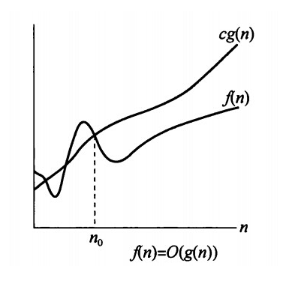
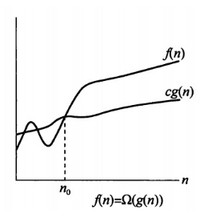
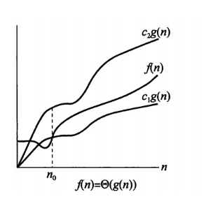

# 时间复杂度

> [参考1](http://blog.csdn.net/itachi85/article/details/54882603) [维基](https://zh.wikipedia.org/wiki/%E6%97%B6%E9%97%B4%E5%A4%8D%E6%9D%82%E5%BA%A6)

## 1.算法效率

- 时间复杂度：评估执行程序所需时间；对处理器的使用；
- 空间复杂度：评估执行程序所需的存储空间；对内存的使用；

## 2.时间复杂度定义

- 时间频度：一个算法执行所耗费的时间，理论上必须上机执行才能知道；与算法中语句执行次数成正比；一个算法中的语句执行次数称为语句频度或时间频度，记为`T(n)`, n为问题规模；
- 时间复杂度：在进行算法分析时, 语句总的执行次数`T(n)`是关于问题规模n的函数,  函数的**数量级**表示了随着 n 的值增加而增加最快的那些部分, 数量级通常称为大O符号，写为 `O(f(n))`, `f(n)`提供了`T(n)`的数量级. 称作算法的渐近时间复杂度, 简称为时间复杂度, 也叫做大O表示法;

### 1.大O( )定义 渐进上界

> 设f(n) 和 g(n) 是定义域为自然数集上的函数。如果存在 c , n0 (c ≥ 0 , n0 ≥ 0 )  , **使得对于一切的 n ≥ n0 都有 0 ≤ f(n) ≤ g(n) 成立** ， **则称 f(n) 渐近的上界是 g(n) , 记作 f(n) = O(g(n))** 。在 n ≥ n0 成立时，函数 f(n) 的阶不会高于函数 g(n) 的阶。



### 2.大Ω( )定义（big-Omega）渐进下界

> 设f(n) 和 g(n) 是定义域为自然数集上的函数。如果存在 c , n0 (c ≥ 0 , n0 ≥ 0 )  , 使得一切　ｎ ≥ ｎ０　都有　0 ≤ g(n) ≤ f(n)　成立，则称　f(n) 的渐近下界是 g(n) , 记作 **f(n) = Ω(g(n))** 



### 3.大Θ( )定义 （big-Theta）渐进精确界

> 设f(n) 和 g(n) 是定义域为自然数集上的函数。如果 lim(n -> ∞) f(n) / g(n) 存在 ， 并且等于某个常数 c (c > 0) , 那么 **f(n) = Θ(g(n)) .**



## 3.推导大O阶

> 1.用常数1来取代运行时间中所有加法常数
> 2.修改后的运行次数函数中，只保留最高阶项 
> 3.如果最高阶项存在且不是1，则去除与这个项相乘的常数。

### 1.分析方式

- 只关注循环执行行次数最多的一段代码.
- 加法法则: 总复杂度等于量级最大的那段代码的复杂度.
- 乘法法则: 嵌套代码的复杂度等于嵌套内外代码复杂度的乘积.

### 2.常见的多项式时间复杂度

#### 1.**常数阶`O(1)`**

先举了例子，如下所示。

```c
  int sum = 0,n = 100; //执行一次  
  sum = (1+n)*n/2; //执行一次  
  System.out.println (sum); //执行一次 123
```

上面算法的运行的次数的函数为`f(n)=3`，根据推导大O阶的规则1，我们需要将常数3改为1，则这个算法的时间复杂度为O(1)。如果sum = （1+n）*n/2这条语句再执行10遍，因为这与问题大小n的值并没有关系，所以这个算法的时间复杂度仍旧是O(1)，我们可以称之为常数阶。

#### 2.**对数阶`O(logn)`**

接着看如下代码：

```c
int number=1;
while(number<n){
	number=number*2;
	//时间复杂度为O(1)的算法
	...
}
```

- 可以看出上面的代码，随着number每次乘以2后，都会越来越接近n，当number不小于n时就会退出循环。假设循环的次数为X，则由2^x=n得出x=log₂n，因此得出这个算法的时间复杂度为`O(logn)`.
- 不管是以多少为底, 所有的对数的时间复杂度都记为`O(logn)`.

#### 3.**线性阶`O(m+n)`**

线性阶主要要分析循环结构的运行情况，如下所示。

```c
for(int i=0;i<n;i++){
	//时间复杂度为O(1)的算法
	...
}
```

上面算法循环体中的代码执行了n次，因此时间复杂度为O(n)。

#### 4.**平方阶 `O(m*n), O(n^2)`**

下面的代码是循环嵌套：

```c
  for(int i=0;i<n;i++){   
      for(int j=0;j<n;i++){
         //复杂度为O(1)的算法
         ... 
      }
  }
```

内层循环的时间复杂度在讲到线性阶时就已经得知是O(n)，现在经过外层循环n次，那么这段算法的时间复杂度则为O(n²)。 
接下来我们来算一下下面算法的时间复杂度：

```c
  for(int i=0;i<n;i++){   
      for(int j=i;j<n;i++){
         //复杂度为O(1)的算法
         ... 
      }
  }
```

## 4.**时间复杂度比较**

> 关于对数: 
>
> 1. 如果 $logx^n = y$ 则 $x^y = n$;
>
> 2. $log2^x$ 计算机领域可以简写为 $logx$;
> 3. 数学上简写: $log2^x$ 简写为 $lbx$, $loge^x$ 简写为 $lnx$, $log10^x$ 简写为 $lgx$;
>
> 


## 5.空间复杂度

> 除了原本的数据存储空间外，算法运行还需要额外的存储空间.