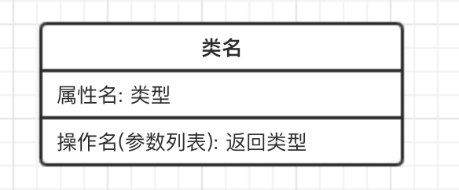
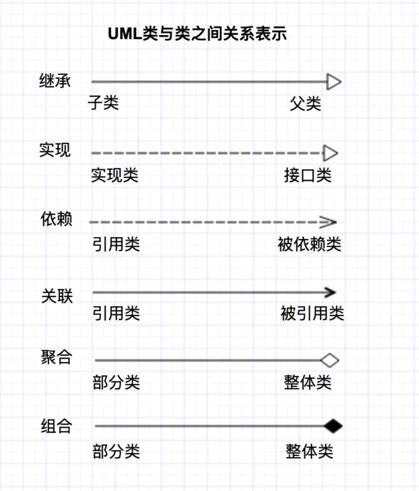
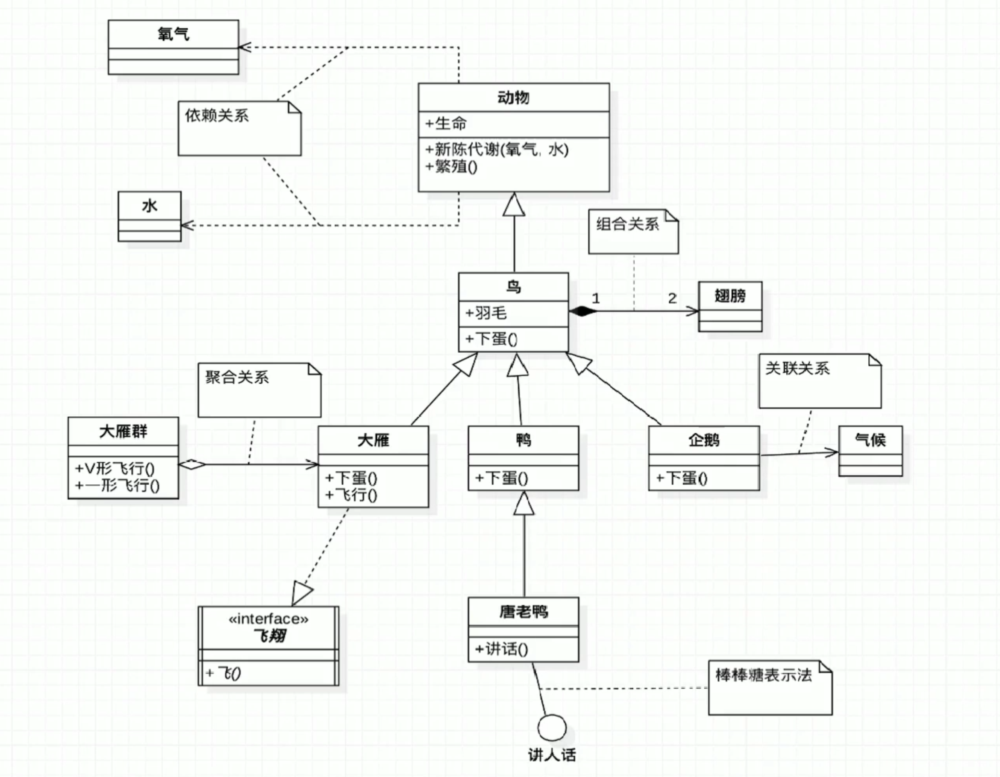
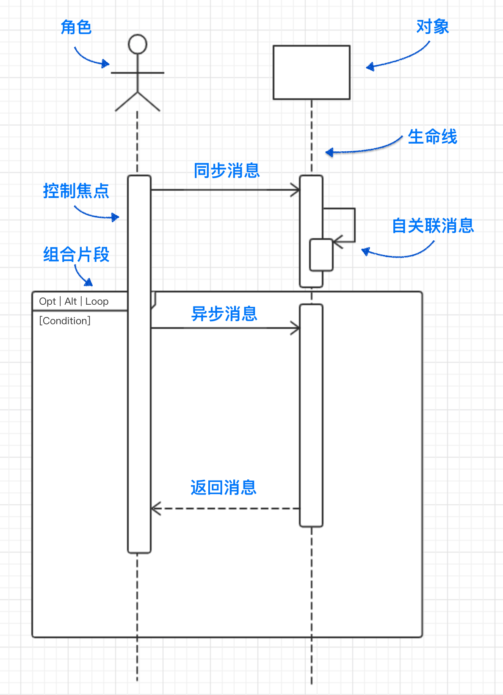

# UML 统一建模语言

## 1.面向对象主题

### 1.抽象 abstraction

- 抽象使我们专注于应用程序的本质, 同时忽略细节.
- 抽象使得我们有充足的时间去自由制定决策, 避免过早的做出不成熟的细节承诺.

### 2.封装 encapsulation

- 将对象的外部因素(可以被其他对象访问) 于内部实现细节(其他对象不可见)分离开来.

### 3.继承

- 过个类基于一种分层关系, 共享类间属性和操作. 父类拥有子类提炼和详细说明的通用信息.
- 子类包含父类的全部特征, 再加上它直接所特有的特征.

### 4.多态

- 对于不同的类, 相同的操作会有不同的动作.
- 例如对于象棋, 马和象都有移动操作, 但是移动操作的具体实施动作是不同的.

### 5.强调对象的本质

- OO技术强调对象是什么, 而不是如何使用它.
- OO开发更注重数据结构, 而较少关注过程结构.

## 1.类图

> 提供了对类及其关系进行建模的一种图形化的表示方法;

- 接口和类的基本表示:

- 属性和方法的访问控制表示:
  - `+` 表示public
  - `-` 表示private
  - `#` 表示protected（friendly也归入这类）

- 类与类之间的关系表达
  - 继承: 也叫泛化, is-a的关系.
  - 实现: 指一个类实现一个接口的功能.
  - 依赖: 一个类A使用到了另一个类B, B的变化会影响到A.
  - 关联: 描述不同类和对象之间的结构关系, 一般用于定义对象之间静态的, 天然的结构.
  - 聚合: 关联关系的特例, 体现的是整体与部分, 即has-a的关系, 但是整体和部分不是强依赖的, 即**使整体消失不存在, 部分仍然存在.**
  - 组合: 关联关系的一种特例, 体现的也是整体与部分, **但是组合关系是一种强依赖的特殊聚合关系, 整体消失, 部分也消失.**

- 类图实例

## 2.时序图

- 角色: 系统角色, 可以是人, 机器, 其他系统等
- 对象:
- 生命线: 从对象图标向下延伸的一条虚线, 表示对象存在的时间
- 控制焦点: 又称激活期, 表示时间段的符号, 在这个时间段内对象将执行相应的操作.
- 消息: 分为同步消息, 异步消息和返回消息
- 自关联消息: 方法的自身调用或者一个对象内的一个方法调用另一个方法;
- 组合片段:
  - Opt: 选项
  - Alt: 抉择
  - Loop: 循环
