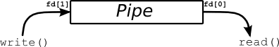
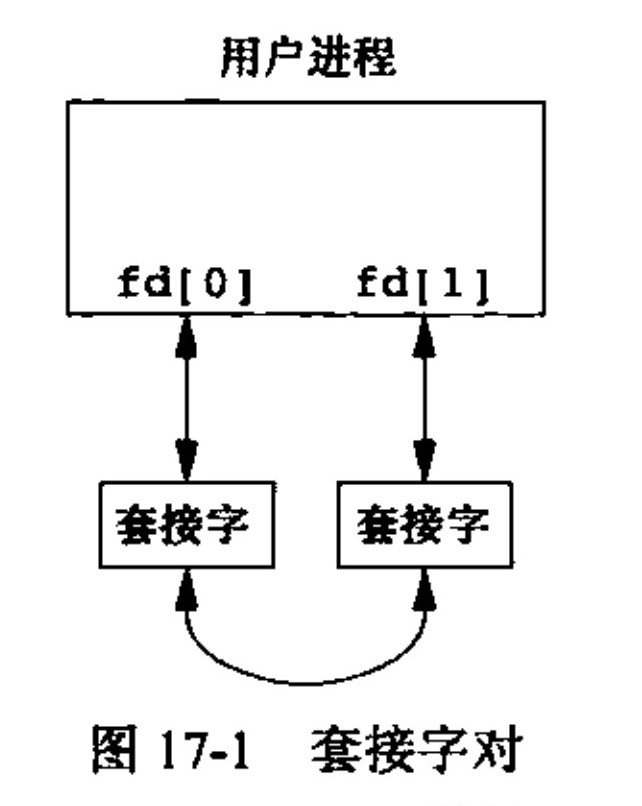

# UNIX环境编程

> cpu工作原理,自动取址执行-->管理cpu就是设置PC值-->多道程序，交替执行 --> 并发 -->  如何实现并发？（切换PC、记录返回地址) --> PCB记录信息（切出去时程序执行的上下文：进程标识符、处理机的信息（通用寄存器，指令计数器，PSW，用户的栈指针、进程调度信息（进程状态，进程的优先级...)、进程控制信息（进程同步和通信机制，链接指针...)
>
> 中断->将寄存器、PC、程序状态字、等压栈 --> 跳转到中断向量所指示的地址
>
> 进程：中断->保存上下文到PCB--> 找到目标PCB  --> 恢复PCB中信息 --> 跳转执行
>
> 进程包括一个地址空间和一个控制线程；
>
> 1.并行实体共享一个地址空间和所有可用数据的能力；2.线程更轻，比进程快10~100倍；3.加快程序执行的速度；
>
> 线程：每个线程中的内容：程序计数器，寄存器，栈，errno变量，以及线程私有数据；==堆为线程共有的==

## 一.进程

进程定义：进程就是一个正在执行的程序的实例，一个其中运行着一个或多个线程的地址空间和这些线程所需的系统资源；

进程有自己的栈空间，用于保存函数中的局部变量和控制函数的调用和返回，进程之间会共享函数程序代码和系统函数库；

### 1.进程环境

- `main(int argc, char *argv[])`函数：`argc`参数个数，`argv`参数列表`argv[0]`为函数名；


- 进程终止：`exit()`先执行清理处理（用户登记的清理函数，IO库的清理和关闭），然后返回内核；`_exit()`和`_Exit()`立即进入内核；`atexit()`登记处理函数，执行时按登记顺序的逆序执行；

  > 在`main()`中调用`exit(0)`等价于`return(0)` ；

- 进程表：保存当前进程的所有相关信息，包括PID，进程状态，命令字符串，和其他一些`ps`命令输出的各类信息。

- 环境表：每个进程都会有一张环境表,以`NULL`结尾，包含为这个进程建立的环境变量,；全局变量`environ`包含了该指针数组的地址；如需使用则需要声明`extern char **environ;`一般用户可以用`getenv()`和`putenv()`使用特定的环境变量；

  - `int putenv(char *str)` ：改变或添加环境变量，传入`"name=value"`的字符串；
  - `char* getenv(sonst chat *name);` ：获取环境变量的值；
  - `int setenv(const char *name, const char *value, int overwrite)` ：也是改变环境变量，`name`: 环境变量名，`value` ：设置值，overwrite是否重写；

- 程序空间布局，从低地址向上依次为：

  - **text**：文本段，只读，CPU执行的机器指令，共享的，存储器中通常只有一个副本；
  - **data**：数据段，存储初始化后全局变量;
  - **bss**：未初始化数据段;
  - **堆**：动态存储分配；
  - **栈**：自动变量，函数调用信息；
  - **命令行参数和环境变量**：

  >函数参数入栈顺序：从右到左；
  >
  >栈帧：函数调用时，将参数、返回地址(当前PC值的下一个值)压栈，跳转到被调函数`func()`中；跳转后`func()`的栈栈就已经形成，首先会把调用者的帧指针压栈；

- 共享库：静态库( .a)和动态库( .so);

  - `void *dlopen(const char *filename, int falgs)` ：打开动态链接库，返回一个句柄给调用进程；
  - `void *dlsym(void *handle, const char *symbol)` ：通过**句柄**和**连接符号名称**获取函数名或变量名；
  - `void *dlclose(const char *filename, int flags)` ：将已装载库==引用计数减一==，当减至零时，库被卸载；

- 存储空间分配：`malloc(),free()` ； `calloc(size_t nmemb, size_t size)` ；为指定长度的对象分配空间，空间中每位初始化为0；

- 跨越函数的跳转：`int setjmp(jmp_buf env),void longjmp(jmp_buf env, int val)`

- 查询和更改资源限制：

  - `int getrlimit(int resource, struct rlimit *rlptr);` ：查询资源限制，

  - `int setrlimit(int resource, const struct rlimit *rlptr);` ：设置资源限制；

    ```c
    struct rlimit{
      rlim_t rlim_cur;
      rlim_t rlim_max;
    }
    ```

### 2.进程控制

- 进程标识：每个进程都有一个非负的唯一进程ID，类型`pid_t` ；`pid_t getpid(void), pid_t getppid(void)`

#### a.创建

- ```c
  pid_t fork(void);           // 子进程返回0，父进程返回子进程ID，出错返回-1
  ```

  - 一个现有的进程调用`fork()`创建一个新的进程，子进程为父进程的一个副本（拷贝）：


  - 写时复制技术：数据段、栈和堆由父子进程共享，内核将访问权限改为只读，只有修改区域的那块内存制作一个副本；
  - `fork()` 失败的原因：系统中已经有了太多的进程、该用户ID的进程总数超过了系统限制；

- ```c
  pid_t vfork(void);			// 创建子进程，并阻塞父进程直到子进程终止exit()或调用exec();
  ```

  - 用`vfork`创建新进程的目的是用`exec`一个新的程序；
  - 保证子进程先运行，在它调用`exec` 或 `exit` 之后父进程才被调度；

#### b.进程退出

- 进程有五种退出方式：1、`main`中`return`,2、调用`exit()`，3、调用`_exit()`， 4，进程最后一个线程中执行`return`语句，5、进程最后一个线程调用`pthread_exit()`;

- 进程异常退出：1.调用`abort()` ,2.收到一个信号；3.最后一个线程被取消；

- 当进程终止时，内核会向其父进程发送`SIGCHLD`信号，终止进程的父进程都能通过`wait()`或`waitpid()` 取得其终止状态；

- ```c
  pid_t wait(int *status);				// 返回子进程PID；
  ```

  -  调用者阻塞，直到有一个子进程终止，如果有僵死子进程也立刻返回；

  - `status` :存放子进程的返回信息，可用通过定义宏来解释状态信息；

    ```c
    WIFEXITED(status);		// 正常终止为真，可以用
    WEXITSTATUS(status);	// 获取exit()返回值；
    WIFSIGNALED(status);	// 如果进程因为一个未捕获的信号而中止，就取非零值
    ...
    ```

- ```c
  pid_t waitpid(pid_t pid, int *status, int options);		// 等待指定的进程，可以不阻塞等待；
  ```

  - 可以等待指定子进程、任意子进程、等待组；
  - 可以不阻塞；

- 僵死进程：当子进程终止退出时，父进程并未对其发出的`SIGCHLD`信号进行适当处理，导致子进程停留在僵死状态等待其父进程为其收尸，这个状态下的子进程就是僵死进程；

  - 危害：子进程终止时，他与父进程之间的关联还会保持，直到父进程也正常终止或父进程调用`wait()`，成为僵尸进程，这些资源并不会释放，进程号也会一直被占用；
  - 避免：建立`SIGCHLD`信号的信号处理函数，在函数中调用`wait()`; 还可以通过两次`fork()`,让二代进程直接退出，父进程先等待子进程退出，在执行；三代进程则称为孤儿进程，不存在僵死问题；

- 孤儿进程：父进程退出，而他的一个或多个子进程还在运行，那么这些子进程将称为孤儿进程，会把init进程收养；

#### c.进程的使用

- 竞争条件：当多个进程都企图对共享数据进行某种处理，而结果又取决于进程运行的顺序时，我们认为发生了竞争条件；

- `exec()`函数：包括一系列函数：调用一个程序，完全取代该进程；

  | 函数         | pathname | filename |  参数表  | argv[] | anviron | envp[] |
  | ---------- | :------: | :------: | :---: | :----: | :-----: | :----: |
  | `execl()`  |    *     |          |   *   |        |    *    |        |
  | `execlp()` |          |    *     |   *   |        |    *    |        |
  | `execle()` |    *     |          |   *   |        |         |   *    |
  | `execv()`  |    *     |          |       |   *    |    *    |        |
  | `execvp()` |          |    *     |       |   *    |    *    |        |
  | `execve()` |    *     |          |       |   *    |         |   *    |
  | 名字中的字母     |          |    p     | l参数列表 | v参数数组  |         |   e    |

  > path 和 file：如果filename中含有`/`就将其视为路径（pathname）
  >
  > 只有`execve()`是内核系统调用，其余只是库函数，整合参数后还是调用`execve()`

- `system()`：允许调用一个一个shell命令；

- 更改用户ID和组ID

  - UNIX系统中，特权和访问控制是基于用户ID和组ID的，当程序需要访问当前并不允许访问的资源时，需要更换自己的用户ID或组ID；
  - `int setuid(uid_t uid);`
  - `int setgid(gid_t gid);`

#### d.进程的调度

- 典型的进程调度算法有：
  - 先来先去，FCFS（first come，first service）
  - 短作业（进程）优先，SJP
  - 轮转法
  - 多级反馈队列
- 可以通过调整nice值来调整调度优先级，值越小，优先级越高；
- 进程时间：也称CPU时间，度量进程使用CPU资源，以时钟滴答计算，类型为`clock_t` ，UNIX系统为进程维护了3个进程时间时，时钟时间、用户CPU时间、系统CPU时间；
  - 时钟时间：又称墙上时钟时间，进程运行的时间总量；
  - 用户CPU时间：执行用户指令所用的时间量，
  - 系统CPU时间：执行内核程序所用时间。
  - 可以用`times(struct tms *buf);` 获取，结构体中包含本身和子进程的用户CPU时间和系统CPU时间；
- 进程状态：
  - 阻塞：等待某些事件而暂时不能运行；
  - 挂起：原因不一定是阻塞，
  - 执行：占用CPU，并在CPU上运行；
  - 就绪：具备运行条件，但是CPU还未分配；
  - 通过STAT代码可以判断进程当前状态：S，睡眠，通常是等待某个事件的发生；R，运行，处于正在执行或即将运行的状态；D，不可中断睡眠，通常是等待输入或输出完成；T，停止，通常是被shell作业控制所停止，或调试器停止；Z，进程僵死；

#### e.其他

- 用户标示：任一进程都可以得到其实际用户ID和有效用户ID及组ID；
- 会话（session)：是一个或多个进程组的集合。

### 3.进程间通信 IPC

> 管道, 命名管道FIFO;
>
> XSI IPC: 消息队列, 信号量, 共享存储;
>
> POSIX信号量;

#### a.管道



- 半双工，数据只能在一个方向流动；

- 般使用方式：创建管道，fork，子进程和父进程之间就可以使用管道通信；

  ```c
  int pipe(int fd[2]);				// fd[0]为读而打开，fd[1]为写打开，需要用底层读写
  ```

- 当缓冲为空时，读断阻塞；缓冲满时，写端阻塞；

- 可以通过`fcntl(fd, F_SETFL, O_NONBLOCK);`设置为非阻塞模式；

- 常用套路：读端的进程通常首先关闭写描述符，写端的程序首先关闭读描述符；

- `popen`和`pclose`：

  ```c
  FILE *popen(const char *command, const char *type);			// 执行fork，然后调用exec执行command，type可以为"r"或"w";
  int pclose(FILE *fp);
  ```

- 只有父、子进程把针对管道的所有写描述符都关闭，管道才会被认为是关闭了，对管道的`read`调用才会失败；

#### b.命名管道

> 一个特殊的文件，文件类型为`p`,也称命名管道，普通的管道使用上局限于同祖先进程，而FIFO，不相关进程也能通信；

```c
int mkfifo(const char *pathname, mode_t mode);				// 创建一个命名管道文件
int mkfifoat(int fd, const char *pathname, mode_t node);
```

- FIFO文件的读写：
  - 只读open会阻塞到某个其他进程为写而打开这个FIFO为止；类似，只写open要阻塞到某个进程为读而打开为止；
  - 如果打开方式为`O_RDONLY|O_NONBLOCK`，即使没有进程以写方式打开，这个调用也会==立刻成功返回==，
  - 如果打开方式为`O_WRONLY|O_NONBLOCK,` 如果没有进程以读方式打开，则==立刻失败返回-1==；

- FIFO有两种用途：
  - shell命令使用FIFO将数据从一条管道传递到另一条时，无需创建中间临时文件；
  - 客户进程-服务进程应用程序中，FIFO用作汇聚点，在客户进程和服务器进程二者之间传递数据；

- FIFO信息不交错条件：每个写请求是发往一个阻塞FIFO的，并且每个写请求的数据长度小于等于一个`PIPE_BUF`;

  > pipe 和FIFO 用于实现进程间相互发送非常短小的，频率很高的消息，适用于两个进程间的通信；

#### c.UNIX域套接字

> 用于同一台计算机上运行的进程之间的通信, 不执行协议处理, 不需要添加或删除网络报头, 无需计算校验和, 不要产生序号, 无需发送确认报文. 类似一个全双工的管道.
>
> 

```python
int socketpair(int domain, int type, int protocol, int sockfd[2]);
// domain = AF_UNIX
// type = SOCK_STREAM
// protocol = 0
```


#### c.System V IPC & POSIX IPC

> System V IPC vs POSIX IPC: [参考1](https://stackoverflow.com/questions/4582968/system-v-ipc-vs-posix-ipc), [参考2](http://ranler.github.io/2013/07/01/System-V-and-POSIX-IPC/), 两者都提供**信号量, 共享内存, 消息队列**, 基本概念一致, 但是接口不同, 实现不同;
>
> System V IPC, 又称为 XSI  IPC: `msgget(), semget(),  shmget()`
>
> POSIX IPC: `mq_open(), sem_open(), shm_open()`

##### 1.信号量 semaphore

> 信号量和文件锁都用于进程之间的共享资源.
>
> 信号量用于保持在0到指定最大值之间的一个计数值, 完成等待, 计数减一, 释放信号量, 计数加一; 适用于有限用户使用或者资源总量有限(python中的场景.

- 创建信号量

  ```c
  /* 创建或得到一个信号量，返回信号量的标识符 semid，失败返回-1 */
  int semget(key_t key, int nsems, int flag);		
  ```
  - `key`：一个整数值，不相关的进程可以通过相同的`key`访问同一个信号量。程序对所有信号量的访问都是间接的，它先提供一个键，再由系统生成一个相应的信号量标识符；**任何进程只要key值相同，都能拿到同一个信号量的标识符**
  - `nesms`：用于指定需要的信号量数目，几乎总是1；
  - `flag` ：通过使用`IPC_CREAT|IPC_EXCL` 来确保创建出一个新的、唯一的信号量；

- 为获取共享资源，进程需要执行以下操作：

  - 1.测试控制该资源的信号量，
  - 若为0，则进程休眠，直到信号量值大于0；
  - 若为正，则进程使用资源，进程会将信号量值减1；
  - 当进程不在使用时，信号量减1；

- 信号的初值：表明有多少共享资源单位可以供使用；

- ```c
  int semop(int semid, struct sembuf *sops, size_t nops);   //用于改变信号量的值
  ```

  - `semid` ：信号量标识符；

  - `struct sembuf *sops` ：

    ```c
    struct sembuf{
      unsigned short sen_num;
      short sem_op;	
      short sem_flg;
    } 
    ```

    - `sem_num` ：信号量编号，除非使用一组信号量，否则一般取0；
    - `sem_op` ：信号量在一次操作中需要改变的数值，可正，可负；
    - `sem_flg` ：常被设置为`SEM_UNDO` ,如果进程没有释放该信号量的情况下终止，操作系统将自动释放该进程持有的信号量；

- ```c
    int semctl(int semid, int semnum, int cmd, ....)； //直接控制信号量信息
    ```

    - `cmd` :常用的有,`SETVAL` 用来把信号量初始化为一个已知的值，通过`union semun` 中的`val`设置`semctl(semid, 0, SETVAL, num);` ；`IPC_RMID` 用于删除一个已经无需继续使用的信号量标识符；

- 信号量也是一种有限资源，需要节约使用；

- 还可以用于生产者消费者的问题：一部分进程增加信号量（增加资源），一部分减少信号量（消耗资源）

##### 2.共享内存

允许多个进程共享一个给定的存储区，数据不需要进程间拷贝，因此是最快的IPC；原理就是同一块物理内存映射到不同进程的各自进程地址空间中；共享段为内存的匿名段；一般还要用信号量同步共享存储访问；

- ```c
  int shmget(key_t key, size_t size, int shmflg);			// 创建共享内存，返回共享内存表示符
  ```

  - `key`：同信号量类似；
  - `size` ：指定需要的共享内存的容量，单位字节；
  - `shmflg`：`IPC_CREAT`,创建共享内存

- ```c
  void *shmat(int shmid, const void *addr, int flag);  //启用共享内存，连接到一个进程地址空间
  ```

  - `addr`：指定共享内存连接到当前进程中的地址位置；通常是一个==空指针==，表示让系统来选择地址；
  - `flag` ：位标志，一般为0；

- ```c
  int shmdt(const void *addr);					// 将共享内存从当前进程中分离
  ```

  - 注意：不是删除，只是分离，使得该共享内存对当前进程不再可用；

- ```c
  int shmctl(int shmid, int cmd, struct shmid_ds *buf);  
  ```

  - `shmid` ：共享内存的标识符；

  - `cmd`：可以为`IPC_STAT` 读取`shmid_ds` 值,  `ICP_SET` 设定值, `IPC_RMID`, 删除共享段内存；

    ```c
    sturct shmid_ds{
      uid_t shm_perm.uid;
      uid_t shm_perm.gid;
      mode_t shm_perm.mode;
    }
    ```

##### 3.消息队列

- ```c
  int msgget(key_t key, int msgflg);             // 返回消息队列标识符
  ```

- ```c
  int msgsnd(int msqid, const void *msg_ptr, size_t msg_sz, int msgflg);//将消息发送到消息队列
  ```

  - `msg_sz` :指向一个准备发送消息的指针，包含正的整形消息类型，消息数据，例如

    ```c
    struct mymesg{
      long mtype;				// 消息类型
      char mtex[512];			// 消息
    }
    ```

- ```c
  ssize_t msgrcv(int msqid, void *ptr, size_t nbytes, long type, int flag);
  ```

### 4.守护进程

生存期长的一种进程，常常是在系统引导装入时启动，在系统关闭时终止；一般在后台运行；

- 守护进程的编程规则：

  - 首先调用`umask`将文件模式创建屏蔽字设置为一个已知值（通常是0），
  - 调用`fork()`, 然后使父进程`exit()` ；这么做主要为了：1，如果该守护进程是做为一条简单的shell命令启动的，那么父进程终止会让shell认为进程执行完毕。2.虽然子进程继承了父进程的进程组ID，但获得了一个新的ID，保证了子进程不是组长进程。
  - 调用`setsid()` 创建新的回话，使调用进程 1.称为新回话的首进程，2.称为一个新进程组的组长进程，3.没有控制终端；
  - 将当前工作目录更改为根目录。
  - 关闭不在需要的文件描述符；
  - 某些守护进程打开`/dev/null` 使其产生 0,1,2 的文件描述符；

  > 会话session：一个或多个进程组的集合，调用`pid_t setsid(void);` 建立。如果调用进程不是进程组组长，则此函数会发生以下3件事：
  >
  > 1.该进程会变成新会话首进程，session leader
  >
  > 2.该进程成为一个新进程的组长进程；
  >
  > 3.该进程没有控制终端；

## 二.信号

- 信号都是以SIG开头，在`<signal.h>`中，信号名都被定义为正整数常量（信号编号）；

- 在信号出现时，可以有三种方式进行信号处理：1.忽略此信号；2.捕捉信号；3.执行系统默认动作（大多数默认动作就是终止进程）；

- `signal`函数：由于多个不同的历史版本，推荐用`sigaction()`替代；

  ```c
  typedef void (*sighandler_t)(int);							//函数指针
  sighandler_t signal(int signum, sighandler_t handler);
  ```

- `sigaction`函数：

  ```c
  // 指定新的处理函数，屏蔽位，也可以读出旧的函数处理信息
  int sigaction(int signum, const struct sigaction *act, struct sigaction *oldact);
  struct sigaction {
  	void     (*sa_handler)(int);   	// 信号处理函数
  	sigset_t   sa_mask;				// 在信号处理期间需要屏蔽的信号
  	int        sa_flags;			// 指定信号处理行为，可以按位或组合
  };
  /* demo */
  static void sig_usr(int signum)
  {
  	printf("I got signal %d\n", sig);
  }

  int main()
  {
  	struct sigaction act;
  	act.sa_handler = sig_usr;   			//信号处理函数
    	sigemptyset(&act.sa_amsk);
    	act.sa_flags = 0;
  	sigaction(SIGINT, &act, NULL);			// 终止信号
  	printf("My PID is %d\n", getpid());
  	while(1)
      {
        sleep(1);
      }
  	return 0;
  }
  ```

- `kill`和`raise`

  ```c
  int kill(pid_t pid, int signo);			// 将信号发送给进程或进程组
  int raise(int signo);					// 向自身发送信号
  ```

- `alarm` 和`pause`

  ```c
  unsigned int alarm(unsigned int seconds);		// seconds秒后产生 SIGALRM信号；
  int pause(void);								// 进程挂起，直到捕捉到一个信号
  ```

- ```c
  unsigned int sleep(unsigned int seconds);		//挂起进程 seconds 秒
  ```

  - 当时间到了，进程恢复；
  - 当进程捕捉到了信号，并从信号处理函数中退出时；

- 关键的信号：

  | 信号    | 说明                                                         |
  | ------- | ------------------------------------------------------------ |
  | q       | 当用户按中断键（Ctrl+c）时，终端产生此信号并发送给前台进程； |
  | SIGKILL | 不能被忽略，不能被捕捉；向系统管理员提供一种可以杀死任意进程的可靠方式； |
  | SIGTERM | 由`kill`命令发送的系统默认终止信号，可以由应用程序捕获，使其有机会做好清理工作； |
  | SIGEGV  | 执行了一个进程执行了一个无效的内存引用，或发生段错误时发送给它的信号； |
  | SIGCHLD | 进程终止或停止时，将SIGCHLD信号发送给其父进程，默认忽略；    |
  | SIGALRM | 当alarm函数设置的定时器超时时，产生此信号。                  |
  | SIGUSR1 | 用户定义信号，可用于应用程序                                 |
  | SIGUSR2 | 同上；                                                       |


## 三.线程  

> Linux实现线程的机制非常特殊, 从内核角度,它并没有线程, Linux把所有的线程都当作进程来实现.线程仅仅被视为一个同其他进程共享某些资源的进程. 每个线程都有自己的`task_struct`(进程描述符)

每个线程都包含有表示执行环境所需的信息，其中包括：**线程ID，一组寄存器值，栈，调度优先级和策略，信号屏蔽字，errno变量，线程私有数据**；一个进程的所有信息，对该进程的所有线程都是共享的，包括==可执行程序的代码，程序的全局内存和堆内存，栈以及文件描述符号==；

> 可以用==`#ifdef _POSIX_THREADS`==在编译时测试系统是否支持线程；
>
> 编译时需要加上：`-lpthread`连接线程库；

- 为什么需要多线程：应用程序有多种活动，有些会被阻塞，比较轻量级，比进程快10~100倍；多cpu系统中，多线程是有益的；
- 可重入：可以被多次调用仍正常工作；这些调用可能来自多个线程，也可能来自嵌套调用；代码中可重入部分通常只使用局部变量；

### 1.线程的生生死死

- 线程ID：用`pthread_t`类型表示，不同的操作系统实现不同，有的是**`struct`**，有的是**`long int`**；*linux中是无符号长整形*；线程ID只有在它所属的进程环境中才有意义；

  ```c
  #include <pthread.h>
  int pthread_equal(pthread_t tid1, pthread_t tid2);			//比较两个线程id是否相同；
  pthread_t pthread_self(void);								//返回自己的线程id；
  ```

- 线程的创建：线程创建时并不能保证那个线程会先运行；
> 进程的创建和终止都能通过`void*`传递的值不止一个，需要注意的是，这个结构体所使用的内存在调用者完成调用以后必须仍然是有效的。可以使用全局结构或者`malloc`函数分配结构

- ```c
  int pthread_create(pthread_t *thread, const pthread_attr_t *attr, void *(* start_routine)(void *), void *arg);                 //成功返回0，失败返回错误编号；
  ```

  - `thread`：用于存放进程ID；
  - `attr` ：设置进程属性，NULL设置默认属性；
  - `start_routine` ：新线程从start_routine开始，该函数返回`void *` 类型，需要一个`void *` 类型参数；
  - `arg` ：传入`start_routine`的参数，当需要多个参数时，可以放入结构体中，传入结构体指针；

- 线程终止

  如果进程中的任意线程调用了`exit、_Exit、_exit`，**整个进程就会终止**；线程；线程可以通过以下三种方式终止

  - 1.从启动例程中返回`return `；
  - 2.被同进程的其他线程取消`pthread_cancel()`；
  - 3.线程调用`pthread_exit();`

  > exit：会调用**终止处理程序**、**标准I/O清理程序(刷新缓冲区)**，最后调用`_exit`或`_Exit`；
  >
  > `_exit(),_Exit()`：立即终止调用的进程，关闭文件描述符号；
  >
  > 在`main()`中执行`return`，相当于调用`exit()`；
  >
  - ```c
    void pthread_exit(void *rval_ptr);			//终止调用的线程
    ```

    - `rval_ptr` ：与传入参数类似，可以通过`pthread_join`拿到这个指针；
    - 注意：`rval_ptr` 指向的内容在线程退出后应该仍然有效；

  - ```c
    int pthread_join(pthread_t thread, void **rval_ptr);		//调用线程阻塞，等待指定进程终
    ```

    - `thread` ：等待的线程ID；
    - `rval_ptr` ：获得的返回结果，或终止信息（如目标线程被取消，放置`PTHREAD_CANCELED`；
    - 如果多个线程同时链接到一个指定线程，结果未定义；
    - ==利用pthread创建的线程必须使用`join`或`detach`释放线程资源；==

  - ```c
    int pthread_cancel(pthread_t tid);		//终止指定的线程，使线程返回一个PTHREAD_CANCELE
    ```

    - 请求取消同一进程中的其他线程；
    - 被取消线程如同调用了参数为`PTHREAD_CANCELE` 的`pthread_exit()`;
    - 并不等待线程退出，立刻返回，仅仅是通知；
    - 被终止线程还可以执行设置好的终止函数；

  - 线程清理函数：执行顺序与注册顺序相反，如同栈；

    ```c
    void pthread_cleanup_push(void (*rtn)(void *), void *arg);		//设置一个进程退出时需要执行的函数
    void pthread_cleanup_pop(int execute);			//从栈中删除一个清理函数，execue=0，清理函数不会被调用；
    ```

    当线程执行以下动作是，清理函数被调用：

    - 线程调用`pthread_exit()`;
    - 线程响应了`pthread_cancel()`取消请求；
    - 用非零的`execute`调用`pthread_cleanup_pop()`时；

  - 线程的分离

    默认情况，线程的终止状态会一直保存直到对该线程调用`pthread_join()`；或用`pthread_detach()`对线程分离，分离后，线程的资源可以在线程终止时立刻被回收，而不必在返回到主线程中；分离后的线程不能在被`pthread_join()`;线程必须被分离，或用`pthread_join`获得进程的返回信息；

    ```c
    int pthread_detach(pthread_t tid);
    ```

    > 进程线程相关函数对比
    >
    > | 进程          | 线程                       | 描述           |
    > | ----------- | ------------------------ | ------------ |
    > | `fork()`    | `pthread_create()`       | 创建           |
    > | `exit()`    | `pthread_exit()`         | 主动退出         |
    > | `waitpid()` | `pthread_join()`         | 等待，获得别人的退出状态 |
    > | `atexit()`  | `pthread_cleanup_push()` | 设置清理函数       |
    > | `getpid()`  | `pthread_self()`         | 获得自己的ID      |
    > | `abort()`   | `pthread_cancel()`       | 请求其他人退出      |
### 2.线程同步

#### a.互斥量mutex

对互斥量加锁以后，其他任何试图再次对互斥量加锁的线程都会被**阻塞**直到当前线程释放该互斥量；互斥量为`pthread_mutex_t`结构体，使用前必须初始化，初始化方式有两种：1.静态分配的可以赋值为`PTHREAD_MUTEX_INITIALIZER`, 2.使用`pthread_mutex_init()` (静态分配和动态申请）；

- ```c
  int pthread_mutex_init(pthread_mutex_t *mutex, const pthread_mutexattr_t *attr);
  ```

  - 初始化互斥量，成功返回0，否则返回错误编号；
  - `mutex` ：指向互斥量的指针；
  - `attr` ：属性，默认属性可置位`NULL`；

- ```c
  int pthread_mutex_destroy(pthread_mutex_t *mutex);		// 销毁信号量，
  ```

  - 对于用`malloc`动态申请的互斥量，==释放内存前==需要调用`pthread_mutex_destroy()`，销毁锁所占用资源；
  - Linux中，互斥锁不占用任何资源，函数只检查状态；

- ```c
  int pthread_mutex_lock(pthread_mutex_t *mutex);			// 上锁，成功返回0
  ```

  - 如果资源已经上锁，调用线程将阻塞直到互斥被解锁；

- ```c
  int pthread_mutex_trylock(pthread_mutex_t *mutex);		// 上锁，成功返回0
  ```

  - 如果互斥量已经上锁，则不阻塞，返回`EBUSY` ， 如果没有锁，则锁定互斥量，返回0；

- ```c
  int pthread_mutex_unlock(pthread_mutex_t *mutex);		// 解锁
  ```

- ```c
  int pthread_mutex_timedlock(pthread_mutex_t *mutex, const struct timespec *tsptr);		
  ```

  - 可以绑定线程阻塞时间，`tsptr`， 注意：指绝对时间！可以`clock_gettime(CLOCK_REALTIME, &tout);` `localtime(&tout.tv_sec);` 然后加上需要等待的时间； 
  - 到达指定时间之前，同`pthread_mutex_lock()` 相同；
  - 超时，未锁定，返回错误码`ETIMEDOUT` ；

#### ｂ.死锁

- 如果一个程序试图对一个互斥量加锁两次，那么它自身就会陷入死锁状态；
- 如果一个以上的互斥量时，如果允许一个程序一直占有第一个互斥亮并且在试图锁住第二个互斥量时处于阻塞状态，但是拥有第二个互斥量的进程也试图锁住第一个互斥量。**两个线程都试图获取对方占有的资源，就产生了死锁**
- 避免方式：
  - 多资源加锁一定要注意：==严格控制加锁顺序，以避免死锁==
  - 使用`pthread_mutex_trylock()`，避免线程阻塞；如果加锁不成功，清理资源，过段时间在试；

#### c.条件变量

条件变量与互斥量一起使用时，允许线程以==无竞争的方式等待特定的条件发生==；==条件本身是由互斥量保护==；类似互斥量，使用前需初始化，分两种：静态分配的赋值`PHTREAD_COND_INITIALIZER` 或用`pthread_cond_init()` ；条件变量类型`pthread_cond_t` ；

- ```c
  int pthread_cond_init(pthread_cond_t *cond, const ptrhead_condattr_t *attr)
  ```

  - `cond` ：指向一个条件变量；
  - `attr` ：属性，置为`NULL` ，设置默认属性；

- ```c
  int pthread_cond_destroy(pthread_cond_t *cond);			//成功返回0
  ```

  - 释放条件变量的内存前，可以对其反初始化；

- ```c
  int pthread_cond_wait(pthread_cond_t *cond, pthread_mutex_t *mutex);	//成功返回0
  int pthread_cond_timedwait(pthread_cond_t *cond, pthread_mutex_t *mutex, const struct timespec *tsptr);
  ```

  - 阻塞直到等待条件变为真；

  - 传入==锁住的互斥锁==，函数自动把调用线程放到等待条件的线程列表上，对互斥量进行解锁。

  - `pthread_cond_timedwait()` 多一个愿意等待的时间；这个时间值是一个绝对数；

    ```c
    struct timeval now;
    struct timespec tsp;
    gettimeofday(&now, NULL);
    tsp.tv_sec = now.tv_sec;
    tsp.tv_nsec = now.tv_usec * 1000;
    tsp.tv_sec += wait_time;               // 期望的等待时间
    ```

- ```c
  int pthread_cond_signal(pthread_cond_t *cond);
  ```

  - 通知线程，条件已经满足；至少能唤醒一个等待该条件的线程；
  - 一般为控制线程在准备好相应条件后，通知等待线程，可以继续执行；

- ```c
  int pthread_cond_broadcast(pthread_cond_t *cond);
  ```

  - 能唤醒等待该条件的所有线程；

#### d.读写锁

类似互斥锁，但比互斥更高效；读写锁有三种模式：读模式锁，写模式锁，不加锁；可以有多线程同时占用读锁，但只有一个线程能占用写锁；读写锁类型为：`pthread_rwlock_t`

- 初始化和销毁

  ```c
  int pthread_rwlock_init(pthread_rwlock_t * lock, const pthread_rwlockattr_t *attr);
  int pthread_rwlock_destroy(pthread_rwlock_t *relock);
  ```

- 上锁解锁

  ```c
  int pthread_rwlock_rdlock(pthread_rwlock_t * lock);		// 上读锁，
  int pthread_rwlock_wrlock(pthread_rwlock_t * lock);		// 上写锁
  int pthread_rwlock_unlock(pthread_rwlock_t * lock);		// 解锁
  int pthread_rwlock_tryrdlock(pthread_rwlock_t * lock);
  int pthread_rwlock_trywrlock(pthread_rwlock_t * lock);
  int pthread_rwlock_timedrdlock(pthread_rwlock_t * lock, const struct timespec *tsptr);
  int pthread_rwlock_timedwrlock(pthread_rwlock_t * lock, const struct timespec *tsptr);
  ```

#### e.自旋锁

自旋锁与互斥量类似，但是==不通过休眠使进程阻塞，而是在获取锁之前一直处于忙等（自旋）阻塞状态==，可以最快时间得到锁；可以用于锁持有时间短，且线程不希望在重新调度上花时间；在锁空闲时立刻获得；类型`pthread_spinlock_t`

- 初始化和销毁

  ```c
    int pthread_spin_init(pthread_spinlock_t *lock, int pshared);
    int pthread_spin_destroy(pthread_spinlock_t *lock);
  ```

- 上锁解锁

  ```c
    int pthread_spin_lock(pthread_spinlock_t *lock);
    int pthread_spin_trylock(pthread_spinlock_t *lock);
    int pthread_spin_unlock(pthread_spinlock_t *lock);
  ```

#### f.屏障

屏障（barrier）是用户协调多个线程并行执行工作的同步机制；屏障允许每个线程等待，直到所有的合作线程都到达某一点，然后从该点继续执行；类型为`pthread_barrier_t`

- 初始化和销毁

  ```c
  int pthread_barrier_init(pthread_barrier_t *barrier, const pthread_barrierattr_t *attr, unsigned int count);
  int pthread_barrier_destroy(pthread_barrier_t *barrier);
  ```

  - `count` 用于指定必须到达屏障的线程数目；

- ```c
  int pthread_barrier_wait(pthread_barrier_t *barrier);    		//成功返回0，
  ```

  - 调用线程会在屏障计数未满足的情况下休眠；
  - 如果满足了屏障计数，多有线程都被唤醒；最后的线程返回`PTHREAD_BARRIER_SERIAL_THEEAD`

#### g.信号量

- **未命名信号量**：只能在同一个进程中使用，用于线程间同步；

- ```c
  int sem_init(sem_t *sem, int pshared, unsigned int value);		// 成功返回0，出错返回-1
  ```

  - `pshared` ：表明是否在多个进程中使用信号量；
  - `value`：指定了信号量的初始值；

- ```c
  int sem_destroy(sem_t *sem);		//销毁，成功为0，失败返回-1；
  ```

- ```c
  int sem_getvalue(sem_t *sem, int *valp);	// 检索信号量值
  ```

  - `valp` ：指向的整数值将包含信号量值，注意：试图读取信号量时，值可能已经改变，需要加锁来避免这种情况；

- **命名的信号量**：可以通过名字访问，可以跨进程；

### 3.线程控制

#### a.线程属性

- 脱离线程：线程退出时直接终止，没有返回到主线程中的必要；可以通过1.调用`pthread_detach()`,2.修改线程属性；

- 修改线程属性流程：`pthread_attr_t thread_attr --> phtread_attr_init() -->pthread_attr_set.... --> pthread_create(.,&thread_attr, ...)` 

- ```c
  int pthread_attr_init(pthread_attr_t *attr);		// 成功返回0， 失败返回错误码
  ```

  - 初始化一个线程属性对象

- 有很多的函数可以设置不同的属性行为，例如

  ```c
  int pthread_attr_setdetachstate(pthread_attr_t *attr, int detachstate);
  int pthread_attr_getdetachstate(const pthread_attr_t *attr, int *detachstate);
  ```

  - `detachstate`  ：可以用到的两个标志分别为`PTHREAS_CREATE_JOINABLE` ,默认属性，允许线程合并， `PTHREAD_CREATE_DETACHED` ，分离线程，不能通过`join`获得另一个线程的退出状态。

#### b.重入

- 线程安全：如果一个函数在相同时间点可以被多个线程安全的调用，就称该函数是线程安全的；
- 可以加入`sysconf(_POSIX_THREAD_SAFE_FUNCTIONS)` 在运行时检查是否支持线程安全函数；

#### c.线程和fork

当==线程调用`fork()`时==，就为子进程创建了整个进程地址空间的副本；子进程从父进程那继承了每个互斥量、读写锁和条件变量的状态。==在子进程内部，只存在一个线程，他是由父进程中调用`fork()`的线程的副本构成==；如果父进程中的线程占有锁，子进程将同样占有这些锁，子进程无法知道那些锁被占用；如果子进程从fork返回以后马上调用`exec`函数，就可以避免这些问题；在fork返回和子进程调用exec函数之间, 子进程只能调用异步信号安全的函数;

#### d.线程和I/O

- 进程中的所有线程共享相同的文件描述符；
- 使用`ssize_t pread(int fd, void *buf, size_t count, off_t offset)`, 原子性偏移，读取文件内容；

## 四.Socket

> `socket()`创建描述符, `connect()` 连接服务器, 如果非阻塞, 失败返回-1; `accept()`: 接受客户端连接, 返回一个新的描述符, 新描述符用于同连接的客户端通信, 原始的描述符继续保持可用状态, 并接受其他连接请求,  如果非阻塞, 无连接发生返回-1;
>
> 使用`poll`或`select`来处理`accept()`: 当有连接请求时, 描述符表现为可读;

```c
//客户端
clientfd = socket(....);
connect(clienfd, 服务器ip，port...);
send(clientfd, 数据)；
reveive（cliendfd, ....);
close(clientfd);

//服务端
listenfd = socket(......);
bind(listenfd, 本机ip和知名端口80，....);
listen(listenfd, ....);
while(ture){
  connfd = accept(listenfd, ....); 
  reveive(connfd, ....);
  send(connfd, .....);
}
```

- ```c
  int socket(int domain, int type, int protocol);  //成功返回套接字描述符，出错返回-1
  ```

  - `domain` ：确定通信的特性，`AF_INET` IPv4因特网域，`AF_INET6` IPv6因特网域，`AF_UNIX` UNIX域，`AF_UPSPEC` 未指定；
  - `type` ：确定socket的类型，进一步确定通信特征；
  - `protocol` ：通常是0，表示给定的域和套接字类型选择默认协议；
  - `socket()` ：与`open()`类似

- 

- TCP/IP协议栈使用大端字节序；


## 五.高级I/O

> ==同步(synchronize)==：调用者主动等待 调用 的结果；
>
> ==异步(Asynchronize)==：调用者不等待调用结果，而是“被调用者”通过状态、通知来通知调用者，或者通过回调函数来处理这个调用；
>
> ==阻塞(block)==：在调用结果返回之前，当前线程会被挂起，调用线程只有在得到结果之后才会返回；
>
> ==非阻塞(Non-block)==：在调用结果返回之前，当前线程不会被阻塞挂起；
>
> **同步阻塞I/O**: 最常见的模型;
>
> **同步非阻塞I/O**: 设备已非阻塞方式打开, 程序读写失败延时继续尝试;
>
> **异步阻塞I/O**: 使用多路复用实现异步, 然后阻塞读写;
>
> **异步非阻塞I/O**: `aio`, 
>
> 标准输入，输出，错误输出的文件描述符：`STDIN_FILENO, STDOUT_FILENO,STDERR_FILENO`;
>
> [参考]( https://www.ibm.com/developerworks/cn/linux/l-async/index.html )

### 1.非阻塞I/O

- 非阻塞IO: 发出`read, open, write `等操作时, 并不会永远阻塞, 而是立刻出错返回;
- 指定非阻塞I/O 的方式有：
  - `open()` 时 ，指定 `O_NONBLOCK` 标志；
  - 对已经打开的，调用`fcntl(int fd, int cmd, ...)` 修改，`fcntl(fd, F_SETFL, O_NONBLOCK)`

### 2.I/O 多路复用, I/O multiplexing

- 多路复用：内核一旦发现进程指定的一个或者多个IO条件满足读/写条件，就通知该进程进行相关操作;
  - 一般需要的参数为关注的文件, 超时时间;
- 通过`select(), poll(), epoll()`能够实现多路复用；
  - `select() 同 poll()` 类似, 返回准备好的描述符数量, 需要后续遍历去处理; 两者参数略有不同.
  - `epoll()`, 

#### a. select()

- ```c
  int select(int nfds, fd_set *readfds, fd_set *writefds, fd_set *exceptfds, struct timeval *timeout);								//准备就绪的描述符数目，超时返回0，失败-1
  ```

  - `nfds`: 三个文件描述符集合中最大的文件描述符 + 1；
- `fd_set`: 文件描述符集合，`rxx,wxx,exxx`分别检测是否有可读，可写，文件异常的文件；
  
  - timeout: 最多等待时间;
- 返回：准备就绪的文件描述符数目，超时返回0，出错返回-1；用法：当返回值>0时，然后挨个查询文件描述符是否有文件可以处理；
  
  - **限制: **
    - **1.最大打开文件限制, **
    - **2.`fd_set`数组长度限制`__FD_SETSIZE`, 源码固定, 更改需要改内核源码重新编译(poll/epoll无此限制)**;


#### b. poll()

- ```c
  int poll(struct pollfd *fds, nfds_t nfds, int timeout);
  ```

  - `poll()`并不为每个条件构造一个描述符集，而是通过一个`struct pollfd` 数组, 表示一些感兴趣的文件及事件；

  - `nfds`：fds数组的元素数；

  - `timeout`：用毫秒表示的时间；-1；永远不会超时；

#### c. epoll()

- `select()和poll()`存在一些不足：

  - 每次调用都会线性扫描全部集合，导致`fd`数量多时处理能力下降。
  
- `poll/epoll`支持的上限为最大可打开文件数目；`epoll`只会对活跃的`socket`进行操作；

- `epoll`主要使用三个函数：`epoll_create( ), epoll_ctl( ), epoll_wait( )`

  - ```c
    int epoll_create(int size);				// 成功返回句柄，失败返回-1
    ```

    - 创建一个`epoll`句柄，使用完需调用`close()`关闭；
    - `size`：用来告诉内核这个监听数量一共多大；

  - ```c
    int epoll_ctl(int epfd, int op, int fd, sturct epoll_event *event);
    ```

    - 事件注册函数，不同于`select`，epoll要注册监听的事件类型，；

    - `epfd` ：`epoll`的句柄；

    - `op` ：动作, 新加, 修改, 删除;

    - `fd` ：需要操作的文件的文件描述符；

    - `event` ： 内核需要的监听事件

  - ```c
    int epoll_wait(int epfd, struct epoll_event *events, int maxevents, int timeout);
    ```

    - 等待事件产生，返回需要处理的事件数量；并将需要处理事件的`fd`集合于参数`events`内；
    - `epfd`：`epoll`的句柄；
    - `events` ：用来存放从内核得到的事件信息, 包含需要处理的文件描述符；
    - `maxevents` ：告诉内核`events`空间有多大；
    - `timeout` ：超时时间（毫秒），0立刻返回；-1，一直阻塞；

### 3. Proactor 和 Reactor

> I/O多路复用机制需要事件分发器(event dispatcher) 事件分发器就是将读写事件源分发给各个读写事件的处理者;

- Reactor: 事件分发器等待文件可读写, 就将事件传递给响应的处理函数或回调函数, 由后者来做实际的读写查找;
  - 步骤1：等待事件到来（Reactor负责）。
  - 步骤2：将读就绪事件分发给用户定义的处理器（Reactor负责）。
  - 步骤3：读数据（用户处理器负责）。
  - 步骤4：处理数据（用户处理器负责）。
- Proactor: 事件分发器或事件分发器直接发起一个异步读写操作, 实际工作由操作系统来完成, 提供缓冲区, 以及完成回调;
  - 步骤1：等待事件到来（Proactor负责）。
  - 步骤2：得到读就绪事件，执行读数据（现在由Proactor负责）。
  - 步骤3：将读完成事件分发给用户处理器（Proactor负责）。
  - 步骤4：处理数据（用户处理器负责）。

- 不同点:
  - 当通知用户处理时, `Reactor`模式表示I/O可读写, `Proactor`模式表示I/O操作已完成.

### 4.异步I/O

- System Ｖ异步I/O
- BSD 异步I/O
- POSIX异步I/O

### 5.存储映射

存储映射能将一个磁盘文件映射到存储空间中的一个缓冲区上，于是，从缓冲区中取数据时，就相当于读文件中的相应字节；这样就可以在不使用`read，write`的情况下执行I/O;

- ```c
  void *mmap(void *addr, size_t len, int prot, int flag, int fd, off_t off);
  ```

  - 将一个给定的文件`fd`映射到一个存储区域中`addr`；
  - `addr` ：存储区的起始地址；通常为0， 表示由系统选择该映射区的起始地址；
  - `len` ：映射的字节数；
  - prot：指定了映射存储区的保护要求；
  - fd：要映射的文件描述符号；
  - `off` ：要映射的字节在文件中的起始偏移量；

- 可以借助存储映射实现共享内存（应该速度较慢）多个进程映射同一个文件；

### 6.fsync

> 大多数磁盘I/O都通过缓冲区进行, 当向文件写入数据时, 内核通常先将数据复制到缓冲区, 然后排入队列, 晚些时候再写入磁盘. 称为延迟写.
>
> 为保证磁盘文件与缓冲区一致, UNIX系统提供了`sync`, `fsync`和`sdatasync`三个函数
>
> 三者都是将数据写入磁盘, 但是具体功能略有不同;

- `void sync(void)`: 只将所有修改过的块缓冲区排入写队列, 就返回.并不等待实际写磁盘操作的结束;
- `int fsync(int fd)`: 只对`fd`文件起作用, 且等待磁盘操作结束才返回, 会将数据和状态都更新;
- `int fdatasync(int fd)`: 类似`fsync`, 但只影响数据部分;


## 六.其他

- 资源限制: [参考](https://learn-linux.readthedocs.io/zh_CN/latest/administration/kernel/rlimit.html)

  - 命令: `ulimit -a`;
  - 文件: `/etc/securitylimits.conf`;

- 大小端：例如数 0x11 22 33 44

  - 大端（高尾端，尾端在高地址）：低地址到高地址--> 11 22 33 44
  - 小端（低尾端，尾端在地地址）：低地址到高地址--> 44 33 22 11

- 内存池：在c和c++中，经常要动态分配内存，会用到`malloc,free,new delete`;当分配很小的内存时，会造成很大的碎片，大大降低了内存的使用效率；为减少内存碎片的出现，采用了内存池技术；

  - 原理：先调用malloc申请一大块内存，然后维护一个空闲链表；该链表是一个个小的空闲内存片，每当需要内存时就从空闲链表上拿过来一片使用，

- 线程池：线程的频繁创建伴随着系统开销，过于频繁的创建销毁，会很大程度上影响处理效率；线程并发数量过多，会抢占系统资源从而导致阻塞；线程池可以对线程进行一些简单管理；

  - 

- 操作系统的内存管理：

  - 内存，RAM（随机存储器）又分为SRAM（静态用于缓存）和DRAM（用于内存）；
  - 空闲内存的管理：位图、空闲链表；
  - 虚拟内存：基本思想是每个程序拥有自己的地址空间，这个空间被分割成多个块，每一块称作一页。页被映射到物理内存；
  - 高端内存：高端内存的最基本思想：借一段地址空间，建立临时地址映射，用完后释放，达到这段地址空间可以循环使用，访问所有物理内存；
  - slab：Linux操作系统的一种内存分配机制，其工作是针对一些经常分配并释放的对象，如进程描述符，这些对象一般较小；
  - 伙伴算法：尽可能快速地在提高内存利用率的同时减少内存碎片的一种算法；

- 内核态和用户态：

  - 内核态：CPU可以访问所有数据，包括外围设备，例如硬盘，网卡，CPU也可以将自己从一个程序切到另一个程序；
  - 用户态：只能受限的访问内存，且不允许访问外围设备，占用CPU的能力可以被剥夺；
  - 32位机器上，内存被分为内核空间和用户空间，
