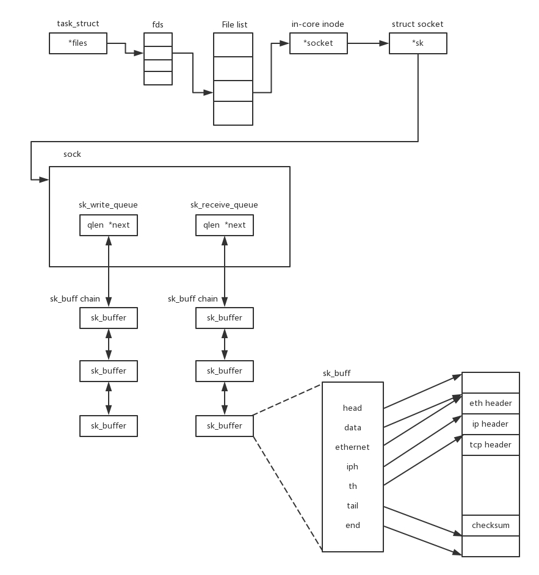

# UNIX网络编程

## 1.套接字

- `socket`在内核中的存储
    - 每个连接后的`socket`在内核中维护了连个队列`sk_write_queue`, `sk_receive_queue`.



- 创建
    - `AF_INET/ AF_INET6`: ipv4和ipv6的socket.
    - `SOCK_STREAM/SOCK_DGRAM`: TCP/UDP socket.

```python
import socket
with socket.socket(socket.AF_INET, socket.SOCK_STREAM) as s:
    pass
```

## 2.TCP协议socket


- `bind()`: 给`socket`赋予一个`IP地址`和端口.
- `listen()`: 服务端进入`listen`状态.
- **监听socket和连接socket**:
    - 监听`socket`: 始终在listen的socket. 
    - 连接socket: `accept()`客户端请求后, 会产生一个新的`socket`, 用于和客户端间的通信.

## 3.UDP协议socket

- 无连接, 因此不需要`listen, connect`, 服务端仅需要一个`socket`, 就可以和所有的客户端通信.


## 3.套接字选项

> 套接字具有一些影响自身功能的配置(选项), 可以通过`setsockopt(), getsockopt`进行获取和设置.
>
> `setsockopt(), getsockopt`需要指定级别和选项.

### 1.级别

- `IPPROTO_IP`: IP协议层级.
- `IPPROTO_TCP`: TCP协议层级.
- `SOL_SOCKET`: socket 层级.
- `IPPROTO_IPV6`: IPV6 协议层级.
- `IPPROTO_ICMPV6`: ICMPv6 协议层级.

### 2.选项

> 不同层级具有不同的选项

- `SOL_SOCKET` socket层级选项:
  
  - `SO_KEEPALIVE`: 用于开启或者关闭保活探测，默认情况关闭.
    
    > 与应用层心跳探测的区别?
    >
    > a. TCP keepalive处于传输层，由操作系统负责，能够判断进程存在，网络通畅.
    >
    > b. 但是keepalive只能检测连接是否存活，不能检测连接是否可用.例如服务器因为负载过高导致无法响应请求.
    - 在`/proc/sys/net/ipv4/`下定义了全局默认的keepalive的一些参数.
  - 在指定时间内, 套接口的任一方向都没有数据交换时, TCP就自动给对方发一个保持存活探测分节(keepalive probe).
    - 可以通过`IPPROTO_TCP`层级调整keepalive的时间间隔和重复检查次数等配置信息.(`TCP_KEEPIDLE: 空闲时间, TCP_KEEPCNT: 重复次数, TCP_KEEPINTVL: 间隔`).
  
- `IPPROTO_TCP` TCP协议层级选项:
  
  - `TCP_NODELAY`: 禁用`Nagle`算法.

## 4.超时

### 1.python 套接字的超时

- `sock.setdefaulttimeout()`, 设置默认超时.
- `sock.settimeout()`, 设置超时时间.
- 在阻塞模式进行`connect(), accept(), send(), read()`前,  均可设置超时时间. 阻塞指定时间后, 触发`socket.timeout`异常.

### 2.超时的底层实现

- 使用`alarm`, 通过捕获信号实现超时处理.
- 在`select`中阻塞, 利用`select`自身的超时.
- 使用选项`SO_RCVTIMEO, SO_SNDTIMEO`, 设置接收和发送超时.

## 5.常见问题

### 1.限制

- 文件描述符限制
- 