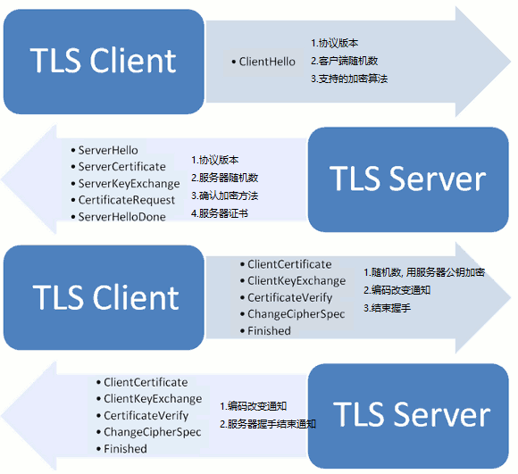

## 1.网络基础知识

-   OSI参考模型：==物理层== -> ==数据链路层== -> ==网络层== -> ==传输层== -> ==会话层== -> ==表示层== -> ==应用层==
-   OSI协议以OSI参考模型为基础界定了每个阶层的协议和每个阶层之间接口相关的标准；
    -   7.应用层：针对特定应用，如电子邮件，远程登录，文件传输；
    -   6.表示层：设备固有数据格式与网络标准数据格式的转换；
    -   5.会话层：通信管理。负责建立和断开通信连接；
    -   4.传输层：管理两个节点之间的数据传输。负责可靠传输；
    -   3.网络层：地址管理与路由选择；
    -   2.数据链路层：互联设备之间传送和识别数据帧。
    -   1.物理层：物理接口，连接器；
-   TCP/IP 分层：==物理层==（以太网，无线LAN，PPP，）-->  ==网络层==（ARP，IPv4 ，IPVC6 ，ICMP）--> ==传输层== （TCP, UDP...） --> ==应用层==（SSH,HTTP,SMTP,POP)
-   WAN (Wide Area Nerwork, 广域网)
-   LAN (Local Area Nerwork，局域网)
-   分组交换: 将大数据分割为一个个包(Packet)的较小的单位进行传输;
-   传输方式：面向有连接与面向无连接型；
-   接受端数量分类：
    -   单播：就是1对1通信；
    -   广播：1对多
    -   多播：与广播类似，也是将消息发送给多个接收主机，不同之处在于多播要限定某一组主机作为接收端。虽然一对多，但是限定多是谁；例如电视会议；
    -   任播：特定的多台主机中选出一台作为接收端的一种通信方式；面向多个，但最终选择单个特定主机通信；如DNS；
-   地址：每一层协议所使用的地址不尽相同；例如MAC地址，IP地址，端口号，等；
-   网络设备：
    -   网卡：使计算机联网的设备，也叫网卡，LAN卡；
    -   网桥：从数据链路层上延长网络的设备；
    -   路由：通过网络层转发分组数据的设备；
    -   交换机器：处理传输层以上各层网络传输的设备；
-   云：利用虚拟化技术，根据需要自动进行动态管理分配计算机资源（存储，CPU，内存等）

## 2.TCP/IP 基础

-   RFC（Request For Comment）文档，记录协议规范内容；http://www.rfc-editor.org/rfc/   ftp://ftp.rfc-deitor.org/in-notes/
-   The Internet：互联网
-   TCP/IP 的分层模型：
    -   物理层和网络接口层：网卡及接口；
    -   网络层：IP，ICMP，ARP
    -   传输层：TCP，UDP
    -   应用层：HTTP(HyperText Transfer Protocol),FTP(File Transfer Prototol),SSH...
-   每个分层中，都会对所发送的数据附加一个首部，在这个首部中包含了该层必要的信息；


## 3.数据链路

数据链路层的协议定义了通过通信媒介互联的设备之间传输的规范。

-   MAC地址：用于识别数据链路中互联的节点；
    -   由于MAC地址没有层次性, 当设备数量增加时, 检索转发表的时间越长, 所以需要网络层IP地址对地址进行分割;

## 4.IP协议

网络层协议，主要作用是“实现终端节点之间的通信”。

### 1. IP协议基础

-   主机：一般将配有IP地址，但不进行路由控制的设备；
-   路由：即配有IP地址，又具有路由控制能力的设备叫做“路由器”
-   节点：路由和主机的统称；
-   路由控制（routing）：指将分组数据发送到最终目标地址的功能；
-   Hop：跳，指网络中的一个区间；一跳指利用数据链路层以下分层的功能传输数据帧的一个区间；
-   路由控制表：Routing Table，主机维护, 记录IP数据在下一步应该发给哪一个路由器;
-   IP属于面向无连接型：原因有两点，一是为了提速，二是为了简化；
-   IP地址由==网络==和==主机==两部分标识组成；相同段内相连的主机必须有相同的网络地址，IP地址的主机标识则不允许在同一个网段内重复出现；
    -   子网掩码用于区分网络标识和主机标识;
-   广播地址：==将主机地址部分为全部置为1==
    -   本地广播：在本网内的广播叫做本地广播，(路由器不会转发)
    -   直接广播：不同网络间的广播；叫做直接广播；(先到达路由器, 路由器进行广播)
-   IP多播：用于将包发送给特定组内的所有主机，多播使用D类地址，开始四位是“1110”就可以认为是多播地址；`224.xxx.xxx.xxx`
-   子网掩码：IP地址==网络部分全部为1==，对应IP地址==主机部分全部为0==；
-   生存时间：TTL，指可以中转多少个路由器，经过一个TTL减1，直到为0丢弃；

### ２.IP协议相关

- DNS: Domain Name System,域名解析, 解决IP地址不便记忆;
  - 查询过程：向默认的DNS服务器发起查询，知道与否？向上一层根域名服务器进行查询.
- ARP: 以IP地址为线索, 查询MAC地址; 
- 为什么需要IP地址和MAC地址:
  - 1.使用IP地址,可以由网络部分充当提供位置的作用, 对地址进行集约;
  - 2.IP地址只是逻辑上的标识, 任何人都可以随意修改, 不用用于标识用户, 而MAC地址则不然, 它是固话在网卡里. 局域网采用MAC地址来标识具体用户;
  - 3.网卡使用MAC地址,可以不依赖任何网络层协议(不仅仅有IP协议), 简化网卡实现;
- RARP: Reverse Address Resolution Protocol, ARP的反过程, 通过MAC定位IP地址;
- DHCP: Dynamic Host Configuration Protocol, 自动分配IP地址;
- NAT: 网络地址转换, 将LAN端的IP和端口转换为全局的IP再发送, 

### 3.路由

> 为了让数据包正确达到目标主机, 路由器必须在途中进行正确的转发, 转发数据所进行的处理就叫路由;

- 路由器根据**路由控制表**转发数据包.

## 5.TCP

> 面向连接的,可靠的流协议.

### 1.基础概念

-   TCP通过一系列技术保证了数据传送的可靠性：
    -   连接管理----3次握手和4次挥手；
    -   数据破坏----校验和
    -   丢包-----应答与超时重发机制
    -   分片乱序-----序列号
    -   窗口滑动------提高发送效率，对发送端和接收端流量进行控制
    -   加快通信速度------快速重发，三次收到重发消息进行重发
    -   流控制----避免网络流量浪费
    -   拥塞控制-----慢启动算法，拥塞窗口


-   TCP：Transmission Control Protocol;是面向连接的、可靠的流协议。流就是不间断的数据结构，TCP为提供可靠性传输，实行“顺序控制”或重发控制；此外还具有流量控制，拥塞控制、提高网络利用率等众多功能；
-   TCP与UDP区别：TCP用于在传输层有必要实现可靠传输的情况，UDP主要用于那些对高速传输和实时性有较高要求的通信或广播通信；如IP电话；
-   **端口号**：MAC地址前者用来识别同一链路中不同的计算机，IP地址用于识别TCP/IP网络中互联的主机和路由；在传输层中也有类似地址的概念，用以区分不同的应用程序，称为端口号；
-   TCP/IP或UDP/IP 通信中通常采用5个信息来识别一个通信；它们是“源IP地址”、"目标IP地址"、"协议号"、"源端口号"、"目标端口号"；
-   端口号的确定：1.标准既定的端口号，一般是0-1023，具有特定用途；此外还有一些被正式注册，分布在2104-49151的数字之间；2.时序分配，交由操作系统动态管理，取值范围49152-65535之间；
-   不同的协议可以使用相同的端口号；

###  2.特点

> 通过校验和, 序列号, 确认应答, 重发控制, 连接管理以及窗口控制等机制实现可靠性传输

- 序列号和应答:
    - 序列号：按顺序给发送数据的每个字节都标记上号码的编号；
    - 确认应答：发送端的数据到达接收主机时，接收主机会返回一个已经收到消息的通知；这个消息叫确认应答(ACK, 收到的序列号+1, 即需要接收的下个数据号)
- 重发超时
    - 重发超时都是0.5的整数倍, 重发超时一般设置为6秒, 以2倍, 4倍的指数函数延长, 达到一定的重发次数后会判断为网络或对段主机发生异常, 强制关闭连接;
- TCP以段为单位发送数据：称为MSS，Maximum Segment Size，最大消息长度；在连接建立时确定，取通信双方最小的；
- 窗口
    - 为解决发送一个段 就进行确认导致的传输速度较低的问题, TCP引入窗口概念, 窗口大小就是指无需等待确认应答而可以继续发送数据的最大值；
    - 滑动窗口：收到确认应答，将窗口滑动到确认应答中的序列号的位置；
    - 窗口在一定程度上保证，即使有少部分确认应答丢失也不会进行数据重发；（可以通过后面的应答，确认）
- 流控制：
    - 接收端根据实际接收能力控制发送的数据量;
    - 接收端主机向发送主机通知自己可以接收数据的大小;

### 3.连接和断开

-   三次握手：
    -   --> SYN(请求建立连接) 
    -   <-- ACK(针对SYN) + SYN(请求建立连接)
    -   --> ACK(针对SYN应答)
    
-   四次挥手：
    - --> FIN(请求切断链接)
    - <-- ACK(针对FIN的应答)
    - <-- FIN(请求切断连接)
    - --> ACK(针对FIN的应答)
    
    -   TCP是全双工模式（数据在两个方向上都能同时传递），收到`FIN`时意味着对方将没有数据再发来。而自己还可以继续发送，直到发送`FIN`到对方，发送`FIN` 一般是应用层进行关闭的结果；


## 6.UDP

-   UDP：User Datagram Protocol;UDP是不具有可靠性的数据报协议。可以确保发送消息的大小，不能保证消息一定会到达；
-   特点：不提供复杂的控制机制；无丢包重传机制，面向无连接，简单高效，可以一对一或一对多；
-   应用：
    -   1.包总量较少的通信（DNS,SNMP等）；
    -   2.视频、音频等多媒体通信（即时通信）；
    -   3.限定LAN等特定网络中的应用通信；
    -   4.广播通信（广播，多播）；

## 7.HTTP

### 1.基础

- 媒体类型MIME:
  - 多用于因特网邮件扩展, 用于解决不用的电子邮件系统之间搬运报文时存在的问题.
  - 用于描述并标记多媒体内容;

- URI: 统一资源标识符, 有两种形式: URL, URN
  
    - URL：统一资源定位符
        - `<协议>://<用户名>:<密码>@<host>:<端口>/<path>;<params>?<query>#<frag>`
- URN: 统一资源名, 处于试验阶段; 
  
- 持久连接:

    -   初始版本中, 每进行一次http通信就需要断开一次TCP连接, HTTP/1.0 提出了持久连接(keep-alive), 只要任意一端没有明确提出断开连接, 则保持TCP连接;

- Cookie:

    -   根据相应报文内的`Set-Cookie`的字段信息, 通知客户端保存Cookie;	
    -   客户端往该服务器发送请求时, 会自动在请求报文中加入Cookie;

-   HTTP报文:

    > 由一行一样简单字符串组成, 纯文本, 每行使用`\r\n`结束, 首部和主机之间用空行分隔;

    
    
    

### 2.请求方法

> 安全方法: GET,HEAD, 请求不会产生什么动作;

- `GET`: 请求指定资源;
- `POST`: 将实体提交到指定的资源;
- `PUT`: 创建新资源或用请求有效载荷替换目标资源, 通post不用在于, PUT是幂等的(连续多次调用效果相同) ;
- `DELETE`：删除指定的资源;
- `PATCH`: 用于对资源应用部分修改;
- `OPTIONS`：设置选项；
- `HEAD`：仅获取文档首部；
- `GET`和`POST`区别:
  - **`GET`和`POST`本质上没有区别,都是HTTP报文, 但是在设计上, `GET`是用于获取资源, 无副作用,幂等, 可缓存, `POST`用于提交资源, 有副作用, 非幂等, 等特性. 浏览器实现上也造成了进一步的区别**
  - 1.`GET`使用URL或Cookie传参, `POST`将产生让在BODY中;
  - 2.`GET`方式提交的数据长度由限制,POST无;(URL长度可能受浏览器或操作系统的限制, 导致URL传参限制);
  - 3.`POST`比GET安全,数据无法通过地址栏查看, 仅此而已;
  - 4.`GET`请求是安全的, 多次请求对服务器无影响, POST不同, 有副作用,非幂等;

### 3.状态

-   2xx：成功状态码
    -   200：一切OK，会GET或POST的回应；
-   3xx：重定向
    -   301: 永久性重定向, 需要更新书签;
    -   302: 临时性重定向;
    -   304：客户端有缓冲的文档并发出了一个条件性的请求，服务器告诉客户，原来的缓冲文档还可以使用；
-   4xx：客户端错误
    -   401: 认证失败;
    -   403：资源不可用；
    -   404：无法找到指定位置的资源；
    -   405：服务器禁止使用该请求方法；
    -   412: 先决条件失败, 通常发生于`GET, HEAD`之外的方法请求;
-   5xx: 服务器错误, 表明服务器端在执行请求时发生了错误;

### 4.HTTP首部

> 首部结构: `首部字段名: 字段值, 例如: Content-type: text/html`
>
> 首部可以分为: 通用首部, 请求首部, 响应首部, 实体首部

- 常用头部说明:
  - `Accept`: 客户端期望MIME类型; 类似还有`Accept-Charset`: 期望字符集,`Accept-Encoding`: 压缩方法; `Accept-Language`语言;
  - `Access-Control-Allow-Credentials`: 跨域时是否允许携带`cookie`;
  - `Access-Control-Allow-Origin`: 允许跨域地址;
  - `Cache-Control`: 缓存控制;
  - `Connection`: 是否保持连接;
  - `Content-Encoding`: 压缩方式;
  - `Content-Length`: HTTP实体的大小;
  - `Content-Type`: HTTP实体的MIME类型;
  - `Cookie`: 存放`Cookie`, 由`Set-Cookie`设置客户端`Cookie`;
  - `Expires, Last-Modified, If-Moidfied-Since, Etag, If-None-Match`: 浏览器缓存相关
  - `Host`: 服务器域名和端口号;
  - `Location`: 重定向的`url`;
  - `Origin`: 与`Referer`不同, 仅包含协议和域名, 用于跨域资源共享, 表明请求发出的协议和域名, 且仅通过浏览器设置, 用户无法更改;
  - `Referer`: 请求发起的详细地址,不包含锚点信息;
  - `Server`: 服务器信息;
  - `Transfer-Encoding`: 压缩类型;
  - `User-Agent`: 客户端信息(操作系统, 浏览器版本,等)
  - `Vary`: 告诉HTTP cache, 想要定位缓存, 除了`path`和`Host`头之外, 还应该考虑哪些头部信息; [参考](<http://blog.gongzhenhua.com/http-vary-header-and-bp/>)
  
- 重要的`MIME`说明

  - `POST`常用的`MIME`类型

    - `application/x-www`-form-urlencoded`: 原生FORM表单, 数据按照`key1=val1&key2=val2`的方式进行编码;

    - `multipart/form-data`: 在头部指定`boundary`, 用于分隔每个数据; 一般用于上传文件;

      ```
      content-type: multipart/form-data; boundary=--------------------------815707955261705118296449
      ----------------------------815707955261705118296449
      Content-Disposition: form-data; name="test1"
      
      123
      ----------------------------815707955261705118296449
      Content-Disposition: form-data; name="test2"; filename="config.ini"
      Content-Type: text/plain
      ...
      ```

    - `application/json`: 内容为`JSON`格式;

    - `text/xml`: 内容为`XML`格式;

### 5.连接

- Nagle算法:发送分组前, 将大量TCP数据绑定一起, 以提高网络效率; 但会造成时延, 一般会禁用Nagle算法;

#### 1.并行连接

- HTTP允许客户端打开多条连接, 并行地执行多个HTTP事务;

#### 2.持久连接

- HTTP1.0中, 没有官方的keepalive操作, 通常使用`Connection: Keep-Alive`, 表明长连接, HTTP1.1中, 所有连接默认都是持续连接;
  - 客户端请求包含首部:`Connection: Keep-Alive`, 激活长连接; 服务端响应`Connection: Keep-Alive`, 表示支持长连接; 否则客户端会立刻断开连接;
  - 一般服务端会设置超时和最大请求数;例如nginx `keepalive_timeout time; keepalive_requests xxx`, 
  - 在长连接下, 一般通过`Content-Length: xxx`表示**响应体内容**大写, 客户端通过长度判断是否已经完成响应;
  - 当响应体大小不确定时; 如通过gzip进行压缩后, 通过`Transfer-Encoding: chunked`, 表示整个response将使用分块传输编码来传递内容, 并以最后一个大小为0的块为结束.
- Keep-alive降低了延迟和连接建立的开销, 但是会维持大量的空闲连接, 消耗资源:

### 6.HTTPS

> 传统HTTP面临的问题: 窃听, 篡改, 冒充;
>
> HTTPS = HTTP + 通信加密 + 证书 + 完整性保护, 身披SSL/TLS外衣的HTTP

#### 1.基础概念

- https默认端口: 443

- SSL: Secure Sockets Layer, 安全套接字, 早期https使用, TLS前身;
- TLS: Transport Layer Security, 传输层安全协议; 
- SSL/TLS协议的基本过程:
  	1. 客户端向服务端索要并验证公钥;
   2. 双发协商生成"对话密钥";
   3. 双发采用"对话密钥"进行加密通信;
 - 对称加密: 加密/解密使用同一串密钥, 常见的加密算法有DES, AES;
    - 效率高, 加密速度快, 但是密钥管理困难;
 - 非对称加密: 加密, 解密使用不同的密钥, 一把作为公开的公钥, 一把作为私钥, 公钥加密的信息, 只有私钥才能解密, 反之, 私钥加密的信息, 只有公钥才能解密; 如RSA
    - 安全性高, 但是加密解密比较消耗资源;
 -  MD5: 消息摘要算法, 密码散列函数, 可以生产出一个128位的散列值, 用于确保传输信息一致;

#### 2.协议细节

- **证书**: 表明**公钥**正确可信;  将公钥等信息通过Hash算法生成摘要, 通过**CA(证书中心)私钥**加密生成**数字签名**; 收信方用**CA公钥**解开数字签名, 就可以验证公钥的真实性;
- 共享密钥加密: 客户端和服务端生成对话密钥, 对话密钥用来加密解密信息(对称加密), 对话密钥本身通过非对称加密传输(**用CA证书中获取的服务端公钥加密**), 保证安全;
- **TLS握手**: 发生再TCP握手之后, 1ClientHello, 2ServerHello, 3.Client Key Exchange, 4.Server Finish
  - 1.协商加密算法获取公钥, 2.加密传输Pre-master secret, 生成会话密钥, 3.双方采用"对话密钥"进行加密通信;




- 会话密钥生成: 使用客户端和服务端生成的三个随机数`Client random`, `Server random`, `Pre-master secret`(被服务端公钥加密后传输,  生成"对话密钥", 用来加密整个对话过程;
- 还需要对数据完整性进行验证;
- 中间人攻击
  - 指攻击者与通讯的两端分别创建独立的联系, 并交换其收到的数据;
  - CA证书, 验证共公钥的正确性;
  - 数据的完整性验证;

#### 3.session恢复

- session ID
  - 每次会话都有一个编号, 如果对话中断, 下次重连的时候, 只要客户端给出编号, 且服务器有这个编号的记录就可以使用原有"对话密钥";
- session ticket
  - 加密后端信息, 包含本次对话的主要信息, 如对话密钥和加密方法. 服务端收到后解密就可以使用原有的对话密钥;

## DNS

Domain Name System,域名系统

-   分类：根DNS服务器，顶级DNS服务器，权威DNS服务器；

-   解析过程：www.qq.com

    -   1.检查本地hosts里有没有这个域名的映射，有完成，没有向下；

    -   2.查找本地DNS解析器缓存，是否有这个网址映射？没有向下；

    -   3.向TCP/IP参数设置中的本地DNS服务器查询？（直连外网：会分配到运营商服务地址；通过路由：含有DHCP服务，可能就是路由本身）

    -   4.如果本地DNS服务器解析失败，则根据DNS设置，进行查询；（如未用转发模式，本地DNS就把请求发送至13台跟DNS，根DNS会判断该顶级域名（.com）由谁管理，并返回一个负责该顶级域名服务器的IP，本地DNS在联系这个服务器，查询到qq.com，然后重复向下查询，直到查询到www.qq.com）

    -   4.5.如果用转发模式，DNS服务器就会把请求转发至上一级服务器进行解析，直到找到；
