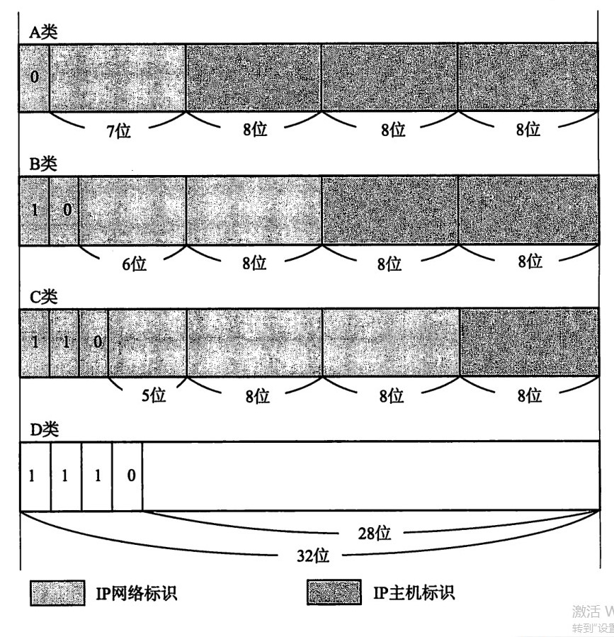
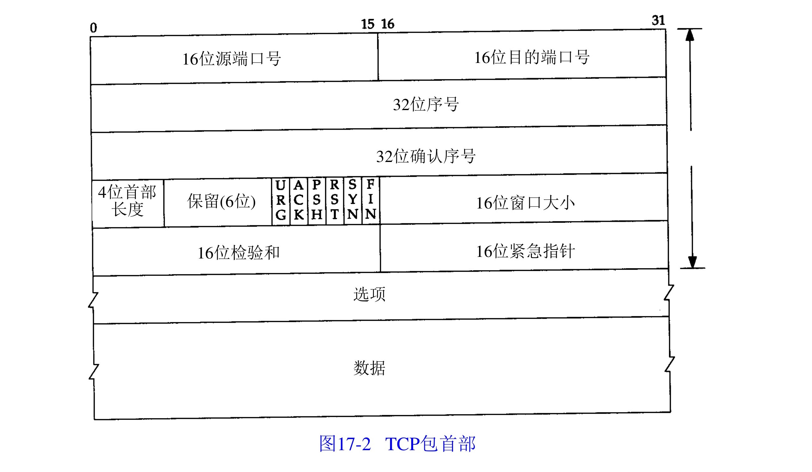
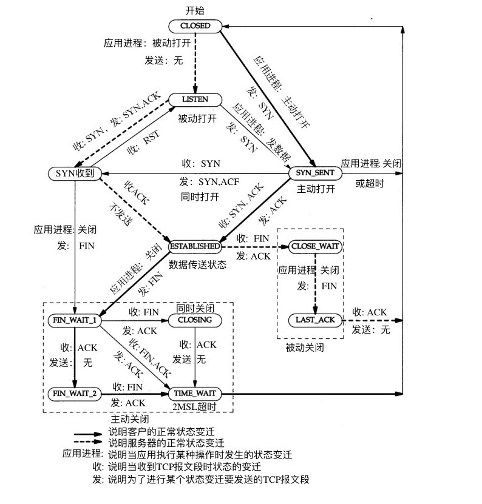
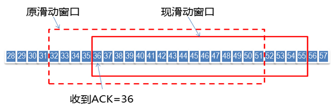
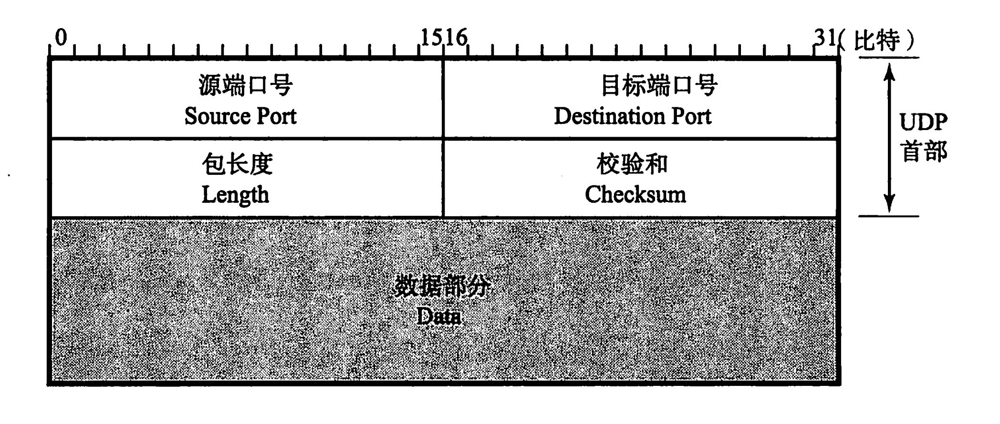
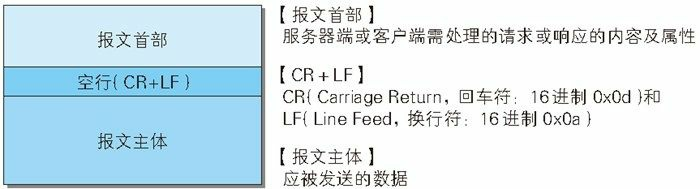
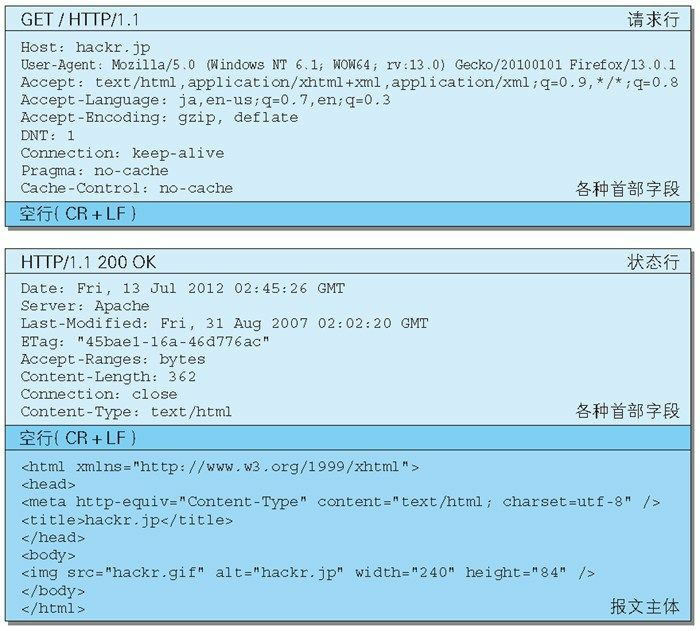
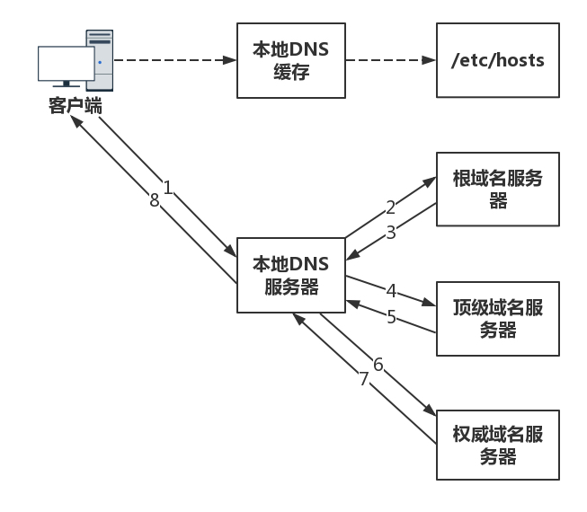

# 网络协议

## 1.网络基础知识

- **分层**
    - **为什么要分层?**
        - 使问题简单化, 每一层专注每一层的事情.
    - OSI 参考模型：==物理层== -> ==数据链路层== -> ==网络层== -> ==传输层== -> ==会话层== -> ==表示层== -> ==应用层==
    - OSI 协议以 OSI 参考模型为基础界定了每个阶层的协议和每个阶层之间接口相关的标准；
      - 7.应用层：针对特定应用，如电子邮件，远程登录，文件传输；
      - 6.表示层：设备固有数据格式与网络标准数据格式的转换；
      - 5.会话层：通信管理。负责建立和断开通信连接；
      - 4.传输层：管理两个节点之间的数据传输。负责可靠传输；
      - 3.网络层：地址管理与路由选择；
      - 2.数据链路层：互联设备之间传送和识别数据帧。
      - 1.物理层：物理接口，连接器；
- 分组交换: 将大数据分割为一个个包(Packet)的较小的单位进行传输;
- 接受端数量分类：
  - 单播：就是 1 对 1 通信；
  - 广播：1 对多
  - 多播：与广播类似，也是将消息发送给多个接收主机，不同之处在于多播要限定某一组主机作为接收端。虽然一对多，但是限定多是谁；例如电视会议；
  - 任播：特定的多台主机中选出一台作为接收端的一种通信方式；面向多个，但最终选择单个特定主机通信；如 DNS；
- 地址：每一层协议所使用的地址不尽相同；例如 MAC 地址，IP 地址，端口号，等；
- 网络设备：
  - 网卡：使计算机联网的设备，也叫网卡，LAN 卡；
  - 网桥：从**数据链路层**上延长网络的设备
  - 网关: 连接两个不同网络的设备.
  - 路由：通过**网络层**转发分组数据的设备, 即配有 IP 地址，又具有路由控制能力的设备;；
- 云：利用虚拟化技术，根据需要自动进行动态管理分配计算机资源（存储，CPU，内存等）
- **端口号**：端口号用以区分同一主机上的不同的进程；MAC 地址前者用来识别同一链路中不同的计算机，IP 地址用于识别 TCP/IP 网络中互联的主机和路由；
- **TTL**: 生存时间, IP包被路由器丢弃前允许通过的最大网段数, 经过一次路由(一跳). TTL减1.
- **Hop**：跳，指网络中的一个区间；一跳指利用数据链路层以下分层的功能传输数据帧的一个区间；
    - `traceroute [参数] [主机]`: 用于检测发出的数据包的主机到目标主机之间所经历的网关数量(跳), 原理: 控制 TTL, 超时会发送 ICMP 报文;
- **MSL**: 报文在网络中的最大生存时间, 一个估算值, 可以通过`/proc/sys/net/ipv4/tcp_fin_timeout`查看和配置.
    - `TIME_WAIT` = 2* `MSL`
- **MTU**: 最大传输单元, 二层的一个定义, 数据报大于`MTU`值时, 就要进行分片传输.

## 2.数据链路

> 数据链路层的协议定义了通过通信媒介互联的设备之间传输的规范。
>
> 主要作用在互联的同一种数据链路的节点间进行包传递.

- MAC 地址：用于识别数据链路中互联的节点；
  - 转发表: 交换机记录网络接口和 MAC 地址的对应关系; 由 MAC 地址就可以查到需要发送数据的接口;
  - 由于 MAC 地址没有层次性, 当设备数量增加时, 检索转发表的时间越长, 所以需要网络层 IP 地址对地址进行分割;

## 3.IP 协议

> 网络层协议，主要作用是“实现终端节点之间的通信”也叫点对点通信;  **网络层可以跨域不同的数据链路**;
>
> IP地址和MAC地址:
>
> 1. MAC地址是固化到网卡终中的, 可以近似认为唯一标识一台主机, 类似个人ID.
>
>  	2. IP地址可以分层, 可以被路由 类似现实世界的地址信息.
>
> 因为IP地址不便记忆, 所以有了域名(DNS), 域名  <--> IP 映射
>
>  需要由IP找到对应的主机(MAC)  --> ARP协议
>
> 在一个子网内, 入网机器需要分配IP --> DHCP
>
> 

### 1. 基础概念

- 路由控制（routing）：指将分组数据发送到最终目标地址的功能；

- 路由控制表：Routing Table，主机维护, 记录 IP 数据在下一步应该发给哪一个路由器;

- IP 地址由==网络==和==主机==两部分标识组成；

  - 相同段内相连的主机必须有相同的网络地址，IP 地址的主机标识则不允许在同一个网段内重复出现；
  - 子网掩码用于区分**网络标识**和**主机标识**;

- 广播地址：==将主机地址部分为全部置为 1==

  - 本地广播：在本网内的广播叫做本地广播，(路由器不会转发)
  - 直接广播：不同网络间的广播；叫做直接广播；(先到达路由器, 路由器进行广播)

- IP 多播：用于将包发送给特定组内的所有主机，多播使用 D 类地址，开始四位是“1110”就可以认为是多播地址；`224.xxx.xxx.xxx`

- 子网掩码：IP 地址==网络部分全部为 1==，对应 IP 地址==主机部分全部为 0==；

### ２.IP 协议相关协议

- DNS: **Domain Name System**,域名解析, 解决 IP 地址不便记忆;
  - 查询过程：向默认的 DNS 服务器发起查询，知道与否？向上一层根域名服务器进行查询.
- ARP: **Address Resolution Protocol**, 以 IP 地址为线索, 查询 MAC 地址;
- 为什么需要 IP 地址和 MAC 地址:
  - 1.使用 IP 地址,可以由网络部分充当提供位置的作用, 对地址进行集约;
  - 2.IP 地址只是逻辑上的标识, 任何人都可以随意修改, 不用用于标识用户, 而 MAC 地址则不然, 它是固话在网卡里. 局域网采用 MAC 地址来标识具体用户;
  - 3.网卡使用 MAC 地址,可以不依赖任何网络层协议(不仅仅有 IP 协议), 简化网卡实现;
- RARP: Reverse Address Resolution Protocol, ARP 的反过程, 通过 MAC 定位 IP 地址;
- DHCP: Dynamic Host Configuration Protocol, 自动分配 IP 地址;
- NAT: 网络地址转换, 将 LAN 端的 IP 和端口转换为全局的 IP 再发送,

### 3.路由

> 为了让数据包正确达到目标主机, 路由器必须在途中进行正确的转发, 转发数据所进行的处理就叫路由;

- 路由器根据**路由控制表**转发数据包.

### 4.IP地址和MAC

- MAC:
    - 唯一, 可以表明用户身份, 但是不能表明位置.
- IP:
    - 分层, 具有定位功能.
    - 

### 5.ICMP

> Internet Control Message Protocol: 互联网控制报文协议

- 查询报文: 例如`ping`.
- 差错报文: 例如`traceroute`. 利用`IMCP`的规则, 故意制造一些能够产生错误的场景. 例如设置`ttl`.

## 4.TCP

> 传输控制协议(Transmission Control Protocol)是面向连接的、可靠的流协议。流就是不间断的数据结构，TCP 为提供可靠性传输，实行“顺序控制”或重发控制；此外还具有流量控制，拥塞控制、提高网络利用率等众多功能；
>
> 
>
>```text
> 控制位含义:
> ACK: 确认序号标志, 确认时, 在确认序号上设置希望接收的下一个序号;
> RST: 重写连接;
> SYN: 用来发起连接(会消耗一个序号);
> FIN: 发端完成发送(会消耗一个序号);
> URG: 紧急指针有效;
> PSH: push 标志;
>```

### 1.基础概念

- **TCP主要关注以下问题**:
  - 顺序问题: 序号.
  - 丢包问题: `ACK`和重发.
  - 连接维护: `SYN`, `RST`,  `FIN`
  - 流量控制: 窗口
  - 拥塞控制: 

### 2.连接与断开


- 连接过程
    - 1.双发都需要发送连接请求,并且选哟回复对方的连接请求.
    - 2.需要确定初始序号.
    - **初始序号为什么不能从0或者1开始?** : 对于重连的场景, 可能存在上次发送的数据包在下次连接建立后收到的情况, 如果数据包序号从0/1开始, 就会造成错误,  所以, 初始序号都是一个随时间变化的数. 


- 断开过程

    - 全双工, 需要各自决定自己是否还需发送信息.

- 断开过程的状态:

    - `CLOSE_WAIT`: 对端关闭, 自己还没有关闭时的状态.
    - `FIN_WAIT2`: 自己关闭了, 但是对端还未关闭.
    - `TIME_WAIT`: 等待`2倍的MSL`, 保证本次连接对方发送的所有包都超时. 

- 状态迁移:

    

### 3.数据发送

- **序号与确认应答**

  - 序列号`Sequence Number`：用来表示从TCP发端向TCP收端发送的数据字节流, 表示在这个报文段中的第一个数据字节.
  - 初始序号`ISN`: 建立连接后生成的随机数, 因为建立连接需要消耗一个序号, 所以数据的第一个序号为`ISN+1`；
  - 确认应答：`ACK`标志置 1, 确认序号为**接收端期望收到的下一个序号**;

- 重传:

    - 超时重传: 发送一个包后, 设置一个超时时间. 
    - 快速重传: 接收端发现丢失一个中间包时, 发送三次前一个包的`ACK`,  发送端就会快速重传, 而不必等待超时时间.

- **滑动窗口**(实现流量控制)

  
  
  - 窗口大小: (4-12)无需等待确认应答可以继续发送数据的最大值;
- 收到确认应答: (4) 将窗口滑动到确认应答中的序号位置;
  
  - 接收端可以通过**调节窗口大小**, 控制发送端发送数据流量;
  
- 拥塞控制:

    - 通过控制窗口, 调节发送速度, 使的带宽占用最大.

- **发动单位--MSS(最大消息长度)**

  - 建立连接的同时, 会在首部写入 MSS 选项, 告知对方自身的 MSS, 双方选择最下 MSS 值进行通信;
  - 在传递大量数据时, 以`MSS`大小将数据进行分割发送;

- **Nagle**算法:

  - 发送端即使还有应该需要发送的数据, 但是如果这部分数据很少, 则进行延时发送.
  - 提高网络利用率;
  - 通过`sock.setsockopt(socket.IPPROTO_TCP, socket.TCP_NODELAY, 1)`可以禁用;

### 4.TCP的KeepAlive

- 由操作系统实现, 一定时间内, 链路上没有数据传送的情况下, TCP层将发送响应的KeepAlive探针, 确定连接可用性; 

- 可以通过配置socket的属性配置:

    ```python
    sock.setsockopt(socket.SOL_SOCKET, socket.SO_KEEPALIVE, 1)  # 开启 TCP keepalive
    sock.setsockopt(socket.SOL_TCP, socket.TCP_KEEPIDLE, 20)    # 正常数据到开始发送keepalive探针的时间
    conn.setsockopt(socket.SOL_TCP, socket.TCP_KEEPCNT, 5)      # 发送探针的数量
    conn.setsockopt(socket.SOL_TCP, socket.TCP_KEEPINTVL, 10)   # 发送探针的间隔时间
    ```

### 5.问题处理

#### 1.大量`TIME_WAIT`问题:

> [参考](https://www.zhuxiaodong.net/2018/tcp-time-wait-instruction/)

- 通常是因为短连接太多, 不断的创建连接, 然后释放. 例如爬虫.

#### 2.大量`CLOSE_WAIT`问题

- 可能连接使用后忘记关闭.

## 5.UDP

> User Datagram Protocol;UDP 是不具有可靠性的数据报协议。可以确保发送消息的大小，不能保证消息一定会到达；
>
> 

- 与TCP的对比:
  - TCP: 
    - 可靠交付.
    - 面向字节流.
    - 速度和拥塞控制. 
  - UDP:
    - 收发简单.
    - 不保证不丢失, 不保证顺序到达.
    - UDP发送无拥塞控制, 任意发送.
- 适用场景：
  - 1.需要资源少, 网络环境好, 或者对丢包不敏感.
  - 2.不需要一对一, 可以是广播的应用. (DHCP)
  - 3.需要速度快, 时延低的场景.(直播)

### 1.QUIC

> 快速UDP互联网连接, Google提出的一种基于UDP改进的通信协议.

- 自定义的连接机制
  
-  使用`UUID`标记每一次连接, 只要`UUID`不变, 就不需握手, 继续传输.
  
- 丢包重传:

    - > 自适应重传算法: 通过采样往返时间RTT, 进行不断调整.

    - QUIC采用严格递增的`sequence number`, 重发包和原发包序号不同, RTT计算更准确.(通过`offset`计算每包的数据位置)

- 每个连接Connection中可以有多个Stream, 互不干扰.

- 流控: 

    - QUIC中的同一个Stream内, **窗口大小从接收到的最大`offset`开始计算**, (因为前面的肯定也已经发送, 只是未收到, 后续可能收到或者重发).(TCP窗口取决于最早的未收到`ACK`的包, 即使重发, 也影响最后面的数据的发送).
    - QUIC中同一个Connection, 不同的Stream相互独立, Stream A阻塞, 不影响Stream B的消息.

- 拥塞控制:

    - TCP的拥塞控制内置在协议栈层面. 不好修改.
    - QUIC可以在应用层改变拥塞控制算法, 或者调优.

## 6.HTTP

> 超文本传输协议, 支持客户/服务器模式, 无状态协议;

### 1.概念

- 媒体类型 MIME: 是一种标准的, 用来表示文档, 文件或字节流的性质和格式.

  - `text/plain, text/html, image/jpeg, application/json`

- URI: 统一资源标识符, 有两种形式: URL, URN

  - URL：统一资源定位符
    - `<协议>://<用户名>:<密码>@<host>:<端口>/<path>;<params>?<query>#<frag>`
  - URN: 统一资源名, 处于试验阶段;

- 持久连接 KeepAlive:

  - 初始版本中, 每进行一次 http 通信就需要断开一次 TCP 连接, HTTP/1.0 提出了持久连接(keep-alive), 只要任意一端没有明确提出断开连接, 则保持 TCP 连接;

- Cookie:

  - 根据相应报文内的`Set-Cookie`的字段信息, 通知客户端保存 Cookie;
  - 客户端往该服务器发送请求时, 会自动在请求报文中加入 Cookie;

- HTTP 报文:

  > 由一行一样简单字符串组成, 纯文本, 每行使用`\r\n`结束, 首部和主机之间用空行分隔;

  - **格式**

  

  

### 2.请求和响应



- 报文格式:

    

#### 1.请求行

- **请求方法**:
    - `GET`: 请求指定资源;
    - `POST`: 将实体提交到指定的资源;
    - `PUT`: 创建新资源或用请求有效载荷替换目标资源, 通 post 不用在于, PUT 是幂等的(连续多次调用效果相同) ;
    - `DELETE`：删除指定的资源;
    - `PATCH`: 用于对资源应用部分修改;
    - `OPTIONS`：设置选项；
    - `HEAD`：仅获取文档首部；
    - `GET`和`POST`区别:
      - **`GET`和`POST`本质上没有区别,都是 HTTP 报文, 但是在设计上, `GET`是用于获取资源, 无副作用,幂等, 可缓存, `POST`用于提交资源, 有副作用, 非幂等, 等特性. 浏览器实现上也造成了进一步的区别**
      - 1.`GET`使用 URL 或 Cookie 传参, `POST`将数据放在 BODY 中;
      - 2.`GET`参数受到 `url `长度由限制, POST 无;(URL 长度可能受浏览器或操作系统的限制, 导致 URL 传参限制);
      - 3.`POST`比 GET 安全,数据无法通过地址栏查看, 仅此而已;
      - 4.`GET`请求是安全的, 多次请求对服务器无影响, POST 不同, 有副作用,非幂等;

- **响应状态**
    - 1xx: 客户端应相应的某些动作
        - 101: 协议转换.

    - 2xx：成功状态码
      - 200：一切 OK，会 GET 或 POST 的回应；
    - 3xx：重定向
      - 301: 永久性重定向, 需要更新书签;
      - 302: 临时性重定向;
      - 304：客户端有缓冲的文档并发出了一个条件性的请求，服务器告诉客户，原来的缓冲文档还可以使用；
    - 4xx：客户端错误
      - 401: 认证失败;
      - 403：权限拒绝；
      - 404：无法找到指定位置的资源；
      - 405：服务器禁止使用该请求方法；
      - 412: 先决条件失败, 通常发生于`GET, HEAD`之外的方法请求;
    - 5xx: 服务器错误, 表明服务器端在执行请求时发生了错误;
        - 500: 服务器未知错误(程序代码出错时出现);
        - 502: 网关错误, 标识作为网关或代理角色的服务器, 从上游(tomcat)中接收到的响应是无效的(上游服务器挂掉).
        - 503: 临时的服务器维护或者过载.
        - 505: 服务器不支持, 或者拒绝支持在请求中使用HTTP版本;

#### 2.请求(响应)头

> 首部结构: `首部字段名: 字段值, 例如: Content-type: text/html`
>
> 首部可以分为: 通用首部, 请求首部, 响应首部, 实体首部

- 常用头部说明:

  - **`Accept`: 客户端期望 MIME 类型; 类似还有`Accept-Charset`: 期望字符集,`Accept-Encoding`: 压缩方法; `Accept-Language`语言;**
  - `Access-Control-Allow-Credentials`: 跨域时是否允许携带`cookie`;
  - `Access-Control-Allow-Origin`: 允许跨域地址;
  - **`Cache-Control`: 缓存控制;**
  - `Connection`: 是否保持连接;
  - `Content-Encoding`: 压缩方式;
  - `Content-Length`: HTTP 实体的大小;
  - **`Content-Type`: HTTP 实体的 MIME 类型;**
  - `Cookie`: 存放`Cookie`, 由`Set-Cookie`设置客户端`Cookie`;
  - `Expires, Last-Modified, If-Moidfied-Since, Etag, If-None-Match`: 浏览器缓存相关
  - `Host`: 服务器域名和端口号;
  - `Location`: 重定向的`url`;
  - `Origin`: 与`Referer`不同, 仅包含协议和域名, 用于跨域资源共享, 表明请求发出的协议和域名, 且仅通过浏览器设置, 用户无法更改;
  - `Referer`: 请求发起的详细地址,不包含锚点信息;
  - `Server`: 服务器信息;
  - `Transfer-Encoding`: 压缩类型;
  - `User-Agent`: 客户端信息(操作系统, 浏览器版本,等)
  - `Vary`: 告诉 HTTP cache, 想要定位缓存, 除了`path`和`Host`头之外, 还应该考虑哪些头部信息; [参考](http://blog.gongzhenhua.com/http-vary-header-and-bp/)

- 重要的`MIME`说明

  - `POST`常用的`MIME`类型

    - `application/x-www-form-urlencoded`: 原生FORM表单, 数据按照`key1=val1&key2=val2`的方式进行编码;

    - `multipart/form-data`: 在头部指定`boundary`, 用于分隔每个数据; 一般用于上传文件;

      ```
      content-type: multipart/form-data; boundary=--------------------------815707955261705118296449
      ----------------------------815707955261705118296449
      Content-Disposition: form-data; name="test1"

      123
      ----------------------------815707955261705118296449
      Content-Disposition: form-data; name="test2"; filename="config.ini"
      Content-Type: text/plain
      ...
      ```

    - `application/json`: 内容为`JSON`格式;

    - `text/xml`: 内容为`XML`格式;

### 3.KeepAlive

> 无keepalive时的情况: 每个HTTP请求都要建立一个TCP连接, 并且使用一次之后就断开这个TCP连接.
>
> 使用keepalive: 每次TCP连接中, 可以持续发送多份数据, 而不会断开连接. 减少连接建立次数, 减少`TIME_WAIT`状态.

- HTTP1.0 中, 没有官方的 keepalive 操作, 通常使用`Connection: Keep-Alive`, 表明长连接, HTTP1.1 中, 所有连接默认都是持续连接;
  - 客户端请求包含首部:`Connection: Keep-Alive`, 激活长连接(**客户端不主动断开连接并进行`tcp`保活**); 服务端响应`Connection: Keep-Alive`, 表示支持长连接;  否则客户端会立刻断开连接;
  - 服务端会设置超时和最大请求数; 例如 `nginx`
      -  `keepalive_timeout time;`连接保持时间, 超时主动断开连接; 
      - `keepalive_requests xxx`: 最大连接数;
  - 长连接下, HTTP包的确定:
      - 一般通过`Content-Length: xxx`表示**响应包**大小, 客户端通过长度判断是否已经完成响应;
      - 大小不确定时: 如通过` gzip` 进行压缩后, 通过`Transfer-Encoding: chunked`, 表示整个 response 将使用**分块传输**编码来传递内容, 并以**最后一个大小为 0 的块为结束**.
- Keep-alive 降低了延迟和连接建立的开销, 但是会维持大量的空闲连接, 消耗资源:

### 4.HTTPS

> 传统 HTTP 面临的问题: 窃听, 篡改, 冒充;
>
> HTTPS = HTTP + 通信加密 + 证书 + 完整性保护, 身披 SSL/TLS 外衣的 HTTP

#### 1.基础概念

- **对称加密**
    - 加密/解密使用同一串密钥, 常见的加密算法有 DES, AES;
    - 效率高, 加密速度快, 但是密钥管理困难;
- **非对称加密**
    - 加密, 解密使用不同的密钥, 一把作为公开的公钥, 一把作为私钥, 公钥加密的信息, 只有私钥才能解密, 反之, 私钥加密的信息, 只有公钥才能解密; 如 RSA
    - 安全性高, 但是加密解密比较消耗资源;
- **数字证书**
    - 签发: 证书中心用私钥对服务端公钥进行加密, 生成数字证书.
- 验证: 客户端用证书中心公钥进行解密数字证书, 就可以拿到服务端公钥.
  
- https 默认端口: 443


#### 2.工作流程


- **TLS 握手**: 发生再 TCP 握手之后, 1ClientHello, 2ServerHello, 3.Client Key Exchange, 4.Server Finish
  - 1.协商加密算法
  - 2.传输随机数
  - 3.传输服务端证书(服务端公钥)
  - 4.**客户端向服务端非对称加密传输(pre-master)**

- **双方根据 服务端随机数 + 客户端随机数 + pre-master 计算对称密钥**
    - 后续过程对称加密传输.
- 中间人攻击
  - 指攻击者与通讯的两端分别创建独立的联系, 并交换其收到的数据;
  - CA 证书, 验证共公钥的正确性;
  - 数据的完整性验证;

#### 3.session 恢复

- session ID
  - 每次会话都有一个编号, 如果对话中断, 下次重连的时候, 只要客户端给出编号, 且服务器有这个编号的记录就可以使用原有"对话密钥";
- session ticket
  - 加密后端信息, 包含本次对话的主要信息, 如对话密钥和加密方法. 服务端收到后解密就可以使用原有的对话密钥;

### 5.HTTP 2.0

- 二进制传输
- `TCP`连接的多路复用
    - 帧: 最小的数据单位，每个帧会标识出该帧属于哪个流, 多个帧之间可以乱序发送
    - 流: 多个帧组成的数据流
    - **将数据乱序的发送到TCP, 通过帧重新组装**
    - 同一域名公用一个连接, 解决原有协议连接数过多的问题.
- **Header压缩**.
    - 将头部的`key, value`在两端建立一个索引表, 对相同的头只发送索引表的索引.
- 服务端Push:
    - 服务端可以主动推送资源.

### 6.WebSocket

#### 1.握手(连接建立)

- 客户端发送连接请求(基于`HTTP`协议)

    - ```
        GET /chat HTTP/1.1
        Upgrade: websocket
        Sec-WebSocket-Key: dGhlIHNhbXBsZSBub25jZQ==
        Sec-WebSocket-Version : 13
        ```

    - `Upgrade: websocket`: 表明是`websocket`连接请求.

    - `sec-websocket-key`:  服务端据此计算`Sec-WebSocket-Accept`( `sha1(sec-websocket-key+'固定值')`)

    - `Sec-WebSocket-Version`: 版本.

- 服务端回复(HTTP)

    - ```
        HTTP/1.1 101 Switching Protocols
        Upgrade: websocket
        Connection: Upgrade
        Sec-WebSocket-Accept: s3pPLMBiTxaQ9kYGzzhZRbK+xOo=
        ```

#### 2.数据传输

- 双方利用`HTTP`通信时的`socket`传输数据, 协议基于`TCP`协议. 

## 7.其他协议和概念

### 1.DNS

> Domain Name System,域名系统



- 可以依靠**权威域名服务器**实现负载均衡

### 2.CDN


### 3.RPC通信

> [Implementing Remote Procedure Calls](http://www.cs.cmu.edu/~dga/15-712/F07/papers/birrell842.pdf)

- RPC框架:

    

    - `RPCRuntime`层: 负责传输, 处理网络错误和异常.
    - `Stub`层: 处理双方约定好的语法, 语义, 封装, 解封装.

- RPC框架需要解决以下问题:
    - 1.远程调用语法, 参数传递, 数据表示?
    - 2.客户端如何感知服务端实现了哪些远程调用接口, 对应服务的`IP`和端口?
    - 3.如果发生错误, 重传, 丢包,等问题如何处理?

- RESTful:

    - 服务端客户端比例失衡, 导致服务端不可能去维护每个客户端的状态. 服务端需要无状态化. 这样服务端也可以进行横向扩展(集群). 
    - 客户端状态的变化服务端不用感知, 只有资源变更时, 才需要请求服务端(GET, POST, ..).
    - API设计应该以资源为核心.
    - 客户端仅需要告知服务器, 资源最终状态, 而不是变更过程.
    - 服务端维护资源状态(持久化数据存储), 客户端维护会话状态.

- gRPC

    - 协议约定: `Protocol Buffers`

    - 传输: `HTTP 2.0`

        

