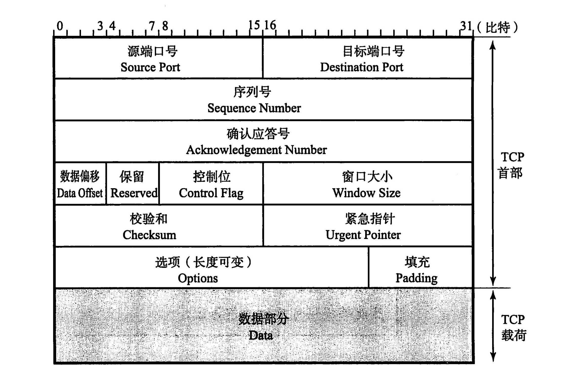

# 网络协议

## 1.网络基础知识

- **分层**
    - **为什么要分层?**
        - 使问题简单化, 每一层专注每一层的事情.
    - OSI 参考模型：==物理层== -> ==数据链路层== -> ==网络层== -> ==传输层== -> ==会话层== -> ==表示层== -> ==应用层==
    - OSI 协议以 OSI 参考模型为基础界定了每个阶层的协议和每个阶层之间接口相关的标准；
      - 7.应用层：针对特定应用，如电子邮件，远程登录，文件传输；
      - 6.表示层：设备固有数据格式与网络标准数据格式的转换；
      - 5.会话层：通信管理。负责建立和断开通信连接；
      - 4.传输层：管理两个节点之间的数据传输。负责可靠传输；
      - 3.网络层：地址管理与路由选择；
      - 2.数据链路层：互联设备之间传送和识别数据帧。
      - 1.物理层：物理接口，连接器；
    - TCP/IP 的分层模型：
      - 物理链路层：网卡及接口；
      - 网络层：IP，ICMP，ARP
      - 传输层：TCP，UDP
      - 应用层：HTTP(HyperText Transfer Protocol),FTP(File Transfer Prototol),SSH...
- 分组交换: 将大数据分割为一个个包(Packet)的较小的单位进行传输;
- 接受端数量分类：
  - 单播：就是 1 对 1 通信；
  - 广播：1 对多
  - 多播：与广播类似，也是将消息发送给多个接收主机，不同之处在于多播要限定某一组主机作为接收端。虽然一对多，但是限定多是谁；例如电视会议；
  - 任播：特定的多台主机中选出一台作为接收端的一种通信方式；面向多个，但最终选择单个特定主机通信；如 DNS；
- 地址：每一层协议所使用的地址不尽相同；例如 MAC 地址，IP 地址，端口号，等；
- 网络设备：
  - 网卡：使计算机联网的设备，也叫网卡，LAN 卡；
  - 网桥：从**数据链路层**上延长网络的设备；
  - 路由：通过**网络层**转发分组数据的设备；
- 云：利用虚拟化技术，根据需要自动进行动态管理分配计算机资源（存储，CPU，内存等）

- 每个分层中，都会对所发送的数据附加一个首部，在这个首部中包含了该层必要的信息；

## 2.数据链路

> 数据链路层的协议定义了通过通信媒介互联的设备之间传输的规范。
>
> 主要作用在互联的同一种数据链路的节点间进行包传递.

- MAC 地址：用于识别数据链路中互联的节点；
  - 转发表: 交换机记录网络接口和 MAC 地址的对应关系; 由 MAC 地址就可以查到需要发送数据的接口;
  - 由于 MAC 地址没有层次性, 当设备数量增加时, 检索转发表的时间越长, 所以需要网络层 IP 地址对地址进行分割;
- 

## 3.IP 协议

> 网络层协议，主要作用是“实现终端节点之间的通信”也叫点对点通信;  **网络层可以跨域不同的数据链路**;
>
> IP地址和MAC地址:
>
> 1. MAC地址是固化到网卡终中的, 可以近似认为唯一标识一台主机, 类似个人ID.
>
>  	2. IP地址可以分层, 可以被路由 类似现实世界的地址信息.
>
> 因为IP地址不便记忆, 所以有了域名(DNS), 域名  <--> IP 映射
>
>  需要由IP找到对应的主机(MAC)  --> ARP协议
>
> 在一个子网内, 入网机器需要分配IP --> DHCP
>
> 

### 1. 基础概念

- 主机：一般将配有 IP 地址，但不进行路由控制的设备；

- 路由器：即配有 IP 地址，又具有路由控制能力的设备;

- 节点：路由和主机的统称；

- 路由控制（routing）：指将分组数据发送到最终目标地址的功能；

- 路由控制表：Routing Table，主机维护, 记录 IP 数据在下一步应该发给哪一个路由器;

- IP 属于面向无连接型：原因有两点，一是为了提速，二是为了简化；

- IP 地址由==网络==和==主机==两部分标识组成；

  - 相同段内相连的主机必须有相同的网络地址，IP 地址的主机标识则不允许在同一个网段内重复出现；
  - 子网掩码用于区分**网络标识**和**主机标识**;

- 广播地址：==将主机地址部分为全部置为 1==

  - 本地广播：在本网内的广播叫做本地广播，(路由器不会转发)
  - 直接广播：不同网络间的广播；叫做直接广播；(先到达路由器, 路由器进行广播)

- IP 多播：用于将包发送给特定组内的所有主机，多播使用 D 类地址，开始四位是“1110”就可以认为是多播地址；`224.xxx.xxx.xxx`

- 子网掩码：IP 地址==网络部分全部为 1==，对应 IP 地址==主机部分全部为 0==；

- Hop：跳，指网络中的一个区间；一跳指利用数据链路层以下分层的功能传输数据帧的一个区间；

  - > `traceroute [参数] [主机]`: 用于检测发出的数据包的主机到目标主机之间所经历的网关数量(跳), 原理: 控制 TTL, 超时会发送 ICMP 报文;

- TTL: 生存时间, 指定数据包被路由器丢弃前允许通过的网段数量, 由发送主机设置, 防止数据包在网络上永不终止, 路由器转发包时, 将 TTL 减 1；

  - 最大值 255, 推荐值 64

### ２.IP 协议相关协议

- DNS: **Domain Name System**,域名解析, 解决 IP 地址不便记忆;
  - 查询过程：向默认的 DNS 服务器发起查询，知道与否？向上一层根域名服务器进行查询.
- ARP: **Address Resolution Protocol**, 以 IP 地址为线索, 查询 MAC 地址;
- 为什么需要 IP 地址和 MAC 地址:
  - 1.使用 IP 地址,可以由网络部分充当提供位置的作用, 对地址进行集约;
  - 2.IP 地址只是逻辑上的标识, 任何人都可以随意修改, 不用用于标识用户, 而 MAC 地址则不然, 它是固话在网卡里. 局域网采用 MAC 地址来标识具体用户;
  - 3.网卡使用 MAC 地址,可以不依赖任何网络层协议(不仅仅有 IP 协议), 简化网卡实现;
- RARP: Reverse Address Resolution Protocol, ARP 的反过程, 通过 MAC 定位 IP 地址;
- DHCP: Dynamic Host Configuration Protocol, 自动分配 IP 地址;
- NAT: 网络地址转换, 将 LAN 端的 IP 和端口转换为全局的 IP 再发送,

### 3.路由

> 为了让数据包正确达到目标主机, 路由器必须在途中进行正确的转发, 转发数据所进行的处理就叫路由;

- 路由器根据**路由控制表**转发数据包.

## 4.TCP

> 传输控制协议(Transmission Control Protocol)是面向连接的、可靠的流协议。流就是不间断的数据结构，TCP 为提供可靠性传输，实行“顺序控制”或重发控制；此外还具有流量控制，拥塞控制、提高网络利用率等众多功能；
>
> 
>
>```text
> 控制位含义:
> ACK: 确认序号标志, 确认时, 在确认序号上设置希望接收的下一个序号;
> RST: 重写连接;
> SYN: 用来发起连接(会消耗一个序号);
> FIN: 发端完成发送(会消耗一个序号);
> URG: 紧急指针有效;
> PSH: push 标志;
>```

### 1.基础概念

- TCP 通过一系列技术保证了数据传送的可靠性：
  - 连接管理----3 次握手和 4 次挥手；
  - 数据破坏----校验和
  - 丢包-----应答与超时重发机制
  - 分片乱序-----序列号
  - 窗口滑动------提高发送效率，对发送端和接收端流量进行控制
  - 加快通信速度------快速重发，三次收到重发消息进行重发
  - 流控制----避免网络流量浪费
  - 拥塞控制-----慢启动算法，拥塞窗口

- **端口号**：MAC 地址前者用来识别同一链路中不同的计算机，IP 地址用于识别 TCP/IP 网络中互联的主机和路由；端口号用以区分同一主机上的不同的进程；
- TCP/IP 或 UDP/IP 通信中通常采用 5 个信息来识别一个通信；它们是“源 IP 地址”、"目标 IP 地址"、"协议号"、"源端口号"、"目标端口号"；
- **端口号的确定**：1.标准既定的端口号，一般是 0-1023，具有特定用途；此外还有一些被正式注册，分布在 2104-49151 的数字之间；2.时序分配，交由操作系统动态管理，取值范围 49152-65535 之间；
- 不同的协议(TCP/UDP)可以使用相同的端口号；

### 2.TCP 特点

- **序号与确认应答**

  - 序列号`Sequence Number`：用来表示从TCP发端向TCP收端发送的数据字节流, 表示在这个报文段中的第一个数据字节.
  - 初始序号`ISN`: 建立连接后生成的随机数, 因为建立连接需要消耗一个序号, 所以数据的第一个序号为`ISN+1`；
  - 确认应答：`ACK`标志置 1, 确认序号为**接收端期望收到的下一个序号**;

- **连接管理**

  - 三次握手：

    > 需要三次? 双方都需要初始化`Sequence Number`序列号并需要确认应答

    - --> `SYN`(请求建立连接`c_SN`=x)
    - <-- `ACK`(确认号 x+1) + `SYN`(请求建立连接 `s_SN`=y) **确认回应, 并初始化一个序号!!**
    - --> `ACK`(确认号 y+1, `Seq`=x+1) **确认回应**
    - _扩展: 针对 SYN 超时的攻击; 保活_

  - 四次挥手：

    > 全双工, 需要分别断开且需要确认应答

    - --> `FIN`(请求切断链接, `Seq`=x)
    - <-- `ACK`(确认号 x+1)
    - <-- `FIN`(请求切断连接, `Seq`=y)
    - --> `ACK`(确认号 y+1)
    - _扩展: 通过`netstat`查看处于`CLOSE_WAIT`的进程数;_

- **滑动窗口**

  > 提高发送速率, 实现流量控制, 与乱序重排;image/win.jpg
  >
  > 

  - 窗口大小: 无需等待确认应答可以继续发送数据的最大值;
  - 收到确认应答, 将窗口滑动到确认应答中的序号位置;
  - 即使中间少部分确认应答丢失, 也不会进行重发. 可以通过后续的确认应答进行确认;
  - 当接收报文丢失, 接收端会重复提示希望接收的段, 发送端如果连续 3 次收到同一个确认应答, 就会将对应的数据重发;
  - 接收端可以通过调节窗口大小, 控制发送端发送数据流量;

- **发动单位--MSS(最大消息长度)**image/win.jpg

  - 建立连接的同时, 会在首部写入 MSS 选项, 告知对方自身的 MSS, 双方选择最下 MSS 值进行通信;
  - 在传递大量数据时, 以`MSS`大小将数据进行分割发送;

- **Nagle**算法:

  - 发送端即使还有应该需要发送的数据, 但是如果这部分数据很少, 则进行延时发送.
  - 提高网络利用率;
  - 通过`sock.setsockopt(socket.IPPROTO_TCP, socket.TCP_NODELAY, 1)`可以禁用;

### 3.TCP状态迁移


- `SYN_SENT`: 客服端发送一个TCP连接的`SYN`请求, 等待对方响应(主动发起方状态)
- `SYN_RECV`: 服务端收到`SYN`包并发送`[SYN, ACK]`包后, 等待对方回复的状态(被动连接方状态).
- `FIN_WAIT_1`: 主动关闭方等待远程TCP连接方回复.
- `FIN_WAIT_2`: 主动关闭方已经关闭连接(FIN--ACK), 但是对方的通讯还在保持的这段状态. (可能会长时间处于该状态, 例如对端异常, 长时间处于`CLOSE_WAIT`状态时)
- **`TIME_WAIT`**: 也称为`2MSL(2倍的最大报文生存时间)`等待状态. 四次挥手后, 主动关闭的一方需要等待一段时间, 然后进入CLOSED状态, 这段时间就是`TIME_WAIT`, 目的是**保证关闭连接后, 原有连接在网络中的数据包都过期**.
- `CLOSE_WAIT`: 等待关闭, **被动关闭方收到主动关闭方的`FIN`包后就进入`CLOSE_WAIT`状态**. 主动关闭方可能处于`FIN_WAIT_1或FIN_WAIT_2(大概率)`.

### 4.TCP的KeepAlive

- 由操作系统实现, 一定时间内, 链路上没有数据传送的情况下, TCP层将发送响应的KeepAlive探针, 确定连接可用性; 

- 可以通过配置socket的属性配置:

    ```python
    sock.setsockopt(socket.SOL_SOCKET, socket.SO_KEEPALIVE, 1)  # 开启 TCP keepalive
    sock.setsockopt(socket.SOL_TCP, socket.TCP_KEEPIDLE, 20)    # 正常数据到开始发送keepalive探针的时间
    conn.setsockopt(socket.SOL_TCP, socket.TCP_KEEPCNT, 5)      # 发送探针的数量
    conn.setsockopt(socket.SOL_TCP, socket.TCP_KEEPINTVL, 10)   # 发送探针的间隔时间
    ```

### 5.问题处理

#### 1.大量`TIME_WAIT`问题:

> [参考](https://www.zhuxiaodong.net/2018/tcp-time-wait-instruction/)
>
> 一般出现在爬虫服务器和web服务器(没有做内核参数优化);
>
> TIME_WAIT过多可能会造成端口资源耗尽

- 对于客户端: 完成任务后关闭连接, 进入`TIME_WAIT`状态, 由于请求量大且频繁断开连接, 导致大量连接处于`TIME_WAIT`状态;
- 对于服务端: 开启服务端的KeepAlive, 尽可能不让服务端主动关闭连接.

#### 2.大量`CLOSE_WAIT`问题

## 5.UDP

> User Datagram Protocol;UDP 是不具有可靠性的数据报协议。可以确保发送消息的大小，不能保证消息一定会到达；
>
> 

- 特点:
  - 非连接;
  - 支持同时向多个客户端传输相同消息;
  - 头部小, 额外开销小;
  - 速率高, 尽最大努力交付, 不保证可靠;
- 应用：
  - 1.包总量较少的通信（DNS,SNMP 等）；
  - 2.视频、音频等多媒体通信（即时通信）；
  - 3.限定 LAN 等特定网络中的应用通信；
  - 4.广播通信（广播，多播）；

## 6.HTTP

> 超文本传输协议, 支持客户/服务器模式, 无状态协议;

### 1.基础

- 媒体类型 MIME: 是一种标准的, 用来表示文档, 文件或字节流的性质和格式.

  - `text/plain, text/html, image/jpeg, application/json`

- URI: 统一资源标识符, 有两种形式: URL, URN

  - URL：统一资源定位符
    - `<协议>://<用户名>:<密码>@<host>:<端口>/<path>;<params>?<query>#<frag>`
  - URN: 统一资源名, 处于试验阶段;

- 持久连接 KeepAlive:

  - 初始版本中, 每进行一次 http 通信就需要断开一次 TCP 连接, HTTP/1.0 提出了持久连接(keep-alive), 只要任意一端没有明确提出断开连接, 则保持 TCP 连接;

- Cookie:

  - 根据相应报文内的`Set-Cookie`的字段信息, 通知客户端保存 Cookie;
  - 客户端往该服务器发送请求时, 会自动在请求报文中加入 Cookie;

- HTTP 报文:

  > 由一行一样简单字符串组成, 纯文本, 每行使用`\r\n`结束, 首部和主机之间用空行分隔;

  - **格式**

  

  - **请求报文 和 响应报文**

  

### 2.请求方法

> 安全方法: GET,HEAD, 请求不会产生什么动作;

- `GET`: 请求指定资源;
- `POST`: 将实体提交到指定的资源;
- `PUT`: 创建新资源或用请求有效载荷替换目标资源, 通 post 不用在于, PUT 是幂等的(连续多次调用效果相同) ;
- `DELETE`：删除指定的资源;
- `PATCH`: 用于对资源应用部分修改;
- `OPTIONS`：设置选项；
- `HEAD`：仅获取文档首部；
- `GET`和`POST`区别:
  - **`GET`和`POST`本质上没有区别,都是 HTTP 报文, 但是在设计上, `GET`是用于获取资源, 无副作用,幂等, 可缓存, `POST`用于提交资源, 有副作用, 非幂等, 等特性. 浏览器实现上也造成了进一步的区别**
  - 1.`GET`使用 URL 或 Cookie 传参, `POST`将数据放在 BODY 中;
  - 2.`GET`参数受到 `url `长度由限制, POST 无;(URL 长度可能受浏览器或操作系统的限制, 导致 URL 传参限制);
  - 3.`POST`比 GET 安全,数据无法通过地址栏查看, 仅此而已;
  - 4.`GET`请求是安全的, 多次请求对服务器无影响, POST 不同, 有副作用,非幂等;

### 3.状态

- 1xx: 客户端应相应的某些动作
    - 101: 协议转换.

- 2xx：成功状态码
  - 200：一切 OK，会 GET 或 POST 的回应；
- 3xx：重定向
  - 301: 永久性重定向, 需要更新书签;
  - 302: 临时性重定向;
  - 304：客户端有缓冲的文档并发出了一个条件性的请求，服务器告诉客户，原来的缓冲文档还可以使用；
- 4xx：客户端错误
  - 401: 认证失败;
  - 403：权限拒绝；
  - 404：无法找到指定位置的资源；
  - 405：服务器禁止使用该请求方法；
  - 412: 先决条件失败, 通常发生于`GET, HEAD`之外的方法请求;
- 5xx: 服务器错误, 表明服务器端在执行请求时发生了错误;
    - 500: 服务器未知错误(程序代码出错时出现);
    - 502: 网关错误, 标识作为网关或代理角色的服务器, 从上游(tomcat)中接收到的响应是无效的(上游服务器挂掉).
    - 503: 临时的服务器维护或者过载.
    - 505: 服务器不支持, 或者拒绝支持在请求中使用HTTP版本;

### 4.HTTP 头部

> 首部结构: `首部字段名: 字段值, 例如: Content-type: text/html`
>
> 首部可以分为: 通用首部, 请求首部, 响应首部, 实体首部

- 常用头部说明:

  - `Accept`: 客户端期望 MIME 类型; 类似还有`Accept-Charset`: 期望字符集,`Accept-Encoding`: 压缩方法; `Accept-Language`语言;
  - `Access-Control-Allow-Credentials`: 跨域时是否允许携带`cookie`;
  - `Access-Control-Allow-Origin`: 允许跨域地址;
  - `Cache-Control`: 缓存控制;
  - `Connection`: 是否保持连接;
  - `Content-Encoding`: 压缩方式;
  - `Content-Length`: HTTP 实体的大小;
  - `Content-Type`: HTTP 实体的 MIME 类型;
  - `Cookie`: 存放`Cookie`, 由`Set-Cookie`设置客户端`Cookie`;
  - `Expires, Last-Modified, If-Moidfied-Since, Etag, If-None-Match`: 浏览器缓存相关
  - `Host`: 服务器域名和端口号;
  - `Location`: 重定向的`url`;
  - `Origin`: 与`Referer`不同, 仅包含协议和域名, 用于跨域资源共享, 表明请求发出的协议和域名, 且仅通过浏览器设置, 用户无法更改;
  - `Referer`: 请求发起的详细地址,不包含锚点信息;
  - `Server`: 服务器信息;
  - `Transfer-Encoding`: 压缩类型;
  - `User-Agent`: 客户端信息(操作系统, 浏览器版本,等)
  - `Vary`: 告诉 HTTP cache, 想要定位缓存, 除了`path`和`Host`头之外, 还应该考虑哪些头部信息; [参考](http://blog.gongzhenhua.com/http-vary-header-and-bp/)

- 重要的`MIME`说明

  - `POST`常用的`MIME`类型

    - `application/x-www`-form-urlencoded`: 原生FORM表单, 数据按照`key1=val1&key2=val2`的方式进行编码;

    - `multipart/form-data`: 在头部指定`boundary`, 用于分隔每个数据; 一般用于上传文件;

      ```
      content-type: multipart/form-data; boundary=--------------------------815707955261705118296449
      ----------------------------815707955261705118296449
      Content-Disposition: form-data; name="test1"

      123
      ----------------------------815707955261705118296449
      Content-Disposition: form-data; name="test2"; filename="config.ini"
      Content-Type: text/plain
      ...
      ```

    - `application/json`: 内容为`JSON`格式;

    - `text/xml`: 内容为`XML`格式;

### 5.KeepAlive

- HTTP1.0 中, 没有官方的 keepalive 操作, 通常使用`Connection: Keep-Alive`, 表明长连接, HTTP1.1 中, 所有连接默认都是持续连接;
  - 客户端请求包含首部:`Connection: Keep-Alive`, 激活长连接(**客户端不主动断开连接并进行tcp保活**); 服务端响应`Connection: Keep-Alive`, 表示支持长连接;  否则客户端会立刻断开连接;
  - 一般服务端会设置超时和最大请求数; 例如 nginx
      -  `keepalive_timeout time;`连接保持时间, 超时主动断开连接; 
      - `keepalive_requests xxx`: 最大连接数;
  - 在长连接下, 一般通过`Content-Length: xxx`表示**响应体内容**大写, 客户端通过长度判断是否已经完成响应;
  - 当响应体大小不确定时; 如通过 gzip 进行压缩后, 通过`Transfer-Encoding: chunked`, 表示整个 response 将使用分块传输编码来传递内容, 并以最后一个大小为 0 的块为结束.
- Keep-alive 降低了延迟和连接建立的开销, 但是会维持大量的空闲连接, 消耗资源:

### 6.HTTPS

> 传统 HTTP 面临的问题: 窃听, 篡改, 冒充;
>
> HTTPS = HTTP + 通信加密 + 证书 + 完整性保护, 身披 SSL/TLS 外衣的 HTTP

#### 1.基础概念

- https 默认端口: 443

- SSL: Secure Sockets Layer, 安全套接字, 早期 https 使用, TLS 前身;
- TLS: Transport Layer Security, 传输层安全协议;
- SSL/TLS 协议的基本过程: 1. 客户端向服务端索要并验证公钥;
  2.  双发协商生成"对话密钥";
  3.  双发采用"对话密钥"进行加密通信;
- 对称加密: 加密/解密使用同一串密钥, 常见的加密算法有 DES, AES;
  - 效率高, 加密速度快, 但是密钥管理困难;
- 非对称加密: 加密, 解密使用不同的密钥, 一把作为公开的公钥, 一把作为私钥, 公钥加密的信息, 只有私钥才能解密, 反之, 私钥加密的信息, 只有公钥才能解密; 如 RSA
  - 安全性高, 但是加密解密比较消耗资源;
- MD5: 消息摘要算法, 密码散列函数, 可以生产出一个 128 位的散列值, 用于确保传输信息一致;

#### 2.协议细节

- **证书**: 表明**公钥**正确可信; 将公钥等信息通过 Hash 算法生成摘要, 通过**CA(证书中心)私钥**加密生成**数字签名**; 收信方用**CA 公钥**解开数字签名, 就可以验证公钥的真实性;
- 共享密钥加密: 客户端和服务端生成对话密钥, 对话密钥用来加密解密信息(对称加密), 对话密钥本身通过非对称加密传输(**用 CA 证书中获取的服务端公钥加密**), 保证安全;
- **TLS 握手**: 发生再 TCP 握手之后, 1ClientHello, 2ServerHello, 3.Client Key Exchange, 4.Server Finish
  - 1.协商加密算法获取公钥, 2.加密传输 Pre-master secret, 生成会话密钥, 3.双方采用"对话密钥"进行加密通信;


- 会话密钥生成: 使用客户端和服务端生成的三个随机数`Client random`, `Server random`, `Pre-master secret`(被服务端公钥加密后传输, 生成"对话密钥", 用来加密整个对话过程;
- 还需要对数据完整性进行验证;
- 中间人攻击
  - 指攻击者与通讯的两端分别创建独立的联系, 并交换其收到的数据;
  - CA 证书, 验证共公钥的正确性;
  - 数据的完整性验证;

#### 3.session 恢复

- session ID
  - 每次会话都有一个编号, 如果对话中断, 下次重连的时候, 只要客户端给出编号, 且服务器有这个编号的记录就可以使用原有"对话密钥";
- session ticket
  - 加密后端信息, 包含本次对话的主要信息, 如对话密钥和加密方法. 服务端收到后解密就可以使用原有的对话密钥;

### 7.HTTP 2.0

- 二进制传输
- 多路复用
    - 帧: 最小的数据单位，每个帧会标识出该帧属于哪个流, 多个帧之间可以乱序发送
    - 流: 多个帧组成的数据流
    - 多个帧之间可以乱序发送, 解决原有协议文本串行发送的问题.
    - 同一域名公用一个连接, 解决原有协议连接数过多的问题.
- Header压缩.
- 服务端Push:
    - 服务端可以主动推送资源.

### 8.WebSocket

#### 1.握手(连接建立)

- 客户端发送连接请求(基于`HTTP`协议)

    - ```
        GET /chat HTTP/1.1
        Upgrade: websocket
        Sec-WebSocket-Key: dGhlIHNhbXBsZSBub25jZQ==
        Sec-WebSocket-Version : 13
        ```

    - `Upgrade: websocket`: 表明是`websocket`连接请求.

    - `sec-websocket-key`:  服务端据此计算`Sec-WebSocket-Accept`( `sha1(sec-websocket-key+'固定值')`)

    - `Sec-WebSocket-Version`: 版本.

- 服务端回复(HTTP)

    - ```
        HTTP/1.1 101 Switching Protocols
        Upgrade: websocket
        Connection: Upgrade
        Sec-WebSocket-Accept: s3pPLMBiTxaQ9kYGzzhZRbK+xOo=
        ```

## 2.数据传输

- 双方利用`HTTP`通信时的`socket`传输数据, 协议基于`TCP`协议. 

## DNS

Domain Name System,域名系统

- 分类：根 DNS 服务器，顶级 DNS 服务器，权威 DNS 服务器；

- 解析过程：www.qq.com

  - 1.检查本地 hosts 里有没有这个域名的映射，有完成，没有向下；

  - 2.查找本地 DNS 解析器缓存，是否有这个网址映射？没有向下；

  - 3.向 TCP/IP 参数设置中的本地 DNS 服务器查询？（直连外网：会分配到运营商服务地址；通过路由：含有 DHCP 服务，可能就是路由本身）

  - 4.如果本地 DNS 服务器解析失败，则根据 DNS 设置，进行查询；（如未用转发模式，本地 DNS 就把请求发送至 13 台跟 DNS，根 DNS 会判断该顶级域名（.com）由谁管理，并返回一个负责该顶级域名服务器的 IP，本地 DNS 在联系这个服务器，查询到 qq.com，然后重复向下查询，直到查询到 www.qq.com）

  - 4.5.如果用转发模式，DNS 服务器就会把请求转发至上一级服务器进行解析，直到找到；
