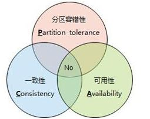

计算机基础相关名词解释

### 1.可重入

> 程序或子程序在" 任意时刻被中断然后操作系统调用执行另外一段代码, 这段代码又调用了该程序不会出错", 则成为可重入. 

- 可重入需要满足的条件:
  - 可重入函数使用的所有变量都保存在调用栈的当前函数栈上.

- 可重入锁

  - 一个锁支持同一个线程的多次加锁,那么这个锁就是可重入的.

### 2.单位

- bit, 比特: 也称为二进制位, 是信息的最小单位.
- Byte, 字节: 等于 8 bit, 
- Bit rate, 比特率: 单位时间内传输或处理的==比特==的数量.

### 3.大小端

- 大端: 高尾端, 高位字节在低地址处, 类似将把数据当作字符串处理; 符合人类阅读习惯;
- 小端: 低尾端, 低位字节在低地址处, 计算机电路先处理低位字节, 处理效率较高;
- 计算机读取数据时: 如果是大端, 先读到的就是高位字节, 如果是小端, 先读到的就是低位字节;

### 4.CAP分布式原则

> CAP原则: 在一个分布式系统中, Consistency(一致性), Availability(可用性), Partition tolerance(分区容错性), 三者不可兼得;

- 一致性（C）：写操作子后的读操作, 必须返回该值;
- 可用性（A）：只要收到用户请求, 服务器就必须给出回应.
- 分区容错性（P）：分布式系统大都分布在多个子网络. 每个网络叫做一个区, 分区容错是指, 区间通信可能失败. 一般来说, 分区容错无法避免, 因此可以认为CAP 的P总是成立; CA二选一;



- BASE理论
  - **BASE理论是对CAP理论的延伸**，核心思想是即使无法做到强一致性（Strong Consistency，CAP的一致性就是强一致性），但应用可以采用适合的方式达到最终一致性（Eventual Consitency）。**Redis等众多系统构建于这个理论之上。**

### 5.并发和并行

- ==并发==是指一次处理多件事;
- ==并行==是指一次做多件事; 并行需要多核心;


### 6.CSA: Compare And Set,

>  将旧值作为条件传入, 如果满足则进行操作;

### 7.MD5

> MD5 消息摘要算法,可以产生一个128位的散列值, 用于确保信息传输的一致性;
>
> 可以被加以破解, 一般用于验证文件的完整性;

- python中实现MD5加密:

  - ```python
    import hashlib
    
    hl = hashlib.md5()
    hl.update('test'.encode(encoding='utf-8')) # 根据字符串生产摘要
    hl.hexdigest()  # 以十六进制字符串返回当前摘要
    ```

### 8.UML [参考](<https://design-patterns.readthedocs.io/zh_CN/latest/read_uml.html#>)

- 继承: 带空心三角箭头的实线连接;

  

- 实现: 带空心三角箭头的虚线连接;

  

- 关联: 通常以成员变量形式实现

  

- 依赖: 体现为类构造方法以及类方法的传入参数

  

