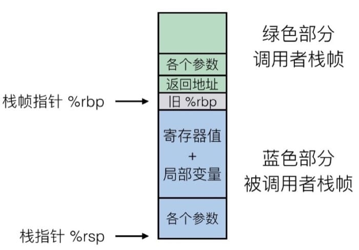

计算机基础相关名词解释

## 1.计算机基础

### 1.可重入

> 程序或子程序在" 任意时刻被中断然后操作系统调用执行另外一段代码, 这段代码又调用了该程序不会出错", 则成为可重入. 

- 可重入需要满足的条件:
  - 可重入函数使用的所有变量都保存在调用栈的当前函数栈上.

- 可重入锁

  - 一个锁支持同一个线程的多次加锁,那么这个锁就是可重入的.

### 2.单位

- bit, 比特: 也称为二进制位, 是信息的最小单位.
- Byte, 字节: 等于 8 bit, 
- Bit rate, 比特率: 单位时间内传输或处理的**比特**的数量.

### 3.大小端

- 大端: 高尾端, 高位字节在低地址处, 类似将把数据当作字符串处理; 符合人类阅读习惯;
- 小端: 低尾端, 低位字节在低地址处, 计算机电路先处理低位字节, 处理效率较高;
- 计算机读取数据时: 如果是大端, 先读到的就是高位字节, 如果是小端, 先读到的就是低位字节;

### 4.并发和并行

- **并发** 是指一次处理多件事;
- **并行** 是指一次做多件事; 并行需要多核心;

### 5.MD5

> MD5 消息摘要算法,可以产生一个128位的散列值, 用于确保信息传输的一致性;
>
> 可以被加以破解, 一般用于验证文件的完整性;

- python中实现MD5加密:

  - ```python
    import hashlib
    
    hl = hashlib.md5()
    hl.update('test'.encode(encoding='utf-8')) # 根据字符串生产摘要
    hl.hexdigest()  # 以十六进制字符串返回当前摘要
    ```

### 6.过程调用和栈帧

- 传递控制: 如何调用, 如何返回到调用处?
  - 将参数压栈; *优先放入寄存器, 数量超限,才会放入栈中*
  - 将返回地址(指令的位置)压栈;
  - 将栈帧指针压栈;
  - 跳转执行;
- 传递数据: 向调用函数传递参数, 函数向调用者返回值?
  - 被调用从寄存器或栈帧中取得参数; *枕指针和偏移量, 可以取出栈帧中的参数*;
  - **返回值**放入寄存器(%rax);
- 内存管理: 内存的分配和释放?



### 7.数据存储结构


### 7.时间

- GMT: 格林威治标准时间
- UTC: 世界协调时间;
- Unix 纪元秒数: 从1970年1月1日零时以来经历的总秒数;

### 8.冯诺依曼架构和哈弗架构

- 冯诺依曼架构: 将程序指令存储和数据存储器合并在一起的存储结构;
- 哈弗架构: 将程序指令存储和数据存储分开, 独立访问;
-  

### 9.链接

> 链接将程序分散到不同的源代码中, 可以复用. 改动代码只需重新编译改动文件, 其他不受影响.
>
> 程序编译过程: **预处理, 编译(转换成汇编语言), 汇编(转换成机器指令, 目标文件), 链接**

- 链接器主要做什么?

  1. 符号解析: 连接器给每一个符号应用一个唯一的符号定义, 用做寻找对应符号的标志;
  2. 重定位: 将原先分散的代码和数据片段汇总, 将原有`.o`文件中相对位置转换成可自行程序的绝对位置; 更新对应的引用符号;

- ELF文件格式:

  - 调试验证工具:
    - `nm`: 列出目标文件的符号;
    - `readelf - h`: 查看ELF文件头信息;
    - `readelf -S`:  查看段表信息;
    - `objdump -r`: 查看重定位表;
  - 符号: 
    - 定义在本目标文件中的全局符号;
    - 引用的全局符号;
    - 段名;
    - 局部符号;

  

#### 1.静态链接

#### 2.动态链接


## 2.架构设计

### 1.UML [参考](<https://design-patterns.readthedocs.io/zh_CN/latest/read_uml.html#>)

- 继承: 带空心三角箭头的实线连接;

  

- 实现: 带空心三角箭头的虚线连接;

  

- 关联: 通常以成员变量形式实现

  

- 依赖: 体现为类构造方法以及类方法的传入参数

  


### 2.架构设计模式

#### 1.MVC

> [参考](<https://draveness.me/mvx>), 

- Model(模型), View(视图), Controller(控制), 不同的组件对其实现有很多不同;

- 软件设计分三层:

  - View: 面向最终用户, 提供界面;
  - Controller: 控制层, 接受用户输入, 操作 View 和 Model,
  - Model: 管理用户的行为和数据

- 维基中的MVC, 所有通信为单项通信, View --> Controller --> Model

  

#### 2.MVP

- 将mvc中的`Controller`替换为`Presenter(主持人)`, 很多逻辑放到`Presenter`层中;
- `View`为被动视图, 没有主动性

- IOS MVC

  

#### 3.MVVM

- 将`present`改为`ViewModel`, 唯一区别是, 采用双向绑定, `View`的改变会自动反应在`ViewModel`上;

  


- 

## 3.分布式相关

### 1.分布式和集群

- 单机结构: 整个项目的所有服务都运行于单台服务器上;
- 集群结构: **同一个业务运行于多节点之上**
  - HA: 高可用集群(High Availability Cluster)
  - LBC: 负载均衡集群(Load Balance Cluster)
  - HPC: 高性能集群(High Performance Computing Cluster)
- 分布式:  拆分, 独立运行, RPC通讯:
  - 将完整的系统, **按照业务功能, 拆分成一个个独立的子系统**, 每个子系统称为**服务**,  这些子系统能够独立运行在web容器中, 之间通过**RPC**方式通信 ;  系统间的耦合度低, 可以独立开发独立测试

### 2.容错, 高可用和灾备

- 容错: 发生故障时, 系统的运行水平可能有所下降, 但是依然可以**继续运行**.
- 高可用: 指的是一旦故障, 能够**快速恢复**, 允许出现暂时中断;
- 灾备: (灾难恢复)保存系统核心部分(数据). 

### 3.CAP分布式原则

> CAP原则: 在一个分布式系统中, Consistency(一致性), Availability(可用性), Partition tolerance(分区容错性), 三者不可兼得;

- 一致性（C）：写操作子后的读操作, 必须返回该值;
- 可用性（A）：只要收到用户请求, 服务器就必须给出回应.
- 分区容错性（P）：分布式系统大都分布在多个子网络. 每个网络叫做一个区, 分区容错是指, 区间通信可能失败. 一般来说, 分区容错无法避免, 因此可以认为CAP 的P总是成立; CA二选一;


- BASE理论
  - **BASE理论是对CAP理论的延伸**，核心思想是即使无法做到强一致性（Strong Consistency，CAP的一致性就是强一致性），但应用可以采用适合的方式达到最终一致性（Eventual Consitency）。**Redis等众多系统构建于这个理论之上。**

### 4.分布式系统间的通信

- RPC: 远程过程调用
  - 实现目的: 要像本地调用函数一样调用远程函数;
  - RPC框架需要实现[参考](<https://www.zhihu.com/question/25536695/answer/221638079>):
    - a.Call ID映射: 调用时, 通用ID, 找到需要调用的函数;
    - b. 序列化和反序列化: 不同编程语言, 不同通信格式之间的转换;
    - c. 网络传输: 基于什么协议, 大部分是基于TCP,  也可用HTTP;
  - 
- Restful
  - 对接口的规范定义;
  - 

> 微服务之间的通信方式有: Restful, RPC
>
> 微服务调用为什么使用RPC? [参考](<https://zhuanlan.zhihu.com/p/61364466>)
>
> 1. RPC要解决的问题: a.分布式系统中, 服务间的调用问题; b. 远程调用时, 要能够像本地调用一样方便;
>
> =======